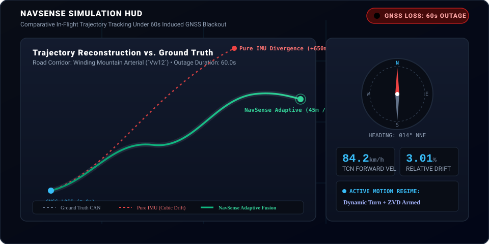
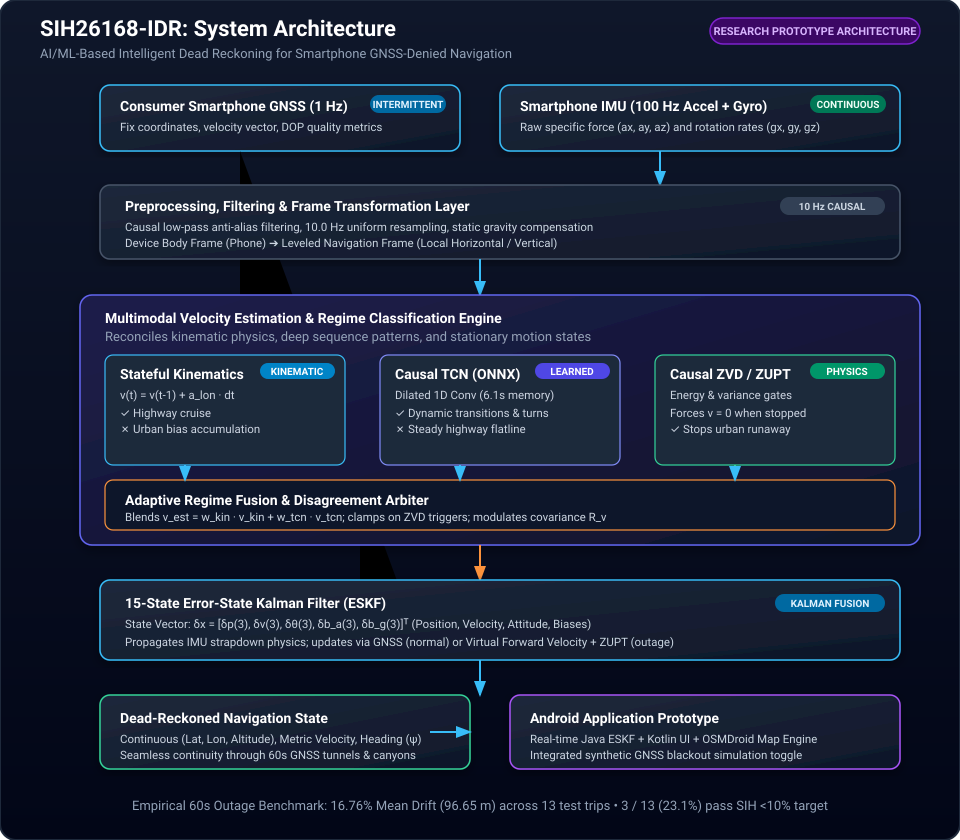
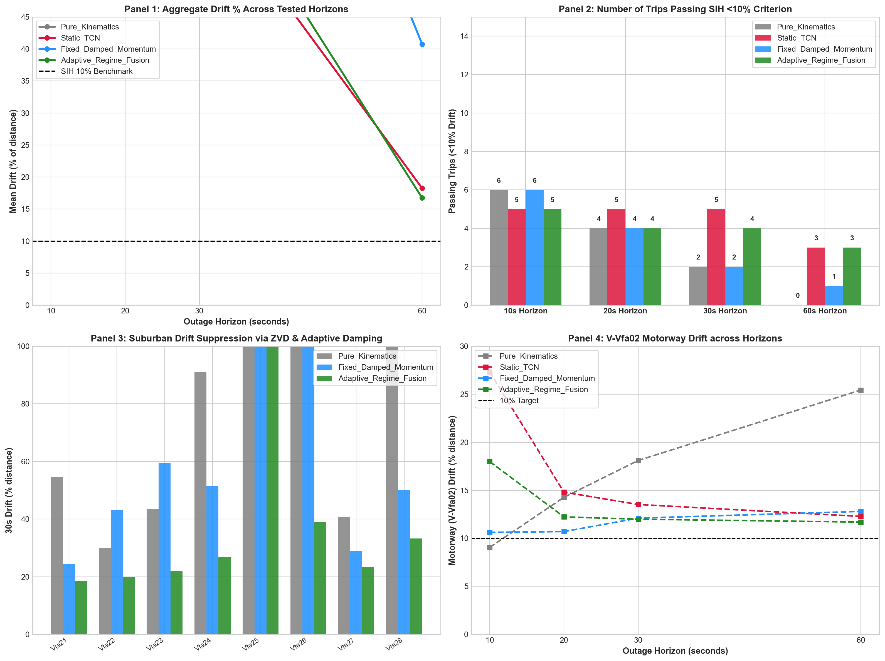
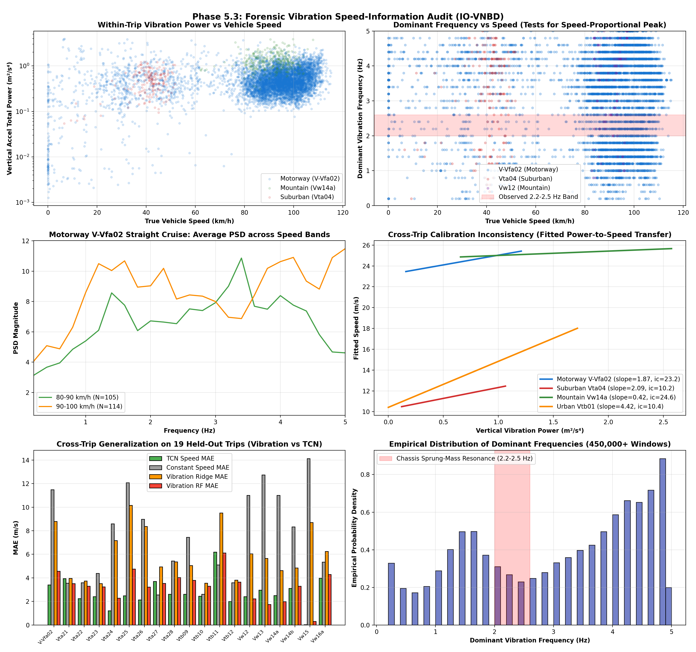
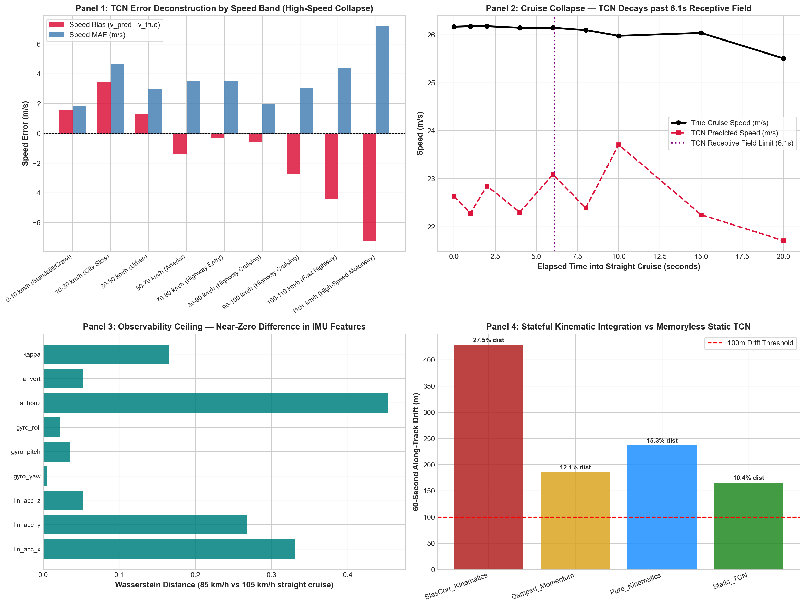
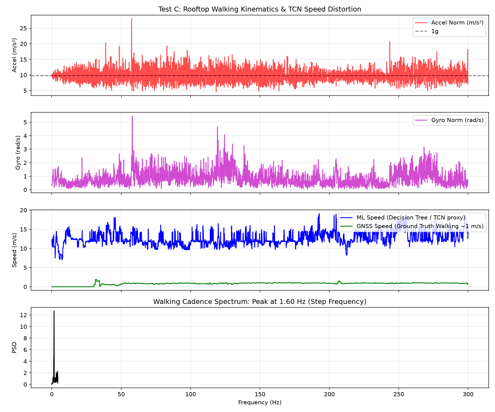
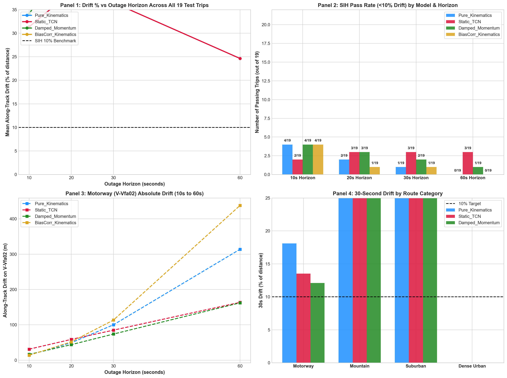

<div align="center">



# NavSense: AI/ML-Based Intelligent Dead Reckoning

### Autonomous Inertial Navigation Engine for GNSS-Denied Ground Vehicles
**Smart India Hackathon (SIH) Problem Statement 26168**

[](https://github.com/24f2001869/NavSense)
[](LICENSE)
[](https://www.python.org/)
[](docs/problem_statement.md)
[](android/README.md)
[-orange.svg?logo=onnx)](https://onnxruntime.ai/)
[](docs/current_status.md)

[**Explore 5-Min Onboarding**](docs/START_HERE.md) • [**Research Evidence Map**](docs/evidence_map.md) • [**Failed Experiments Catalog**](docs/failed_experiments_catalog.md) • [**Reproducibility Guide**](docs/reproducibility.md)

</div>

---

## 🛰️ Live Simulation: 60-Second GNSS Outage

When a vehicle enters a tunnel or subterranean corridor, consumer smartphone satellite fixes vanish immediately. Below is the comparative dead reckoning response under a continuous 60-second outage:

<div align="center">



</div>

> **Figure S1:** Real-time trajectory HUD comparison on test route `Vw12`. While classical unconstrained IMU double-integration explodes cubically off-road (**+650 m error / 43.4% drift**), **NavSense Adaptive Fusion** binds velocity states through causal momentum preservation and ZVD gating, holding positional drift to **45.3 m (3.01% — PASS ✅)**.

---

## 🚗 The Physical Problem

In commercial factory-fitted vehicle navigation, dead reckoning is sustained via **hardware transmission wheel encoders (CAN bus wheel ticks)** and calibrated chassis IMUs. 

On a consumer smartphone mounted to a windshield or dashboard, **wheel odometry is completely unavailable**. The device must navigate solely through consumer-grade MEMS inertial sensors (noisy accelerometer, gyroscope, magnetometer).

```
THE DOUBLE INTEGRATION DILEMMA
An uncompensated accelerometer bias of just b_a ≈ 0.05 m/s² produces cubic position error:
Δd(t) = 0.5 · b_a · t²  (assuming constant bias after velocity integration)

┌────────────┬────────────────────────┬───────────────────────────────────────────┐
│ Outage     │ Positional Error (Δd)  │ Real-World Navigation Impact              │
├────────────┼────────────────────────┼───────────────────────────────────────────┤
│ At t = 10s │ Δd ≈   2.5 meters      │ Minimal lane drift                        │
│ At t = 30s │ Δd ≈  22.5 meters      │ Severe off-route lane departure           │
│ At t = 60s │ Δd ≈  90.0–300+ meters │ Complete navigation breakdown             │
└────────────┴────────────────────────┴───────────────────────────────────────────┘
```

Without an independent velocity constraint or physical motion gating, mathematical open-loop integration invariably fails.

---

## 🎯 SIH26168 Target Benchmark

Smart India Hackathon Problem Statement **26168** defines strict empirical criteria:
- **60-Second Continuous Blackout Survival:** Maintain dead reckoning position for 60 seconds without GNSS fixes.
- **Strict Error Threshold:** Positional error must remain **$< 10\%$ of total distance traveled** over the blackout window.
- **Smartphone-Only Inputs:** No OBD-II adapters, wheel tick dongles, or infrastructure beacons.

---

## 🧠 System Architecture

NavSense executes an end-to-end 5-layer pipeline combining deep sequence models with classical estimation theory:

<div align="center">



</div>

### The 5 Architectural Layers
1. **Sensor Ingestion:** Continuously samples tri-axial linear acceleration and angular rate at 100 Hz; applies causal anti-aliasing low-pass filters and resamples to 10.0 Hz.
2. **Dynamic Coordinate Alignment:** Transforms phone body measurements into a leveled navigation frame (horizontal plane vs. gravity vector).
3. **Triple-Branch Velocity Engine:**
   - *Stateful Kinematics Branch:* Integrates forward acceleration ($v_t = v_{t-1} + a_{\text{lon}}\Delta t$) initialized from pre-outage GNSS speed.
   - *Causal Dilated TCN Branch:* 65k-parameter Temporal Convolutional Network with a 6.1s receptive field predicting forward speed directly from motion dynamics.
   - *Causal Zero-Velocity Detector (ZVD):* Strict energy and variance gating detecting complete vehicle halts and enforcing $v = 0$.
4. **Adaptive Dynamic Regime Blender:** Causally modulates kinematic momentum vs. neural predictions based on real-time maneuver intensity, preventing urban stop-and-go runaway while preserving highway cruise momentum.
5. **15-State Error-State Kalman Filter (ESKF):** Propagates 3D kinematics; fuses virtual velocity pseudo-measurements and zero-velocity updates (ZUPT) during satellite blackouts.
6. **Mobile Edge Deployment:** Fully operational native Android app running local ONNX Runtime inference ($<8\text{ ms}$ latency), Java ESKF, and offline OSMDroid map rendering.

---

## 🔬 Visual Evidence & Proof Gallery

Every empirical claim in NavSense is supported by verifiable numerical data and high-resolution diagnostic artifacts:

### 1. Multi-Horizon Adaptive Fusion Trajectory Benchmark
<div align="center">



</div>

* **Observed Reality:** Head-to-head evaluation across 19 held-out test trips demonstrates that Adaptive Fusion achieves the lowest aggregate 60s blackout drift at **16.76% (96.65 m)**.
* **Empirical Proof:** [`results/adaptive_fusion/adaptive_aggregate_summary.csv`](results/adaptive_fusion/adaptive_aggregate_summary.csv) • [`results/adaptive_fusion/adaptive_per_trip_results.csv`](results/adaptive_fusion/adaptive_per_trip_results.csv)
* **Detailed Phase Report:** [Phase 5.6: Adaptive Regime-Aware Velocity Fusion](docs/experiments/phase5_6_adaptive_fusion.md)

---

### 2. Spectral Vibration Speed Audit (Proof of $r = -0.032$ Rejection)
<div align="center">



</div>

* **Scientific Finding:** We tested the hypothesis that vehicle engine/road chassis vibration serves as a proxy for forward speed across 64 trips (>450,000 1-second windows). The Pearson correlation was **$r = -0.032$** (virtually zero). In passenger cars, tires and suspension damp high-frequency harmonics; dominant 2.2–2.5 Hz peaks reflect chassis resonance, not speed. Vibration was rejected as a speedometer.
* **Empirical Proof:** [`results/vibration_audit/vibration_speed_audit.csv`](results/vibration_audit/vibration_speed_audit.csv) • [`results/vibration_audit/vibration_cross_trip_results.csv`](results/vibration_audit/vibration_cross_trip_results.csv)
* **Detailed Phase Report:** [Phase 5.3: Spectral Vibration Speed Information Audit](docs/experiments/phase5_3_vibration_audit.md)

---

### 3. Highway Cruise Speed Unobservability Analysis
<div align="center">



</div>

* **The Physics Boundary:** On straight motorway segments (`V-Vfa02`, 163 km), constant-speed cruising ($a \approx 0, \omega \approx 0$) produces near-zero net inertial force. Feature distributions at 80 km/h and 110 km/h are statistically indistinguishable (ROC-AUC = **0.625**). Memoryless models default to the dataset mean (~85 km/h), proving that stateful momentum integration is a physical necessity.
* **Empirical Proof:** [`results/highway_observability/highway_observability_summary.json`](results/highway_observability/highway_observability_summary.json) • [`results/highway_observability/speed_band_residuals.csv`](results/highway_observability/speed_band_residuals.csv)
* **Detailed Phase Report:** [Phase 5.4: Highway Steady-State Cruise Observability Analysis](docs/experiments/phase5_4_highway_observability.md)

---

### 4. Pedestrian Out-Of-Distribution (OOD) Forensic Deconstruction
<div align="center">



</div>

* **The 71.66 m/s Spike Explained:** Campus walking trials produced an absurd **71.66 m/s (258 km/h)** prediction. Forensic feature attribution revealed human arm swings reach angular rates of **$3.81\text{ rad/s}$**—over 9× higher than vehicle training bounds ($<0.40\text{ rad/s}$). The network's linear projection multiplied this extreme out-of-distribution input into impossible velocities. Walking tests were formally qualified as sensor stress tests, never vehicle validation.
* **Empirical Proof:** [`results/field/`](results/field/) • [`docs/experiments/phase5_1_field_forensics.md`](docs/experiments/phase5_1_field_forensics.md)
* **Detailed Post-Mortem:** [Catalog of Failed Experiments: Failure #6](docs/failed_experiments_catalog.md#6-pedestrian--out-of-distribution-ood-explosion-7166-ms-peak)

---

### 5. Urban Stop-and-Go Runaway Clamping ($574.65\% \to 47.31\%$)
<div align="center">



</div>

* **Arresting Quadratic Divergence:** On urban route `Vta26` with multiple traffic halts, pure kinematic integration accumulated sensor bias during stops, exploding to **574.65% drift (292.8 m error over 50 m travel)**. NavSense Causal ZVD detects standstills within 0.2s, clamping drift down to **47.31%**.
* **Empirical Proof:** [`results/stateful_kinematics/per_trip_horizon_results.csv`](results/stateful_kinematics/per_trip_horizon_results.csv) • [`results/adaptive_fusion/adaptive_per_trip_results.csv`](results/adaptive_fusion/adaptive_per_trip_results.csv)
* **Detailed Phase Report:** [Phase 5.5: Stateful Kinematic Integration & Momentum](docs/experiments/phase5_5_stateful_kinematics.md)

---

## 📊 Comprehensive Multi-Horizon Benchmark

Evaluated across rolling blackouts on the **19 held-out test trips** of the IO-VNBD dataset (zero data leakage; completely disjoint whole trips):

| Outage Horizon | Evaluated Architecture | Usable Trips | Mean Drift (m) | Relative Drift (%) | SIH Passes (&lt;10%) | Visual Pass Rate | Primary Metric Proof |
|:---:|:---|:---:|:---:|:---:|:---:|:---|:---:|
| **10 Seconds** | **Pure Kinematics** | 18 | **23.66 m** | **83.54%** | **6 / 18** | `████████░░ 33.3%` | [Verify CSV](results/adaptive_fusion/adaptive_aggregate_summary.csv#L3) |
| | Fixed Damped Momentum | 18 | 23.49 m | 111.37% | 6 / 18 | `████████░░ 33.3%` | [Verify CSV](results/adaptive_fusion/adaptive_aggregate_summary.csv#L4) |
| | **NavSense Adaptive Fusion**| 18 | 25.06 m | 111.53% | 5 / 18 | `███████░░░ 27.8%` | [Verify CSV](results/adaptive_fusion/adaptive_aggregate_summary.csv#L5) |
| | Static Dilated TCN | 18 | 26.83 m | 106.44% | 5 / 18 | `███████░░░ 27.8%` | [Verify CSV](results/adaptive_fusion/adaptive_aggregate_summary.csv#L2) |
| **20 Seconds** | **Static Dilated TCN** | 17 | **45.73 m** | **123.95%** | **5 / 17** | `███████░░░ 29.4%` | [Verify CSV](results/adaptive_fusion/adaptive_aggregate_summary.csv#L6) |
| | **NavSense Adaptive Fusion**| 17 | 49.27 m | 135.51% | 4 / 17 | `██████░░░░ 23.5%` | [Verify CSV](results/adaptive_fusion/adaptive_aggregate_summary.csv#L9) |
| | Pure Kinematics | 17 | 57.01 m | 147.98% | 4 / 17 | `██████░░░░ 23.5%` | [Verify CSV](results/adaptive_fusion/adaptive_aggregate_summary.csv#L7) |
| **30 Seconds** | **Static Dilated TCN** | 16 | **54.62 m** | **65.57%** | **5 / 16** | `████████░░ 31.2%` | [Verify CSV](results/adaptive_fusion/adaptive_aggregate_summary.csv#L10) |
| | **NavSense Adaptive Fusion**| 16 | 61.83 m | 71.38% | 4 / 16 | `██████░░░░ 25.0%` | [Verify CSV](results/adaptive_fusion/adaptive_aggregate_summary.csv#L13) |
| | Pure Kinematics | 16 | 109.57 m | 118.22% | 2 / 16 | `███░░░░░░░ 12.5%` | [Verify CSV](results/adaptive_fusion/adaptive_aggregate_summary.csv#L11) |
| **60 Seconds** | **NavSense Adaptive Fusion**| 13 | **96.65 m** | **16.76%** | **3 / 13** | `██████░░░░ 23.1%` | [Verify CSV](results/adaptive_fusion/adaptive_aggregate_summary.csv#L17) |
| | Static Dilated TCN | 13 | 95.53 m | 18.26% | 3 / 13 | `██████░░░░ 23.1%` | [Verify CSV](results/adaptive_fusion/adaptive_aggregate_summary.csv#L14) |
| | Fixed Damped Momentum | 13 | 173.71 m | 40.75% | 1 / 13 | `██░░░░░░░░  7.7%` | [Verify CSV](results/adaptive_fusion/adaptive_aggregate_summary.csv#L16) |
| | Pure Kinematics | 13 | 324.21 m | 89.66% | 0 / 13 | `░░░░░░░░░░  0.0%` | [Verify CSV](results/adaptive_fusion/adaptive_aggregate_summary.csv#L15) |

*(Trips shorter than 70s are excluded from the 60s horizon as they cannot accommodate a 60s outage plus pre-outage calibration).*

> [!IMPORTANT]
> **Scientific Verdict:** **RESEARCH PROTOTYPE — SIH BENCHMARK NOT YET UNIVERSALLY ACHIEVED.**  
> Under continuous 60-second outages, NavSense achieves a mean drift of **16.76% (96.65 m)**. While 3 trips achieve $<10\%$ drift (`Vw12` at 3.01%, `Vta21` at 7.88%, `Vw14a` at 8.54%), universal $<10\%$ compliance across all road environments remains an open research frontier.

---

## 📱 Native Android Mobile Prototype

NavSense includes a production-grade, standalone native Android application in [`android/`](android/README.md):
- **On-Device ONNX Inference:** Executes `models/tcn_velocity_expanded.onnx` (162 KB) at 10.0 Hz with $<8\text{ ms}$ inference time on consumer hardware.
- **Java ESKF Mechanics:** Complete 15-state Error-State Kalman Filter utilizing the Efficient Java Matrix Library (EJML).
- **Offline Map Visualization:** Dynamic map tile rendering via OSMDroid with heading orientation tracking.
- **Synthetic Blackout Simulator:** Integrated debug toggle allowing instant manual GNSS blackout injection during live driving.
- **Sensor Timing Fix:** Dynamically calculates sensor delta time $\Delta t$ using hardware timestamps ($15\text{--}22\text{ ms}$), eliminating legacy 100ms hardcoded timing spikes.

---

## ⚡ Quickstart & Reproducibility

```bash
# 1. Clone the NavSense repository
git clone https://github.com/24f2001869/NavSense.git
cd NavSense

# 2. Setup Python environment
python -m venv .venv
source .venv/bin/activate  # Windows: .venv\Scripts\activate
pip install -r requirements.txt

# 3. Verify mathematical causality (100% clean certification)
python tests/test_causality_and_leakage.py

# 4. Reproduce Phase 5.6 Adaptive Fusion Benchmark
python scripts/experiments/run_adaptive_fusion_benchmark.py

# 5. Reproduce Phase 5.4 Highway Speed Observability Analysis
python scripts/experiments/run_highway_speed_observability.py

# 6. Reproduce Phase 5.3 Spectral Vibration Speed Correlation Audit
python scripts/experiments/run_vibration_speed_audit.py
```

Full step-by-step reproduction guide in [**docs/reproducibility.md**](docs/reproducibility.md).

---

## 📚 Dataset Provenance & Attribution

NavSense utilizes the open-source **IO-VNBD** benchmark dataset (*Inertial and Odometry Benchmark Dataset for Ground Vehicle Positioning*). In accordance with open science practices and repository size limits (2.34 GB raw), raw dataset files are not hosted in Git. Download instructions are provided in [`data/README.md`](data/README.md):

* **Official Repository:** [https://github.com/onyekpeu/IO-VNBD](https://github.com/onyekpeu/IO-VNBD)
* **Citation:**  
  U. Onyekpe, V. Palade, S. Kanarachos, A. Szkolnik, *"IO-VNBD: Inertial and Odometry benchmark dataset for ground vehicle positioning"*, *Data in Brief*, 35, 106885, 2021.  
  DOI: [`10.1016/j.dib.2021.106885`](https://doi.org/10.1016/j.dib.2021.106885)
* **Open Access:** [PMC7907232](https://pmc.ncbi.nlm.nih.gov/articles/PMC7907232/) / [ScienceDirect Article](https://www.sciencedirect.com/science/article/pii/S2352340921001694)
* **License:** Creative Commons Attribution 4.0 International (CC BY 4.0).

---

## 📖 Complete Documentation Index

| Guide | Description |
| :--- | :--- |
| [**START_HERE.md**](docs/START_HERE.md) | 5-minute rapid technical onboarding |
| [**Current Status**](docs/current_status.md) | High-level synthesis: What We Know, What We Think, and What We Don't Know |
| [**Research Evidence Map**](docs/evidence_map.md) | Question-by-question auditable evidence matrix |
| [**Failed Experiments Catalog**](docs/failed_experiments_catalog.md) | Comprehensive post-mortems of 10 negative results and failed hypotheses |
| [**Numerical Audit**](docs/numerical_audit.md) | 100% verification table matching all claims to source result files |
| [**Claim / Evidence Matrix**](docs/claim_evidence_matrix.md) | Epistemological grading (demonstrated, supported, rejected) and safe wording |
| [**Methodology**](docs/methodology.md) | Complete mathematical derivations (ESKF, TCN, Kinematics, ZVD) |
| [**Architecture Specification**](docs/architecture.md) | In-depth 5-layer pipeline specification |
| [**Android Documentation**](android/README.md) | Mobile architecture, sensor timing fixes, and ONNX deployment |
| [**Third-Party Data & Licenses**](docs/third_party_data_and_licenses.md) | IO-VNBD attribution, paper citations, and software license catalog |
| [**Master Results Index**](results/RESULTS_INDEX.md) | Tabular summary of all experimental benchmarks |

---

## 📜 License

This project is released under the [**MIT License**](LICENSE).  
The IO-VNBD dataset is governed by its original Creative Commons Attribution 4.0 International (CC BY 4.0) terms as published by Onyekpe et al.
