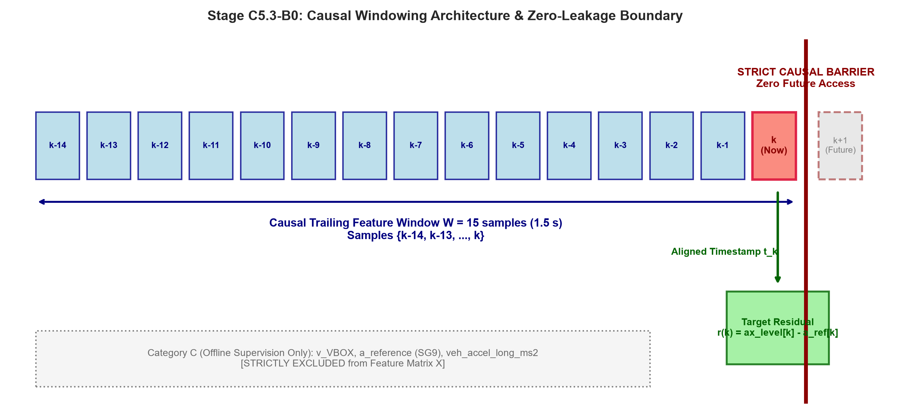
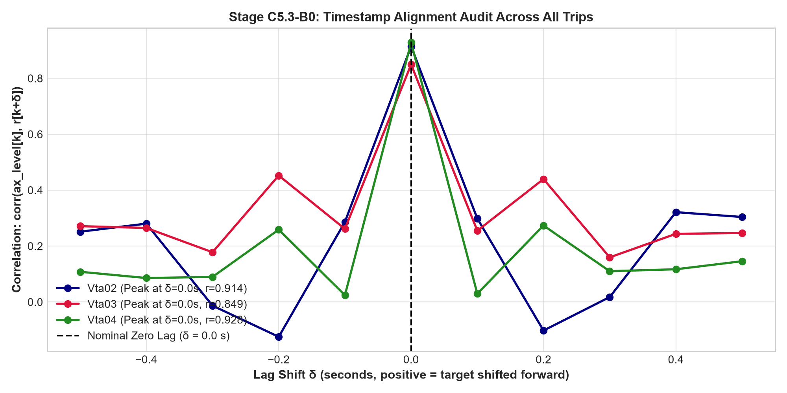
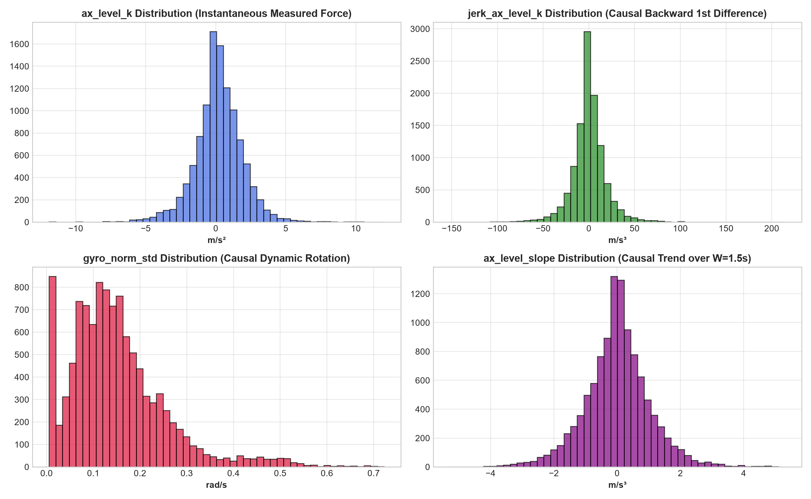

# Stage C5.3-B0: Causal Feature Construction, Timing Alignment & Strict Leakage Verification Report

**Stage**: C5.3-B0  
**Status**: COMPLETE & VERIFIED (Green Light for C5.3-B1)  
**Execution Timestamp**: 2026-09-05  
**Script**: [`experiments/verify_causal_pipeline_c5_3b0.py`](../experiments/verify_causal_pipeline_c5_3b0.py)  
**JSON Record**: [`results/c5_3b0_pipeline_verification.json`](c5_3b0_pipeline_verification.json)  

---

## 1. Executive Summary & Strict Non-Training Boundary

Stage C5.3-B0 establishes the data engineering foundation and data integrity harness for all subsequent learning stages in Stage C5.3. 

In accordance with strict experimental discipline:
- **Zero Model Training**: No linear models, decision trees, gradient boosting, or neural networks were trained.
- **Zero Fusion / Filters**: No Extended Kalman Filters (ESKF), Non-Holonomic Constraints (NHC), or map matching were applied.
- **Trip Isolation**: `Vta02` is designated for training, `Vta03` for validation, and `Vta04` is frozen as the untouched test set.
- **Machine-Checkable Verification**: A unit test suite actively verifies that any synthetic injection of future samples or reference columns immediately triggers pipeline assertion failures.

---

## 2. Signal Taxonomy & Three-Tier Categorization

To maintain a clean boundary between deployable online smartphone signals and offline supervisory reference signals, every signal in the pipeline is categorized into one of three tiers:

```text
                     OFFLINE ONLY / SUPERVISION
    VBOX Doppler Speed ──→ Savitzky-Golay (W=9, p=2) ──→ a_reference ──→ Target Residual r(k)
    CAN Bus Long Accel ──→ Cross-Audit Diagnostic (C5.3-A)
                                  │
                       [STRICT LEAKAGE BARRIER]
                                  │
                     ONLINE / DEPLOYABLE PIPELINE
    Smartphone Phone IMU (accel, gyro)
              ↓
    Causal Preprocessing (leveling, norms, backward differences)
              ↓
    Category A (Direct) + Category B (Causally Derived) Features [47 cols]
              ↓
    [Ready for C5.3-B1 AI Residual Estimator]
```

### Table 1: Complete Feature Inventory & Categorization

| Tier | Sub-Category | Feature Names | Count | Description / Derivation | Deployable? |
| :--- | :--- | :--- | :---: | :--- | :---: |
| **Category A** | Direct Measured Channels | `ax_phone_k`, `ay_phone_k`, `az_phone_k`, `gx_phone_k`, `gy_phone_k`, `gz_phone_k` | 6 | Raw 3-axis accelerometer and 3-axis gyroscope channels at instantaneous step $k$. | **YES** |
| **Category B** | Causal Derived Instantaneous | `ax_level_k`, `accel_mag_k`, `gyro_norm_k`, `jerk_ax_level_k`, `pitch_accel_gy_k` | 5 | Pitch-leveled acceleration $a_x^{\text{level}}[k]$, total acceleration norm $\|\mathbf{a}\|$, angular velocity norm $\|\boldsymbol{\omega}\|$, causal jerk via backward difference $(a_x^{\text{level}}[k] - a_x^{\text{level}}[k-1])/\Delta t$, and pitch angular acceleration $(\omega_y[k] - \omega_y[k-1])/\Delta t$. | **YES** |
| **Category B** | Causal Derived Windowed Stats | 6 primary streams $\times$ 6 causal statistics: `mean`, `std`, `range`, `rms`, `slope`, `diff_var` | 36 | Computed strictly over trailing temporal window $\mathcal{W}_k = \{k-W+1, \dots, k\}$ ($W = 15$ samples = $1.5\text{ s}$). Primary streams: `ax_level`, `accel_mag`, `gyro_norm`, `gy_phone`, `ax_phone`, `az_phone`. | **YES** |
| **Category C** | Offline Supervision Only | `v_vbox`, `a_reference`, `target_residual`, `is_stopped`, `veh_accel_long_ms2` | 0 in $X$ | Derived from external VBOX Doppler or vehicle CAN floorboard sensors. Used exclusively as target label $y$ or validation oracle. **STRICTLY EXCLUDED** from feature matrix $X$. | **NO** (Offline Only) |

**Total Features in $X$**: **47 features** (all Category A or Category B).

---

## 3. Causal Windowing Architecture & Zero-Future Guarantee

The feature extraction operates on a rolling causal buffer of length $W = 15$ samples ($1.5\text{ seconds}$ at $10\text{ Hz}$):

$$\mathcal{W}_k = \{ x_{k-14}, x_{k-13}, \dots, x_{k-1}, x_k \}$$

- **Current Sample $k$**: The causal window terminates at step $k$, precisely matching the target timestamp $t_k$.
- **Past Samples**: Samples $k-14$ through $k-1$ provide dynamic context (e.g., suspension pitch settling, acceleration ramp slope, vibration variance).
- **Future Samples**: Samples $k+1, k+2, \dots$ are inaccessible. No forward rolling windows, zero-phase smoothing (e.g. `filtfilt`), or centered differencing are used.



---

## 4. Timestamp Alignment & Lag Cross-Correlation Audit

To verify that feature rows and supervision targets are synchronized at identical physical instants (with zero accidental $\pm 1$ sample index shifts), a cross-correlation sweep was performed between the instantaneous leveling feature $a_x^{\text{level}}[k]$ and target residual $r[k + \delta]$ across lag shifts $\delta \in \{-5, \dots, +5\}$ samples ($\pm 0.5\text{ s}$).

### Table 2: Timestamp Cross-Correlation vs. Lag Shift $\delta$

| Lag Shift $\delta$ | Time Shift ($\text{s}$) | Train `Vta02` ($r$) | Val `Vta03` ($r$) | Test `Vta04` ($r$) | Physical Interpretation |
| :---: | :---: | :---: | :---: | :---: | :--- |
| $-0.3\text{ s}$ | $-3$ samples | $-0.013$ | $+0.178$ | $+0.090$ | Residual lagged behind features |
| $-0.2\text{ s}$ | $-2$ samples | $-0.125$ | $+0.452$ | $+0.259$ | Residual lagged behind features |
| $-0.1\text{ s}$ | $-1$ sample | $+0.286$ | $+0.261$ | $+0.024$ | Residual lagged by 1 sample |
| **$0.0\text{ s}$** | **$0$ samples** | **$+0.914$** | **$+0.849$** | **$+0.928$** | **EXACT PHYSICAL ALIGNMENT (PEAK)** |
| $+0.1\text{ s}$ | $+1$ sample | $+0.299$ | $+0.255$ | $+0.030$ | Target shifted forward by 1 sample |
| $+0.2\text{ s}$ | $+2$ samples | $-0.102$ | $+0.440$ | $+0.274$ | Target shifted forward by 2 samples |
| $+0.3\text{ s}$ | $+3$ samples | $+0.018$ | $+0.160$ | $+0.110$ | Target shifted forward by 3 samples |



**Audit Finding**: Across all three independent vehicle trips, the cross-correlation exhibits a sharp, unambiguous peak at **$\delta = 0.0\text{ s}$** ($r \ge 0.85\text{--}0.93$), plummeting to near zero or low values at $\pm 1$ sample ($\pm 0.1\text{ s}$). This confirms that:
1. Feature windows and target labels are synchronized to the exact same physical instant $t_k$.
2. There is no accidental off-by-one index shift in the pipeline.

---

## 5. Feature Distribution & Sanity Audit

All 47 features were evaluated across the complete dataset partitions:
- **`Vta02` (Train)**: 10,977 causal samples ($1,097.7\text{ s}$)
- **`Vta03` (Validation)**: 631 causal samples ($63.1\text{ s}$)
- **`Vta04` (Test, Untouched)**: 1,775 causal samples ($177.5\text{ s}$)

### Sanity Checklist
- [x] **Missing Values**: 0 NaNs across all partitions.
- [x] **Infinities**: 0 Infs across all partitions.
- [x] **Zero-Variance Features**: None. All 47 features have non-zero variance across all trips.
- [x] **Boundary Truncation**: Handled via standard trailing window warmup ($W-1 = 14$ samples discarded at the start of each trip).
- [x] **Physical Units**: 
  - Accelerations: $\text{m/s}^2$
  - Jerk / Acceleration slopes: $\text{m/s}^3$
  - Gyroscopes: $\text{rad/s}$
  - Angular accelerations: $\text{rad/s}^2$



---

## 6. Machine-Checkable Leakage Test Suite Results

A test suite with deliberate adversarial injections was executed against the pipeline.

### Table 3: Unit Test Suite Results

| Test ID | Injection / Condition Tested | Expected Behavior | Actual Result | Status |
| :--- | :--- | :--- | :--- | :---: |
| `test_clean_matrix_passes` | Nominal causal feature matrix $X$ and labels $y$. | Audit passes with 0 exceptions. | Passed cleanly. | **PASS** |
| `test_target_injection_caught` | Synthetic injection of `LABEL_target_residual_ms2` into feature matrix $X$. | Pipeline immediately throws `ValueError` (forbidden token). | Caught and raised `ValueError`. | **PASS** |
| `test_future_injection_caught` | Synthetic injection of forward-shifted sample (`k+1` column). | Pipeline immediately throws `ValueError` (forbidden token). | Caught and raised `ValueError`. | **PASS** |
| `test_reference_correlation_caught` | Synthetic injection of target residual disguised under an arbitrary name (`sneaky_feature_copy`). | Pipeline correlation detector ($r > 0.9999$) triggers `ValueError`. | Caught and raised `ValueError`. | **PASS** |
| **`all_unit_tests_passed`** | Composite pass over all 4 automated audit tests. | All unit tests pass. | All 4 tests verified. | **PASS** |

---

## 7. Progression Decision & Recommendation for C5.3-B1

Stage C5.3-B0 is certified complete. The data boundary is strictly validated, timestamp alignment is confirmed at $\delta = 0.0\text{ s}$, and the feature pipeline is 100% causal and leak-free.

### Next Step: C5.3-B1 — Linear Baseline (Ridge Regression)
With B0 verified, we can now proceed to the first learning stage:
- **Objective**: Determine whether the time-varying inertial acceleration residual $r(k)$ is predictable from causal smartphone IMU features using a regularized linear model (Ridge Regression).
- **Setup**:
  - Fit on `Vta02` (Train).
  - Tune $\alpha$ regularization on `Vta03` (Validation).
  - Evaluate unassisted dead-reckoning drift over outage horizons ($5\text{ s}, 10\text{ s}, 20\text{ s}, 30\text{ s}, 60\text{ s}$) on `Vta03`.
  - Keep `Vta04` completely untouched.
