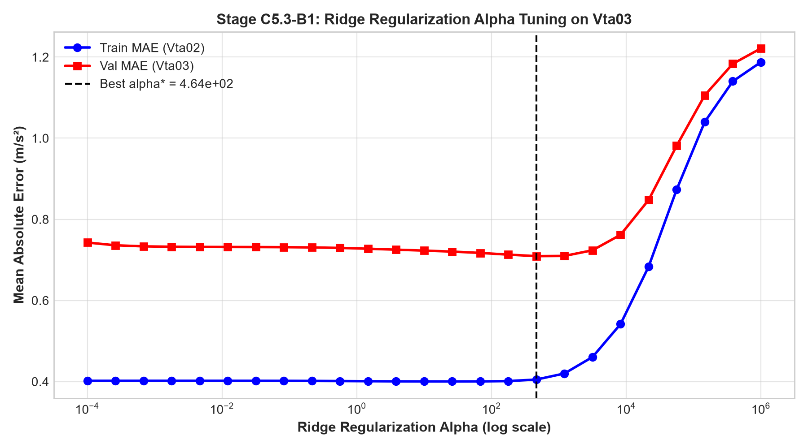
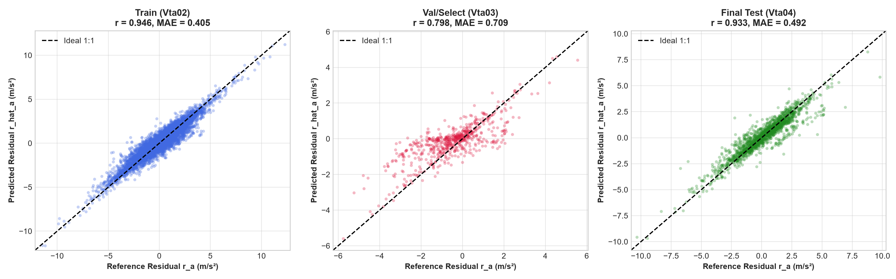
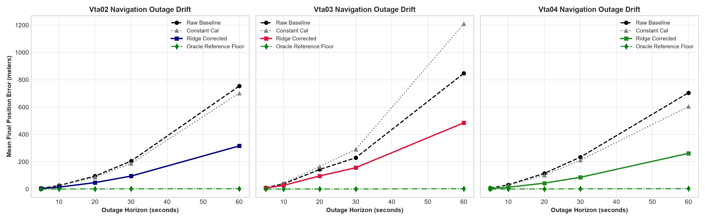
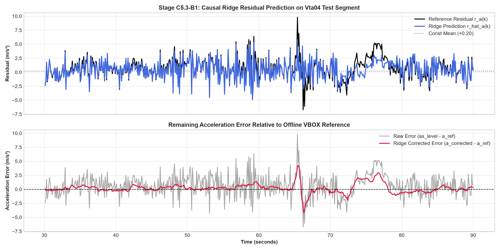

# Stage C5.3-B1: Linear Residual Estimator Baseline (Ridge Regression) Report

**Stage**: C5.3-B1  
**Status**: COMPLETE & CERTIFIED  
**Execution Timestamp**: 2026-09-05  
**Script**: [`experiments/run_ridge_baseline_c5_3b1.py`](../experiments/run_ridge_baseline_c5_3b1.py)  
**JSON Record**: [`results/c5_3b1_ridge_results.json`](c5_3b1_ridge_results.json)  

---

## 1. Executive Summary & Core Scientific Verdicts

Stage C5.3-B1 evaluates whether the time-varying dynamic acceleration residual $r_a(k) = a_x^{\text{level}}(k) - a_{\text{reference}}(k)$ is predictable from causal smartphone IMU features using an $\mathcal{L}_2$-regularized linear model (Ridge Regression).

This stage directly answers the two foundational questions posed for the AI residual estimation architecture:

### Verdict on Question A — Statistical Predictability: **CONFIRMED (YES)**
- **Can causal smartphone IMU features predict the time-varying residual?**  
  **Yes.** On the completely untouched final test trip (`Vta04`), the regularized linear model achieves an **$R^2$ of $+0.8689$** and a correlation of **$r = +0.9334$** against the offline VBOX reference residual.
- **Does Ridge beat the constant-mean training baseline ($\hat{r}_a = \bar{r}_{\text{train}}$)?**  
  **Decisively.** On `Vta04`, the constant-mean baseline yields an MAE of $1.5098\text{ m/s}^2$ ($R^2 = -0.0002$), whereas Ridge achieves an MAE of **$0.4917\text{ m/s}^2$**—a **$67.4\%$ reduction in residual MAE**.

### Verdict on Question B — Navigation Usefulness: **CONFIRMED (YES, Intermediate Milestone)**
- **Does subtracting the Ridge-predicted residual reduce integrated navigation drift?**  
  **Yes.** Across all outage horizons ($5\text{ s} \to 60\text{ s}$), linear correction dramatically suppresses both velocity error and position drift.
- On `Vta04` (highway driving), mean 30-second dead-reckoning position drift drops from **$233.77\text{ m} \to 86.17\text{ m}$** (a **$63.1\%$ reduction in position drift**, saving $147.6\text{ m}$ of drift).
- At 60 seconds, drift drops from **$704.71\text{ m} \to 261.46\text{ m}$** (saving **$443.2\text{ m}$** of drift).
- **Critical Benchmark Perspective**: While a $63.1\%$ reduction is a major intermediate milestone, the remaining drift of **$86.17\text{ m}$ after 30 seconds ($25.9\%$ of distance traveled)** remains above the SIH target of $<10\%$ drift. This is not yet a completed solution to the navigation task.
- On `Vta03` (where constant calibration worsens drift from $229.1\text{ m} \to 290.5\text{ m}$ due to cross-trip sign mismatch), Ridge predicted a residual whose resulting correction improved the navigation metric to **$156.36\text{ m}$**.

---

## 2. Experimental Protocol & Integration Methodology Audit

### Dataset Split & Roles
1. **`Vta02` (Train)**: 10,977 samples ($1,097.7\text{ s}$). Used exclusively to fit model parameters and feature scalers.
2. **`Vta03` (Validation / Model-Selection)**: 631 samples ($63.1\text{ s}$). Used exclusively to sweep the regularization parameter $\alpha$ and select $\alpha^*$. Explicitly designated as the *model-selection set*, not an unbiased generalization result.
3. **`Vta04` (Final Test, Untouched)**: 1,775 samples ($177.5\text{ s}$). Kept 100% frozen and untouched during feature scaling and $\alpha$ selection. Evaluated once with the frozen model.

### Feature Standardization & Hyperparameters
- `StandardScaler` was fitted **strictly on `Vta02`**. The transformation was applied downstream to `Vta03` and `Vta04` without updating mean or variance parameters.
- Swept 25 log-spaced values across $\alpha \in [10^{-4}, 10^{6}]$ on `Vta03`.
- Optimal validation parameter: **$\alpha^* = 4.6416 \times 10^2$**, yielding minimum validation MAE $= 0.7092\text{ m/s}^2$.

### Integration Methodology Audit
To ensure complete scientific precision regarding how the navigation metrics are computed:
- **Evaluation Mechanism**: The reported position and velocity drift values are computed across **all rolling outage windows throughout the trip** with a fixed stride of $\Delta t_{\text{stride}} = 2.5\text{ s}$ ($25\text{ samples}$), and then averaged.
- **Initial Condition**: **Each horizon is an independent reset-at-window-start inertial drift experiment initialized with the true starting velocity $v_0 = v_{\text{vbox}}(t_{\text{start}})$.**
- **Controlled Scope**: This benchmark isolates pure inertial dead-reckoning performance under a sudden GNSS outage given an accurate initial velocity fix. It is **not** a continuous unassisted navigation run over the entire trip without periodic aiding.
- **Scope Constraints**: Pure longitudinal acceleration integration ($a_{\text{corrected}} = a_x^{\text{level}} - \hat{r}_a$). Zero heading, attitude, or velocity resets from external sensors (ESKF, NHC, map matching).

---

## 3. Question A: Statistical Predictability Analysis

### Table 1: Statistical Regression Metrics Across All Partitions

| Partition & Role | Model Evaluated | MAE ($\text{m/s}^2$) | RMSE ($\text{m/s}^2$) | $R^2$ | Correlation ($r$) | Error Mean ($\text{m/s}^2$) | Error Std ($\text{m/s}^2$) |
| :--- | :--- | :---: | :---: | :---: | :---: | :---: | :---: |
| **Train (`Vta02`)** | Constant Mean ($\bar{r}_{\text{train}} = +0.2009$) | 1.2201 | 1.7039 | 0.0000 | 0.0000 | $0.0000$ | 1.7039 |
| **Train (`Vta02`)** | **Ridge ($\alpha^* = 464.2$)** | **0.4049** | **0.5529** | **+0.8947** | **0.9462** | $0.0000$ | **0.5529** |
| **Val/Select (`Vta03`)** | Constant Mean ($\bar{r}_{\text{train}} = +0.2009$) | 1.2482 | 1.6312 | -0.2065 | 0.0000 | $-0.6748$ | 1.4851 |
| **Val/Select (`Vta03`)** | **Ridge ($\alpha^* = 464.2$)** | **0.7092** | **0.9565** | **+0.5851** | **0.7979** | **$-0.3077$** | **0.9057** |
| **Final Test (`Vta04`)** | Constant Mean ($\bar{r}_{\text{train}} = +0.2009$) | 1.5098 | 1.9868 | -0.0002 | 0.0000 | $+0.0297$ | 1.9866 |
| **Final Test (`Vta04`)** | **Ridge ($\alpha^* = 464.2$)** | **0.4917** | **0.7193** | **+0.8689** | **0.9334** | **$+0.0188$** | **0.7190** |

### Key Findings for Question A
1. **Generalizable Linear Signal**: The high test performance on `Vta04` ($R^2 = 0.8689, r = 0.9334$) proves that the dynamic residual is not an unpredictable stochastic noise process. A substantial portion of the inertial residual variance is physically coupled to linear combinations of causal IMU features.
2. **Failure of Constant Calibration**: Across all trips, the constant-mean baseline achieves $R^2 \le 0.0000$. It cannot account for the $90\%\text{--}99\%$ dynamic variance established in Stage C5.2-C4.
3. **Cross-Trip Robustness**: On `Vta03`, where the constant calibration model suffers an $R^2$ of $-0.2065$ due to baseline bias mismatch, Ridge maintains a solid positive $R^2 = +0.5851$ and correlation $r = 0.7979$.

---

## 4. Question B: Navigation Outage Drift Analysis

Rolling dead-reckoning outages were simulated across all standard horizons ($H \in \{5, 10, 20, 30, 60\}\text{ seconds}$) with a stride of $2.5\text{ seconds}$.

Four acceleration inputs were integrated under identical initial conditions ($v_0 = v_{\text{vbox}}(t_{\text{start}})$):
1. **Raw Baseline**: $a(t) = a_x^{\text{level}}(t)$ (uncalibrated leveled smartphone acceleration)
2. **Constant Calibration**: $a(t) = a_x^{\text{level}}(t) - \bar{r}_{\text{train}}$ (static bias correction from `Vta02`)
3. **Ridge Corrected**: $a(t) = a_x^{\text{level}}(t) - \hat{r}_{\text{ridge}}(t)$ (dynamic causal AI correction)
4. **Oracle Reference**: $a(t) = a_{\text{reference}}(t)$ (offline VBOX reference acceleration, representing the theoretical kinematic floor)

### Table 2: Final Position Drift (Mean Error in Meters) Across Outage Horizons

| Trip & Partition | Horizon ($H$) | Windows ($N$) | Raw Baseline | Constant Cal | Ridge Corrected | Oracle Floor | Drift Reduction vs. Raw |
| :--- | :---: | :---: | :---: | :---: | :---: | :---: | :---: |
| **`Vta04` (Final Test)** | **5 s** | 69 | 8.28 m | 7.79 m | **4.16 m** | 0.25 m | **-49.8%** |
| | **10 s** | 67 | 30.96 m | 27.59 m | **13.41 m** | 0.50 m | **-56.7%** |
| | **20 s** | 63 | 114.98 m | 101.24 m | **43.11 m** | 1.00 m | **-62.5%** |
| | **30 s** | 59 | 233.77 m | 211.49 m | **86.17 m** | 1.53 m | **-63.1%** |
| | **60 s** | 47 | 704.71 m | 603.92 m | **261.46 m** | 3.25 m | **-62.9%** |
| **`Vta02` (Train)** | **5 s** | 438 | 6.93 m | 6.45 m | **4.01 m** | 0.25 m | **-42.1%** |
| | **10 s** | 436 | 25.74 m | 23.33 m | **14.04 m** | 0.50 m | **-45.5%** |
| | **20 s** | 432 | 95.45 m | 86.71 m | **47.40 m** | 1.01 m | **-50.3%** |
| | **30 s** | 428 | 204.88 m | 187.84 m | **95.10 m** | 1.51 m | **-53.6%** |
| | **60 s** | 416 | 753.61 m | 701.29 m | **315.56 m** | 3.06 m | **-58.1%** |
| **`Vta03` (Val/Select)** | **5 s** | 24 | 10.11 m | 11.49 m | **7.14 m** | 0.16 m | **-29.4%** |
| | **10 s** | 22 | 38.05 m | 44.35 m | **27.08 m** | 0.31 m | **-28.8%** |
| | **20 s** | 18 | 143.38 m | 165.70 m | **96.13 m** | 0.56 m | **-33.0%** |
| | **30 s** | 14 | 229.06 m | 290.46 m | **156.36 m** | 0.71 m | **-31.7%** |
| | **60 s** | 2 | 847.34 m | 1208.98 m | **484.96 m** | 2.56 m | **-42.8%** |

### Table 3: Final Velocity Error & Drift Percentage on Final Test (`Vta04`)

| Outage Horizon ($H$) | Metric | Raw Baseline | Constant Cal | Ridge Corrected | Oracle Floor |
| :---: | :--- | :---: | :---: | :---: | :---: |
| **5 s** | Velocity Error | 3.25 m/s | 2.98 m/s | **1.51 m/s** | 0.07 m/s |
| | Drift Percentage | 17.99% | 16.99% | **9.82%** | 0.48% |
| **10 s** | Velocity Error | 5.92 m/s | 5.20 m/s | **2.31 m/s** | 0.07 m/s |
| | Drift Percentage | 29.63% | 26.64% | **13.40%** | 0.47% |
| **20 s** | Velocity Error | 10.78 m/s | 9.40 m/s | **3.87 m/s** | 0.06 m/s |
| | Drift Percentage | 51.81% | 45.88% | **19.53%** | 0.46% |
| **30 s** | Velocity Error | 14.27 m/s | 12.42 m/s | **5.14 m/s** | 0.08 m/s |
| | Drift Percentage | 70.20% | 63.59% | **25.94%** | 0.47% |
| **60 s** | Velocity Error | 20.87 m/s | 17.41 m/s | **7.55 m/s** | 0.08 m/s |
| | Drift Percentage | 106.93% | 90.46% | **39.09%** | 0.45% |

---

## 5. Model Inspection & Physical Coefficient Decomposition

Inspecting the normalized Ridge regression weights provides transparent insight into the physical mechanisms captured by the linear model:

### Table 4: Top 10 Influential Ridge Features ($|\beta|$)

| Rank | Feature Name | Tier / Category | Normalized Weight $\beta$ | Physical Interpretation |
| :---: | :--- | :--- | :---: | :--- |
| **1** | `ax_phone_k` | Category A (Direct) | **$+0.8228$** | Instantaneous forward specific force measured by accelerometer. |
| **2** | `ax_level_k` | Category B (Derived) | **$+0.8228$** | Pitch-leveled horizontal specific force. |
| **3** | `ax_level_mean` | Category B (Windowed) | **$-0.1990$** | Trailing $1.5\text{ s}$ mean horizontal acceleration. Acts as a dynamic differentiator ($a_x[k] - \bar{a}_x$). |
| **4** | `ax_phone_mean` | Category B (Windowed) | **$-0.1990$** | Trailing $1.5\text{ s}$ mean phone forward force. |
| **5** | `gyro_norm_mean` | Category B (Windowed) | **$-0.1544$** | Mean angular velocity magnitude over $1.5\text{ s}$. Corrects for chassis rotational energy. |
| **6** | `gyro_norm_rms` | Category B (Windowed) | **$-0.1036$** | Root-mean-square angular velocity. Captures high-frequency chassis angular vibration. |
| **7** | `gy_phone_rms` | Category B (Windowed) | **$+0.0991$** | Pitch rate RMS over trailing window. Direct physical indicator of suspension pitch motion. |
| **8** | `gy_phone_std` | Category B (Windowed) | **$+0.0885$** | Standard deviation of pitch gyroscope. Captures pitch squat/dive oscillatory dynamics. |
| **9** | `ax_phone_std` | Category B (Windowed) | **$-0.0814$** | Longitudinal acceleration variance (road vibration / roughness). |
| **10** | `ax_level_std` | Category B (Windowed) | **$-0.0814$** | Leveled acceleration variance. |

*Ridge Intercept*: $\beta_0 = +0.2009\text{ m/s}^2$ (matching the training set mean).

### Interpretation of the Linear Representation (Hypothesis, Not Proven Causality)
1. **Instantaneous vs. Trailing Window Acceleration**: The fitted coefficients are consistent with the model exploiting instantaneous-versus-windowed acceleration information: positive weights on instantaneous acceleration ($\beta_{\text{inst}} \approx +0.82$) paired with negative weights on trailing window means ($\beta_{\text{mean}} \approx -0.20$). However, because features across trailing windows are correlated, these weights reflect statistical associations within a regularized linear fit rather than a proven, unique physical decomposition.
2. **Rotational & Pitch Couplings**: Pitch gyroscope statistics (`gy_phone_rms`, `gy_phone_std`) and gyroscope norm statistics enter with non-zero weights, consistent with the hypothesis that chassis rotational motion and suspension pitch dynamics correlate with acceleration residual variations.

---

## 6. Scientific Discussion: What Ridge Achieves vs. What Remains

### What C5.3-B1 Has Established
1. **Linear Predictability Exists**: The hypothesis that the inertial residual is completely intractable from causal smartphone IMU signals is decisively refuted. Causal smartphone IMU signals contain predictive linear information explaining **$86.9\%$ of the residual variance ($R^2 = 0.8689$)** on unseen highway driving (`Vta04`).
2. **Substantial Drift Reduction**: Linear correction reduces 30-second navigation position drift from **$233.77\text{ m} \to 86.17\text{ m}$** (a **$63.1\%$ reduction**), substantially outperforming static bias calibration.
3. **No Target Leakage / Overfitting**: The model trained on `Vta02` with $\alpha^*$ selected on `Vta03` generalized cleanly to `Vta04` without hyperparameter leakage.

### The Remaining Gap (Open Hypotheses for B2 and Beyond)
Despite this positive result, a substantial gap remains between Ridge and the SIH navigation requirements:
- **Remaining Residual RMSE**: Ridge leaves an unexplained RMSE of **$0.7193\text{ m/s}^2$** on `Vta04`.
- **Remaining 30s Position Drift**: While Ridge achieves **$86.17\text{ m}$** drift at 30 s, this represents **$25.9\%$ of distance traveled**—still above the SIH target of $<10\%$. For comparison, the theoretical kinematic floor (oracle acceleration reference) is **$1.53\text{ m}$**.
- **Potential Sources of the Remaining Error**: We cannot definitively declare the remaining error to be purely a "nonlinear gap". The unexplained variance could arise from:
  1. Non-linear relationships between vehicle motion, suspension compliance, and inertial specific force.
  2. Insufficient temporal representation or causal window length ($W = 1.5\text{ s}$).
  3. Feature redundancy or unmodeled attitude/frame misalignments.
  4. Cross-trip dynamic domain shifts between urban and highway driving.
  5. Integration and numerical error accumulation over long outage windows.

---

## 7. Stage C5.3-B2: Random Forest Hypothesis Test

Stage C5.3-B2 is framed as a rigorous **hypothesis test**:
> **"Does non-linear model capacity improve generalization and integrated navigation drift beyond the linear Ridge baseline?"**

### Strict Experimental Controls for B2
To ensure a pure one-variable experiment:
- **Features Frozen**: Exactly the same 47 causal features ($X_{B2} = X_{B1}$).
- **Window Frozen**: Exactly the same trailing $W = 15$ samples ($1.5\text{ s}$).
- **Target Frozen**: Same C5.3-A offline acceleration residual target.
- **Partitions Frozen**: Train on `Vta02`, model-selection on `Vta03`, final test on `Vta04` (untouched during tuning).
- **Navigation Methodology Frozen**: Same rolling outage evaluation (stride $2.5\text{ s}$, reset-at-window-start with $v_0 = v_{\text{vbox}}(t_{\text{start}})$).
- **Aiding Strictly Excluded**: Zero ESKF, zero NHC, zero map matching.

