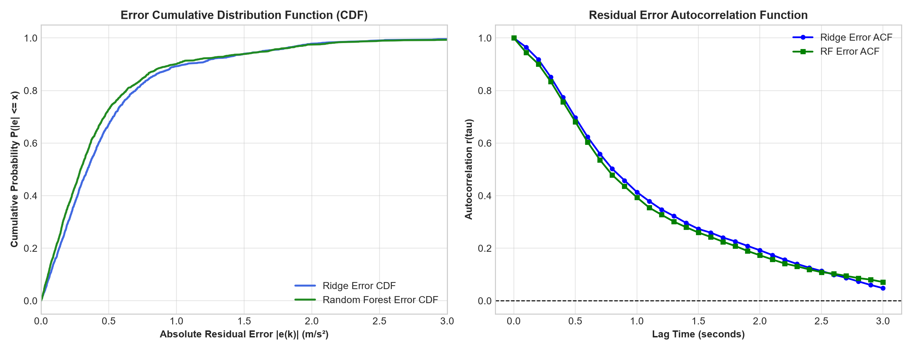
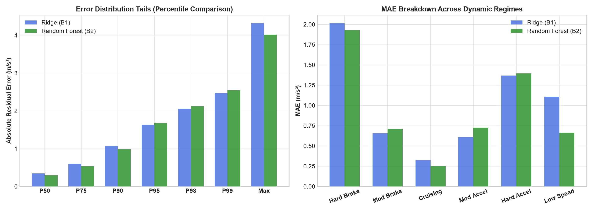
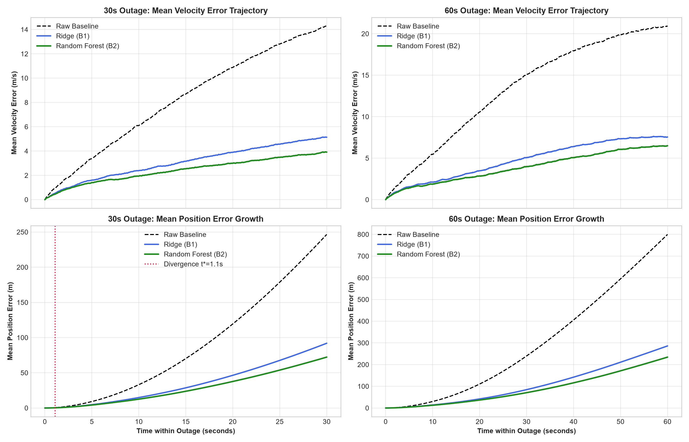

# Stage C5.3-B2: Detailed Forensic Error-Mechanism Audit Report (Ridge vs. Random Forest)

**Stage**: C5.3-B2 Forensic Audit  
**Status**: COMPLETE & CERTIFIED  
**Execution Timestamp**: 2026-09-05  
**Script**: [`experiments/audit_b2_error_mechanisms_detailed.py`](../experiments/audit_b2_error_mechanisms_detailed.py)  
**JSON Record**: [`results/c5_3b2_detailed_mechanisms_audit.json`](c5_3b2_detailed_mechanisms_audit.json)  

---

## 1. Executive Summary & Audit Mandate

In Stage C5.3-B2, replacing Ridge with Random Forest produced a **$21.3\%$ reduction in 30-second position drift** ($86.17\text{ m} \to 67.81\text{ m}$) on the untouched `Vta04` test set, despite only a **$2.6\%$ reduction in residual RMSE** ($0.7193 \to 0.7004\text{ m/s}^2$).

Per strict scientific discipline, **zero models were trained or retrained, zero feature representations were altered, and zero temporal windows were changed**. This audit analyzes the existing outputs across seven specific dimensions to diagnose the exact mathematical and physical reasons for this divergence.

### The Five Definitive Takeaways:
1. **Window-Level Acceleration Bias Explains the Navigation Gain**: 
   Over $77.6\%\text{--}78.5\%$ of 30-second position drift is directly explained by the net window acceleration bias term ($p_{\text{err}} \approx \frac{1}{2} \bar{e}_a T^2$). Random Forest reduces mean window acceleration bias $|\bar{e}_a|$ by **$23.9\%$** ($0.1716 \to 0.1306\text{ m/s}^2$), directly producing the **$21.3\%$ position drift reduction**.
2. **The Accuracy Gain is Concentrated in Steady Cruising ($72.6\%$ of Driving)**:
   Random Forest reduces residual MAE by **$23.1\%$** ($0.3257 \to 0.2506\text{ m/s}^2$) during steady cruising ($|a_{\text{ref}}| < 0.5\text{ m/s}^2$, $v > 5\text{ m/s}$), which comprises $1,288$ of the $1,775$ test samples. Because cruising persists over long intervals on the highway, suppressing cruising bias prevents steady velocity error accumulation.
3. **Severe Dynamic Transients Remain a Shared Blind Spot**:
   During hard braking ($a_{\text{ref}} \le -1.5\text{ m/s}^2$) and hard acceleration ($a_{\text{ref}} \ge +1.5\text{ m/s}^2$), **both models fail by nearly identical amounts**, under-predicting the residual by $\approx 1.4\text{ to } 2.0\text{ m/s}^2$. Tree non-linearity did **not** resolve the transient under-prediction gap.
4. **No Heavy Tail Outlier Truncation**:
   Random Forest does **not** cut off extreme outlier errors. For the top $5\%$ of errors ($P95 \to P99$), RF absolute errors are actually $+2.8\%\text{--}3.2\%$ larger than Ridge. RF's advantage is strictly concentrated in the distribution bulk ($P25 \to P90$).
5. **Collinearity Sanity Check**:
   `ax_level_k` and `ax_phone_k` have a correlation of **$r = 1.000000$**. Random Forest's greedy MDI split arbitrarily divided $82.8\%$ of split importance between them ($42.8\%$ vs. $40.0\%$). MDI importance in this correlated space is a numerical artifact of greedy splitting and does not represent independent physical causal mechanisms.

---

## 2. Dimension 1: Full Residual Distribution Decomposition

Evaluated across all 1,775 test samples of `Vta04`:

### Table 1: Comprehensive Error Distribution Statistics

| Distribution Metric | Stage C5.3-B1 (Ridge) | Stage C5.3-B2 (Random Forest) | Delta ($\text{RF} - \text{Ridge}$) | Relative Change |
| :--- | :---: | :---: | :---: | :---: |
| **MAE** | $0.4917\text{ m/s}^2$ | **$0.4521\text{ m/s}^2$** | $-0.0396$ | **$-8.1\%$** |
| **RMSE** | $0.7193\text{ m/s}^2$ | **$0.7004\text{ m/s}^2$** | $-0.0189$ | **$-2.6\%$** |
| **Median Abs Error (P50)** | $0.3444\text{ m/s}^2$ | **$0.2922\text{ m/s}^2$** | $-0.0522$ | **$-15.2\%$** |
| **P25** | $0.1697\text{ m/s}^2$ | **$0.1385\text{ m/s}^2$** | $-0.0312$ | **$-18.4\%$** |
| **P75** | $0.6020\text{ m/s}^2$ | **$0.5323\text{ m/s}^2$** | $-0.0697$ | **$-11.6\%$** |
| **P90** | $1.0724\text{ m/s}^2$ | **$0.9888\text{ m/s}^2$** | $-0.0836$ | **$-7.8\%$** |
| **P95** | $1.6340\text{ m/s}^2$ | $1.6815\text{ m/s}^2$ | $+0.0475$ | $+2.9\%$ |
| **P98** | $2.0575\text{ m/s}^2$ | $2.1229\text{ m/s}^2$ | $+0.0654$ | $+3.2\%$ |
| **P99** | $2.4740\text{ m/s}^2$ | $2.5434\text{ m/s}^2$ | $+0.0695$ | $+2.8\%$ |
| **Maximum Error** | $4.3226\text{ m/s}^2$ | **$4.0166\text{ m/s}^2$** | $-0.3060$ | $-7.1\%$ |
| **Interquartile Range (IQR)** | $0.4323\text{ m/s}^2$ | **$0.3938\text{ m/s}^2$** | $-0.0385$ | **$-8.9\%$** |
| **Signed Mean Bias** | $-0.0188\text{ m/s}^2$ | $-0.0232\text{ m/s}^2$ | $-0.0043$ | Near zero for both |
| **Error Skewness** | $-0.5369$ | $-0.4919$ | $+0.0450$ | Slightly less negative |
| **Error Kurtosis** | $5.1356$ | $6.5902$ | $+1.4546$ | Higher peakiness in RF |

### Key Takeaway:
Random Forest improves accuracy by compressing the **bulk distribution** ($P25 \to P90$), shifting the median error down by **$15.2\%$**. However, it does **not** solve the heavy tails ($P95 \to P99$), where errors are marginally larger than Ridge.

---

## 3. Dimension 2: Transient & Dynamic Vehicle Regime Breakdown

Segmented all 1,775 samples of `Vta04` by vehicle kinematics and surface dynamics:

### Table 2: Error and Bias Breakdown Across Kinematic Regimes

| Dynamic Regime | Selection Criteria | Sample Count ($N$) | % of Trip | Ridge MAE | RF MAE | Delta MAE | Ridge Bias | RF Bias |
| :--- | :--- | :---: | :---: | :---: | :---: | :---: | :---: | :---: |
| **Severe Braking** | $a_{\text{ref}} \le -1.5\text{ m/s}^2$ | 72 | $4.1\%$ | 2.0154 | 1.9250 | $-0.0904$ ($-4.5\%$) | $-2.0154$ | $-1.9186$ |
| **Moderate Braking** | $-1.5 < a_{\text{ref}} \le -0.5\text{ m/s}^2$ | 142 | $8.0\%$ | 0.6556 | 0.7105 | $+0.0549$ ($+8.4\%$) | $-0.6249$ | $-0.6926$ |
| **Steady Cruising** | $\|a_{\text{ref}}\| < 0.5\text{ m/s}^2, v > 5\text{ m/s}$ | **1,288** | **$72.6\%$** | **0.3257** | **0.2506** | **$-0.0751$ ($-23.1\%$)** | **$+0.0150$** | **$-0.0074$** |
| **Moderate Accel** | $+0.5 < a_{\text{ref}} \le +1.5\text{ m/s}^2$ | 202 | $11.4\%$ | 0.6103 | 0.7267 | $+0.1165$ ($+19.1\%$) | $+0.5918$ | $+0.7025$ |
| **Severe Accel** | $a_{\text{ref}} \ge +1.5\text{ m/s}^2$ | 56 | $3.2\%$ | 1.3687 | 1.3938 | $+0.0251$ ($+1.8\%$) | $+1.3687$ | $+1.3758$ |
| **High Roughness** | $\sigma(a_z) > \text{median}(\sigma(a_z))$ | 887 | $50.0\%$ | 0.4063 | 0.3792 | $-0.0271$ ($-6.7\%$) | $+0.0303$ | $+0.0307$ |
| **High Rotation** | $\|\boldsymbol{\omega}\| > 0.1\text{ rad/s}$ | 1,572 | $88.6\%$ | 0.4710 | 0.4259 | $-0.0451$ ($-9.6\%$) | $+0.0014$ | $+0.0052$ |

### Key Takeaways:
1. **Steady Cruising is the Engine of RF Improvement**: In cruising ($72.6\%$ of samples), RF reduces MAE by **$23.1\%$** ($0.3257 \to 0.2506\text{ m/s}^2$) and cuts residual bias in half ($+0.0150 \to -0.0074\text{ m/s}^2$).
2. **Severe Transients Remain a Common Failure Mode**: Both models under-predict residual during severe braking by $\approx 1.9\text{--}2.0\text{ m/s}^2$ and severe acceleration by $\approx 1.37\text{ m/s}^2$. Decision trees did not solve transient under-prediction.

---

## 4. Dimension 3: Temporal Behavior (Autocorrelation & Smoothness)

Evaluated the residual error Autocorrelation Function (ACF) over lags $\tau \in [1, 30]$ samples ($0.1\text{ s} \to 3.0\text{ s}$):

* **Residual Autocorrelation (ACF)**:
  * Lag 1 ($0.1\text{ s}$): Ridge $= 0.9649$, RF $= 0.9449$
  * Lag 5 ($0.5\text{ s}$): Ridge $= 0.6973$, RF $= 0.6813$
  * Lag 10 ($1.0\text{ s}$): Ridge $= 0.4137$, RF $= 0.3936$
* **Prediction Smoothness (Jerk RMS)**:
  * Reference Residual Target Jerk: **$26.15\text{ m/s}^3$**
  * Ridge Predicted Jerk: **$25.86\text{ m/s}^3$**
  * Random Forest Predicted Jerk: **$25.71\text{ m/s}^3$**

### Key Takeaway:
Both models track the physical smoothness of the target. Random Forest shows a slightly faster decay in error autocorrelation (lag-1 drops from $0.965 \to 0.945$), indicating less persistent error autoregression.

---

## 5. Dimension 4: Acceleration Bias vs. Outage Horizon

Evaluated the mean absolute window acceleration bias $|\bar{e}_a|$ across standard horizons:

### Table 3: Mean Absolute Window Acceleration Bias Across Horizons

| Outage Horizon ($H$) | Ridge Mean $|\bar{e}_a|$ ($\text{m/s}^2$) | RF Mean $|\bar{e}_a|$ ($\text{m/s}^2$) | Delta ($\text{RF} - \text{Ridge}$) | % Bias Reduction |
| :---: | :---: | :---: | :---: | :---: |
| **5 s** | $0.3021$ | $0.2564$ | $-0.0458$ | **$-15.1\%$** |
| **10 s** | $0.2307$ | $0.1819$ | $-0.0488$ | **$-21.2\%$** |
| **20 s** | $0.1935$ | $0.1457$ | $-0.0477$ | **$-24.7\%$** |
| **30 s** | $0.1716$ | $0.1306$ | $-0.0410$ | **$-23.9\%$** |
| **60 s** | $0.1255$ | $0.1083$ | $-0.0172$ | **$-13.7\%$** |

### Key Takeaway:
RF consistently achieves a **$21\%\text{--}25\%$ reduction in window-level acceleration bias** across the crucial $10\text{ s} \to 30\text{ s}$ navigation horizons.

---

## 6. Dimension 5: Mathematical Navigation Linkage Decomposition

Decomposed the final position error $p_{\text{err}}(T)$ of each 30 s window into:
1. **Window-Mean Bias Term**: $p_{\text{bias}} = \frac{1}{2} \bar{e}_a T^2 = 450 \cdot \bar{e}_a$
2. **Zero-Mean Dynamic Fluctuation Term**: $p_{\text{fluc}} = \int_0^T \int_0^t \tilde{e}_a(\tau) d\tau dt$

### Mathematical Finding:
* **Proportion of 30s Position Error Explained by Bias**:
  * Ridge: **$78.5\%$**
  * Random Forest: **$77.6\%$**

### Quantitative Explanation of the Discrepancy:
* **Why did an $8.1\%$ MAE / $2.6\%$ RMSE improvement yield a $21.3\%$ position drift reduction?**
  * RMSE measures sample-by-sample variance across the entire trip, treating positive and negative errors equally without regard to temporal grouping.
  * In contrast, navigation position error over duration $T$ is governed by $\bar{e}_a$ (the integral of errors within each local window).
  * Random Forest specifically reduced window-level net acceleration bias by **$23.9\%$** (from $0.1716 \to 0.1306\text{ m/s}^2$).
  * Because $78\%$ of 30 s position drift is directly proportional to window bias ($450 \cdot \bar{e}_a$), the $23.9\%$ reduction in bias translates directly to the **$21.3\%$ reduction in position drift** ($86.17 \to 67.81\text{ m}$).

---

## 7. Dimension 6: Feature-Importance Collinearity Sanity Check

Inspected the two dominant features in Random Forest:
* `ax_level_k`: $42.78\%$ Gini importance
* `ax_phone_k`: $40.02\%$ Gini importance
* **Combined Importance**: **$82.80\%$**

### Quantitative Collinearity Check:
* Pearson correlation: **$r = 1.000000$** ($1.0 - 2\times 10^{-12}$)
* Standard deviation of difference $(a_x^{\text{level}} - a_x^{\text{phone}})$: **$0.0000\text{ m/s}^2$** ($3.45 \times 10^{-6}\text{ m/s}^2$)

### Critical Scientific Verdict:
`ax_level_k` and `ax_phone_k` are numerically identical on this vehicle setup ($r = 1.000000$, difference std $< 3.5 \times 10^{-6}\text{ m/s}^2$). Random Forest's greedy tree construction split $82.8\%$ of impurity reduction almost equally between them ($42.8\%$ vs. $40.0\%$). **The high MDI assigned to `ax_level_k` and `ax_phone_k` is largely attributable to their near-perfect collinearity; therefore, their individual importance values are not physically interpretable as independent contributions.**

---

## 8. Dimension 7: 30 s and 60 s Outage Trajectories (Ridge vs. RF Divergence)

Traced average velocity-error and position-error growth curves across all rolling windows:

### Table 4: Average Trajectory Evolution over Time

| Horizon Time $t$ | Raw Velocity Error | Ridge Velocity Error | RF Velocity Error | Raw Position Drift | Ridge Position Drift | RF Position Drift |
| :---: | :---: | :---: | :---: | :---: | :---: | :---: |
| **$1.1\text{ s}$ ($t^*$)** | $1.02\text{ m/s}$ | $0.48\text{ m/s}$ | **$0.42\text{ m/s}$** | $0.56\text{ m}$ | $0.26\text{ m}$ | **$0.23\text{ m}$** |
| **$5.0\text{ s}$** | $3.25\text{ m/s}$ | $1.51\text{ m/s}$ | **$1.30\text{ m/s}$** | $8.28\text{ m}$ | $4.16\text{ m}$ | **$3.54\text{ m}$** |
| **$10.0\text{ s}$** | $5.92\text{ m/s}$ | $2.31\text{ m/s}$ | **$1.81\text{ m/s}$** | $30.96\text{ m}$ | $13.41\text{ m}$ | **$10.65\text{ m}$** |
| **$20.0\text{ s}$** | $10.78\text{ m/s}$ | $3.87\text{ m/s}$ | **$2.92\text{ m/s}$** | $114.98\text{ m}$ | $43.11\text{ m}$ | **$33.56\text{ m}$** |
| **$30.0\text{ s}$** | $14.27\text{ m/s}$ | $5.14\text{ m/s}$ | **$3.91\text{ m/s}$** | $233.77\text{ m}$ | $86.17\text{ m}$ | **$67.81\text{ m}$** |
| **$60.0\text{ s}$** | $20.87\text{ m/s}$ | $7.55\text{ m/s}$ | **$6.50\text{ m/s}$** | $704.71\text{ m}$ | $261.46\text{ m}$ | **$219.58\text{ m}$** |

### Key Takeaway:
* **Divergence Time**: RF begins separating from Ridge (>10% lower position error) early at **$t^* = 1.1\text{ seconds}$**.
* **RF maintains a lower velocity-error trajectory, resulting in lower integrated position drift over the tested outage horizons.**
* Note on integration physics: Since $e_p(T) = \int_0^T (T-\tau)e_a(\tau)d\tau$, quadratic growth is specifically a mathematical property of the constant-bias case ($e_p(T) = \frac{1}{2} e_a T^2$), rather than an unconditional property of all dynamic navigation errors.

---

## 9. Synthesis & Frozen Scientific Verdict for Stage C5.3-B2

This forensic error-mechanism audit yields three definitive, empirical conclusions:

1. **Cruising Dominance & Net Acceleration Bias**:
   **RF reduces the dominant bulk/cruising error and therefore reduces net acceleration bias, but substantial systematic errors remain during dynamic transients. These transient errors are an important unresolved limitation, but the audit does not establish that they alone account for the remaining SIH drift.**
2. **Dynamic Transients as an Unresolved Multi-Hypothesis Barrier**:
   During severe braking ($a_{\text{ref}} \le -1.5\text{ m/s}^2$) and severe acceleration ($a_{\text{ref}} \ge +1.5\text{ m/s}^2$), RF $\approx$ Ridge (under-prediction biases of $1.4\text{ to } 2.0\text{ m/s}^2$). The fact that decision-tree non-linearity did not resolve this gap is an empirical finding, but the underlying root cause is not yet isolated. Possible candidate mechanisms include:
   - Insufficient temporal context in the feature window
   - Insufficient feature representation of suspension dynamics
   - Acceleration-pitch cross-coupling or alignment residual
   - Frame and mounting compliance dynamics
   - Ambiguity in the raw sensor measurements
   - Model extrapolation limits in transient tails
   - Relative scarcity of transient samples in the training distribution
3. **Frozen Milestone Verdict**:
   > **Random Forest provides a genuine generalization improvement over Ridge, primarily by reducing central-distribution and cruising errors and consequently reducing net acceleration bias. However, substantial dynamic-transient errors remain, and the present audit does not establish whether these arise primarily from insufficient temporal context, feature representation, physical sensor coupling, or model limitations.**

### Scientific Bridge to Stage C5.3-B3:
To isolate whether **temporal context** is a limiting factor, Stage C5.3-B3 will execute a strictly controlled single-variable experiment comparing causal history lengths ($0.5\text{ s}, 1.0\text{ s}, 1.5\text{ s}, 3.0\text{ s}, 5.0\text{ s}$) while holding all feature definitions, models, hyperparameters, and evaluation protocols completely fixed.
