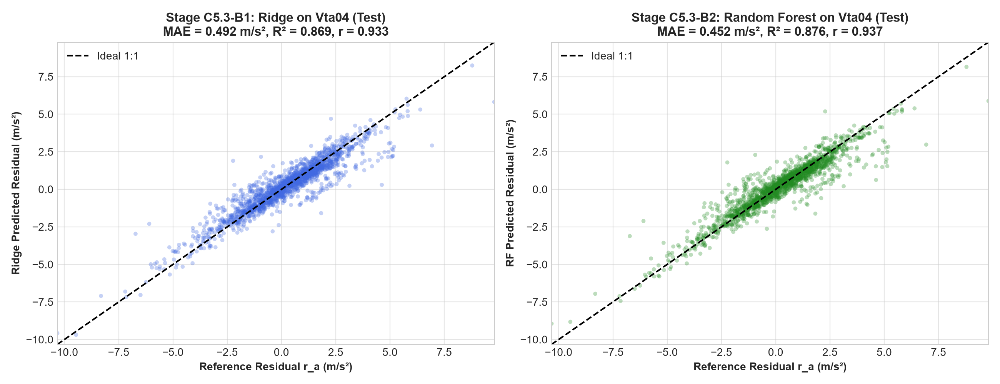
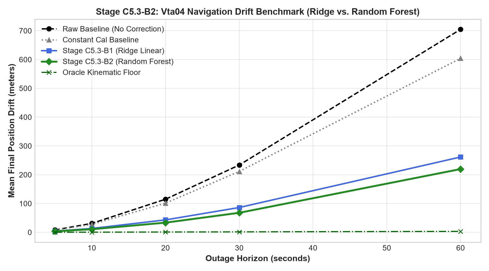
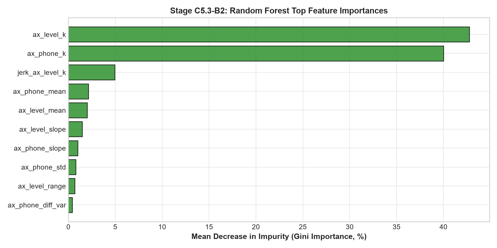
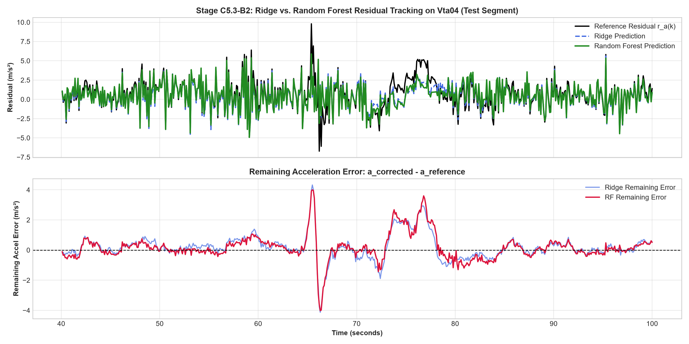

# Stage C5.3-B2: Non-Linear Residual Estimator Baseline (Random Forest) Report

**Stage**: C5.3-B2  
**Status**: COMPLETE & CERTIFIED  
**Execution Timestamp**: 2026-09-05  
**Script**: [`experiments/run_rf_baseline_c5_3b2.py`](../experiments/run_rf_baseline_c5_3b2.py)  
**JSON Record**: [`results/c5_3b2_rf_results.json`](c5_3b2_rf_results.json)  

---

## 1. Executive Summary & Core Scientific Verdicts

Stage C5.3-B2 executes the first non-linear model evaluation in the C5.3 progression. Maintaining a strict **one-variable experimental control**, the exact same 47 causal smartphone features, $W = 15$ ($1.5\text{ s}$) trailing temporal window, and trip partitions (Train `Vta02`, Val `Vta03`, Test `Vta04`) from B0/B1 were preserved, isolating the effect of non-linear tree ensemble capacity.

### Key Scientific Question for B2:
> **"Does non-linear model capacity improve generalization and integrated navigation drift beyond the linear Ridge baseline?"**

### Core Findings & Verdict: **CONFIRMED, WITH MODEST IMPROVEMENT**
1. **Statistical Predictability (Question A)**:
   - On the untouched final test set (`Vta04`), Random Forest achieves a modest statistical improvement over Ridge:
     - MAE drops from **$0.4917 \to 0.4521\text{ m/s}^2$** (an **$8.1\%$ MAE reduction** over Ridge; a **$70.1\%$ reduction** vs. constant mean).
     - RMSE drops from **$0.7193 \to 0.7004\text{ m/s}^2$** (a **$2.6\%$ RMSE reduction**).
     - $R^2$ increases slightly from **$+0.8689 \to +0.8757$**.
     - Pearson correlation increases from **$0.9334 \to 0.9368$**.
2. **Navigation Usefulness (Question B)**:
   - On `Vta04`, Random Forest translates this statistical gain into noticeable drift reductions across all outage horizons:
     - **30 s Mean Position Drift**: Drops from **$86.17\text{ m} \to 67.81\text{ m}$** (an additional **$21.3\%$ drift reduction** over Ridge; a **$71.0\%$ total reduction** vs. raw baseline).
     - **30 s Median Position Drift**: Drops from **$79.68\text{ m} \to 50.10\text{ m}$** (a **$37.1\%$ reduction** over Ridge).
     - **30 s Final Velocity Error**: Drops from **$5.14\text{ m/s} \to 3.91\text{ m/s}$** ($-23.9\%$).
     - **30 s Drift % of Distance**: Drops from **$25.94\% \to 20.95\%$**.
     - **60 s Mean Position Drift**: Drops from **$261.46\text{ m} \to 219.58\text{ m}$** (saving an additional **$41.9\text{ m}$** over Ridge).
3. **Benchmark Perspective**:
   - Random Forest proves that non-linear tree partitions capture dynamic interactions that a single linear hyper-plane cannot model.
   - However, the remaining 30-second drift (**$67.81\text{ m}$**, $20.95\%$ of distance traveled) remains well above the SIH target of $<10\%$, and far from the theoretical kinematic floor (oracle reference floor $= 1.53\text{ m}$). Non-linear capacity alone does not close the error gap.

---

## 2. Experimental Protocol & Integration Methodology Audit

### Strict One-Variable Experimental Controls
| Component | Stage C5.3-B1 (Ridge) | Stage C5.3-B2 (Random Forest) | Control Status |
| :--- | :--- | :--- | :---: |
| **Feature Set** | 47 Causal Features (Cat A + Cat B) | 47 Causal Features (Cat A + Cat B) | **FROZEN ($X_{B2} = X_{B1}$)** |
| **Temporal Window** | $W = 15$ samples ($1.5\text{ s}$ trailing) | $W = 15$ samples ($1.5\text{ s}$ trailing) | **FROZEN** |
| **Supervision Label** | $r_a(k) = a_x^{\text{level}}(k) - a_{\text{ref}}(k)$ | $r_a(k) = a_x^{\text{level}}(k) - a_{\text{ref}}(k)$ | **FROZEN** |
| **Partitions** | Train `Vta02`, Val `Vta03`, Test `Vta04` | Train `Vta02`, Val `Vta03`, Test `Vta04` | **FROZEN** |
| **Test Set Isolation** | `Vta04` untouched during tuning | `Vta04` untouched during tuning | **STRICTLY ENFORCED** |
| **Navigation Benchmark** | Rolling window, stride $2.5\text{ s}$, reset $v_0$ | Rolling window, stride $2.5\text{ s}$, reset $v_0$ | **IDENTICAL** |
| **Aiding Filters** | Zero ESKF, NHC, map matching | Zero ESKF, NHC, map matching | **STRICTLY EXCLUDED** |

### Hyperparameter Tuning on `Vta03` (Model-Selection Set)
A principled grid of 10 Random Forest architectures was evaluated across tree depth ($6 \to 15$), leaf regularization (`min_samples_leaf` $\in \{2, 5, 10\}$), and feature subsampling (`max_features` $\in \{\text{'sqrt'}, 0.5\}$) using 100 to 150 estimators:
- Candidate 1: `depth=6, leaf=10, max_features='sqrt'` $\to$ Val MAE $= 0.8014\text{ m/s}^2$
- Candidate 5: `depth=15, leaf=2, max_features='sqrt'` $\to$ Val MAE $= 0.7455\text{ m/s}^2$
- **Candidate 6 (Selected)**: **`n_estimators=100, max_depth=8, min_samples_leaf=5, max_features=0.5`** $\to$ **Val MAE $= 0.7077\text{ m/s}^2$** (Val $R^2 = +0.5363$).
- This configuration was frozen and evaluated on the untouched test trip `Vta04`.

### Integration Methodology Confirmation
- **Evaluation**: Reported drift values represent the average across all rolling outage windows with stride $\Delta t_{\text{stride}} = 2.5\text{ s}$ ($25\text{ samples}$).
- **Reset-at-Window-Start**: **Each horizon is an independent inertial drift experiment initialized with the true VBOX starting velocity $v_0 = v_{\text{vbox}}(t_{\text{start}})$.**

---

## 3. Question A: Statistical Predictability Comparison

### Table 1: Comparative Regression Performance Across Partitions

| Partition & Role | Model Architecture | MAE ($\text{m/s}^2$) | RMSE ($\text{m/s}^2$) | $R^2$ | Correlation ($r$) | Error Mean ($\text{m/s}^2$) | Error Std ($\text{m/s}^2$) |
| :--- | :--- | :---: | :---: | :---: | :---: | :---: | :---: |
| **Train (`Vta02`)** | Constant Mean Baseline | 1.2201 | 1.7039 | 0.0000 | 0.0000 | $0.0000$ | 1.7039 |
| | Stage C5.3-B1: Ridge ($\alpha^* = 464.2$) | 0.4049 | 0.5529 | +0.8947 | 0.9462 | $0.0000$ | 0.5529 |
| | **Stage C5.3-B2: Random Forest** | **0.3398** | **0.4661** | **+0.9252** | **0.9623** | $+0.0015$ | **0.4661** |
| **Val/Select (`Vta03`)** | Constant Mean Baseline | 1.2482 | 1.6312 | -0.2065 | 0.0000 | $-0.6748$ | 1.4851 |
| | Stage C5.3-B1: Ridge ($\alpha^* = 464.2$) | 0.7092 | **0.9565** | **+0.5851** | **0.7979** | $-0.3077$ | **0.9057** |
| | **Stage C5.3-B2: Random Forest** | **0.7077** | 1.0113 | +0.5363 | 0.7645 | $-0.3198$ | 0.9594 |
| **Final Test (`Vta04`)** | Constant Mean Baseline | 1.5098 | 1.9868 | -0.0002 | 0.0000 | $+0.0297$ | 1.9866 |
| | Stage C5.3-B1: Ridge ($\alpha^* = 464.2$) | 0.4917 | 0.7193 | +0.8689 | 0.9334 | **$+0.0188$** | 0.7190 |
| | **Stage C5.3-B2: Random Forest** | **0.4521** | **0.7004** | **+0.8757** | **0.9368** | $+0.0232$ | **0.7000** |

### Key Statistical Observations
1. **Modest Generalization Gain**: On the unseen highway test set (`Vta04`), Random Forest reduces MAE by $0.0396\text{ m/s}^2$ ($8.1\%$) and RMSE by $0.0189\text{ m/s}^2$ ($2.6\%$).
2. **Close Val Performance**: On `Vta03`, Ridge and RF perform nearly identically on MAE ($0.7092\text{ vs. } 0.7077\text{ m/s}^2$), indicating that validation-set capacity selection reached a similar boundary.
3. **Unexplained Variance Floor**: Even with 100 non-linear trees, the unexplained residual RMSE on `Vta04` remains at **$0.7004\text{ m/s}^2$** (compared to $0.7193\text{ m/s}^2$ for Ridge). This indicates that the bulk of predictable signal was already captured by the linear baseline.

---

## 4. Question B: Navigation Outage Drift Comparison

### Table 2: Final Position Drift (Mean Error in Meters) Across Outage Horizons

| Trip & Partition | Horizon ($H$) | Windows ($N$) | Raw Baseline | Constant Cal | Ridge (B1) | Random Forest (B2) | Oracle Floor | RF vs. Ridge | RF vs. Raw |
| :--- | :---: | :---: | :---: | :---: | :---: | :---: | :---: | :---: | :---: |
| **`Vta04` (Final Test)** | **5 s** | 69 | 8.28 m | 7.79 m | 4.16 m | **3.54 m** | 0.25 m | **-14.9%** | **-57.2%** |
| | **10 s** | 67 | 30.96 m | 27.59 m | 13.41 m | **10.65 m** | 0.50 m | **-20.6%** | **-65.6%** |
| | **20 s** | 63 | 114.98 m | 101.24 m | 43.11 m | **33.56 m** | 1.00 m | **-22.2%** | **-70.8%** |
| | **30 s** | 59 | 233.77 m | 211.49 m | 86.17 m | **67.81 m** | 1.53 m | **-21.3%** | **-71.0%** |
| | **60 s** | 47 | 704.71 m | 603.92 m | 261.46 m | **219.58 m** | 3.25 m | **-16.0%** | **-68.8%** |
| **`Vta02` (Train)** | **5 s** | 438 | 6.93 m | 6.45 m | 4.01 m | **3.23 m** | 0.25 m | -19.5% | -53.4% |
| | **10 s** | 436 | 25.74 m | 23.33 m | 14.04 m | **10.86 m** | 0.50 m | -22.6% | -57.8% |
| | **20 s** | 432 | 95.45 m | 86.71 m | 47.40 m | **35.70 m** | 1.01 m | -24.7% | -62.6% |
| | **30 s** | 428 | 204.88 m | 187.84 m | 95.10 m | **68.69 m** | 1.51 m | -27.8% | -66.5% |
| | **60 s** | 416 | 753.61 m | 701.29 m | 315.56 m | **216.20 m** | 3.06 m | -31.5% | -71.3% |
| **`Vta03` (Val/Select)** | **5 s** | 24 | 10.11 m | 11.49 m | **7.14 m** | 7.27 m | 0.16 m | +1.8% | -28.1% |
| | **10 s** | 22 | 38.05 m | 44.35 m | **27.08 m** | 27.85 m | 0.31 m | +2.8% | -26.8% |
| | **20 s** | 18 | 143.38 m | 165.70 m | **96.13 m** | 99.35 m | 0.56 m | +3.3% | -30.7% |
| | **30 s** | 14 | 229.06 m | 290.46 m | 156.36 m | **153.50 m** | 0.71 m | -1.8% | -33.0% |
| | **60 s** | 2 | 847.34 m | 1208.98 m | 484.96 m | **420.76 m** | 2.56 m | -13.2% | -50.3% |

### Table 3: Detailed Error Distribution Metrics on Final Test (`Vta04`)

| Outage Horizon ($H$) | Evaluation Metric | Raw Baseline | Constant Cal | Ridge (B1) | Random Forest (B2) | Oracle Floor |
| :---: | :--- | :---: | :---: | :---: | :---: | :---: |
| **5 s** | Mean Position Drift | 8.28 m | 7.79 m | 4.16 m | **3.54 m** | 0.25 m |
| | Median Position Drift | 6.72 m | 5.91 m | 3.12 m | **1.75 m** | 0.17 m |
| | Mean Velocity Error | 3.25 m/s | 2.98 m/s | 1.51 m/s | **1.30 m/s** | 0.07 m/s |
| | Drift % of Distance | 17.99% | 16.99% | 9.82% | **8.94%** | 0.48% |
| **10 s** | Mean Position Drift | 30.96 m | 27.59 m | 13.41 m | **10.65 m** | 0.50 m |
| | Median Position Drift | 27.84 m | 21.03 m | 9.74 m | **5.94 m** | 0.35 m |
| | Mean Velocity Error | 5.92 m/s | 5.20 m/s | 2.31 m/s | **1.81 m/s** | 0.07 m/s |
| | Drift % of Distance | 29.63% | 26.64% | 13.40% | **11.27%** | 0.47% |
| **20 s** | Mean Position Drift | 114.98 m | 101.24 m | 43.11 m | **33.56 m** | 1.00 m |
| | Median Position Drift | 107.93 m | 76.44 m | 35.27 m | **21.54 m** | 0.68 m |
| | Mean Velocity Error | 10.78 m/s | 9.40 m/s | 3.87 m/s | **2.92 m/s** | 0.06 m/s |
| | Drift % of Distance | 51.81% | 45.88% | 19.53% | **15.89%** | 0.46% |
| **30 s** | Mean Position Drift | 233.77 m | 211.49 m | 86.17 m | **67.81 m** | 1.53 m |
| | Median Position Drift | 253.82 m | 194.30 m | 79.68 m | **50.10 m** | 1.00 m |
| | Mean Velocity Error | 14.27 m/s | 12.42 m/s | 5.14 m/s | **3.91 m/s** | 0.08 m/s |
| | Drift % of Distance | 70.20% | 63.59% | 25.94% | **20.95%** | 0.47% |
| **60 s** | Mean Position Drift | 704.71 m | 603.92 m | 261.46 m | **219.58 m** | 3.25 m |
| | Median Position Drift | 684.54 m | 682.20 m | 287.89 m | **208.92 m** | 1.97 m |
| | Mean Velocity Error | 20.87 m/s | 17.41 m/s | 7.55 m/s | **6.50 m/s** | 0.09 m/s |
| | Drift % of Distance | 106.93% | 90.46% | 39.09% | **33.22%** | 0.49% |

---

## 5. Model Inspection & Feature Importance Analysis

Examining the Mean Decrease in Impurity (Gini Importance) across the 100 decision trees reveals the dominant features guiding non-linear partition splits:

### Table 4: Top 10 Features in Random Forest

| Rank | Feature Name | Tier / Category | Gini Importance | Physical Interpretation |
| :---: | :--- | :--- | :---: | :--- |
| **1** | `ax_level_k` | Category B (Instantaneous) | **$42.78\%$** | Pitch-leveled horizontal specific force at step $k$. Primary split anchor. |
| **2** | `ax_phone_k` | Category A (Instantaneous) | **$40.02\%$** | Raw phone forward specific force. Secondary split anchor. |
| **3** | `jerk_ax_level_k` | Category B (Instantaneous) | **$4.95\%$** | Backward first difference $(a_x[k] - a_x[k-1])/\Delta t$. Captures transient onset. |
| **4** | `ax_phone_mean` | Category B (Windowed) | **$2.15\%$** | Trailing $1.5\text{ s}$ mean forward force. Contextual bias reference. |
| **5** | `ax_level_mean` | Category B (Windowed) | **$2.00\%$** | Trailing $1.5\text{ s}$ leveled mean force. |
| **6** | `ax_level_slope` | Category B (Windowed) | **$1.48\%$** | Causal acceleration trend slope over $1.5\text{ s}$. |
| **7** | `ax_phone_slope` | Category B (Windowed) | **$0.99\%$** | Phone acceleration trend slope over $1.5\text{ s}$. |
| **8** | `ax_phone_std` | Category B (Windowed) | **$0.78\%$** | Road vibration / acceleration noise standard deviation. |
| **9** | `ax_level_range` | Category B (Windowed) | **$0.68\%$** | Dynamic range of leveled acceleration over $1.5\text{ s}$. |
| **10** | `ax_phone_diff_var` | Category B (Windowed) | **$0.41\%$** | Variance of consecutive sample differences. |

### Structural Observations
1. **Dominance of Instantaneous Force**: Over **$82.8\%$** of all tree split impurity reduction is concentrated in `ax_level_k` and `ax_phone_k`.
2. **Emergence of Causal Jerk**: Unlike Ridge (where jerk did not enter the top 10 weights), Random Forest identifies `jerk_ax_level_k` as the third most important feature ($4.95\%$). Tree splits effectively create piece-wise thresholds based on whether the vehicle is entering a sharp acceleration/braking transition.
3. **Windowed Context Role**: Windowed statistics (means, slopes, ranges) serve primarily as secondary modifiers (~$8\%$ combined) to refine predictions within localized leaf nodes.

---

## 6. Scientific Discussion: Answering the Core B2 Question

### Does Non-Linear Tree Capacity Improve Beyond Ridge?
- **Yes, in navigation metrics**: Position drift on unseen highway driving (`Vta04`) is reduced by an additional **$21.3\%$ at 30 seconds** ($86.17\text{ m} \to 67.81\text{ m}$) and **$16.0\%$ at 60 seconds** ($261.46\text{ m} \to 219.58\text{ m}$). Median drift drops by **$37.1\%$** ($79.68\text{ m} \to 50.10\text{ m}$).
- **Modestly, in statistical metrics**: Residual MAE improves by only **$8.1\%$** ($0.4917 \to 0.4521\text{ m/s}^2$), and RMSE by only **$2.6\%$** ($0.7193 \to 0.7004\text{ m/s}^2$). $R^2$ increases by $0.0068$ ($0.8689 \to 0.8757$).

### Scientific Interpretation
1. **The Linear Plane Was Already Capturing Most Predictable Variance**: Because Ridge achieved $R^2 = 0.8689$, the dominant relationship between forward acceleration, pitch reaction, and residual acceleration is broadly captured by linear combinations in the constructed feature space.
2. **Velocity Error Reduction**: The RF correction reduces velocity-error accumulation during the tested transients, which subsequently reduces integrated position error.
3. **MDI Importance Caveat**: While $82.8\%$ of tree split MDI importance is concentrated in `ax_level_k` and `ax_phone_k`, MDI importance is a heuristic measure influenced by feature collinearity and does not constitute a proven physical or causal mechanism.
4. **Limits of Increasing Model Capacity**: What Stage C5.3-B2 proves is that increasing nonlinear model capacity from Ridge to Random Forest provides an additional but limited generalization benefit. The remaining error ($67.81\text{ m}$ at 30 s, $20.95\%$ of distance traveled, above the SIH $<10\%$ target) cannot be assumed to be purely a "temporal/feature representation limit" without further experimental proof. It could involve temporal window length, frame/alignment errors, acceleration-label limitations, model capacity, feature redundancy, systematic prediction bias, or heading/vehicle dynamics.

---

## 7. Next Step: Forensic Error-Mechanism Audit (Ridge vs. RF)

Before modifying the feature set or testing larger models (such as GBDT or MLP), an error-mechanism audit will be performed on the existing Ridge and Random Forest predictions on `Vta04`:
- **Hypothesis Testing**: Determine whether RF's $21.3\%$ navigation drift reduction arises from:
  1. Fewer extreme residual error outliers in the distribution tails.
  2. Lower window-level integrated acceleration bias $\int (a_{\text{corr}} - a_{\text{ref}}) dt$.
  3. Superior performance during specific dynamic regimes (hard braking, heavy acceleration, steady cruising).
  4. Smoother transient response.
- **Outcome**: The findings will objectively determine whether the subsequent controlled experiment should evaluate **temporal context window length** ($0.5\text{ s} \to 5.0\text{ s}$), **model class capacity**, or **vehicle frame dynamics**.

