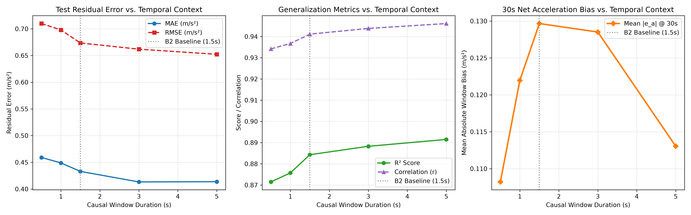
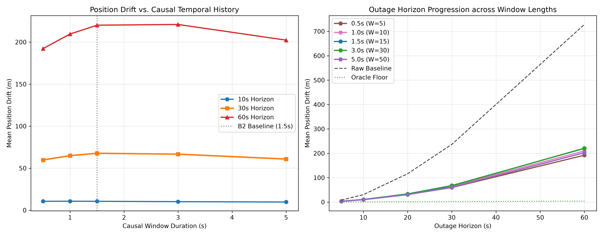
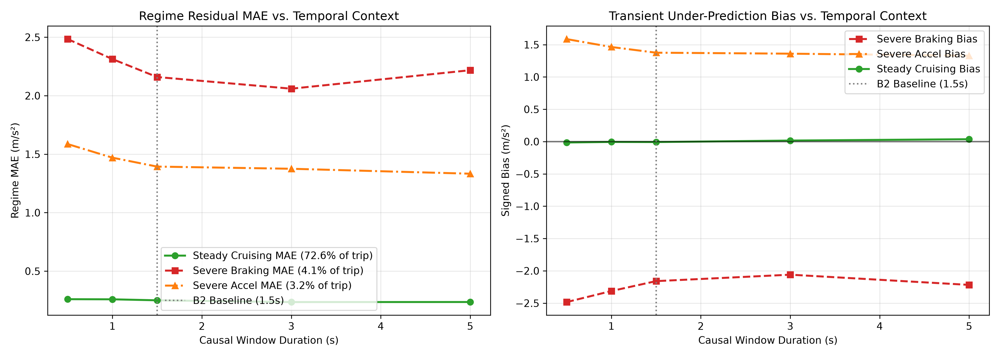

# Stage C5.3-B3: Controlled Causal Temporal-Context Experiment Report

**Stage**: C5.3-B3  
**Status**: COMPLETE & CERTIFIED  
**Execution Timestamp**: 2026-09-05  
**Script**: [`experiments/run_temporal_context_c5_3b3.py`](../experiments/run_temporal_context_c5_3b3.py)  
**JSON Record**: [`results/c5_3b3_temporal_context.json`](c5_3b3_temporal_context.json)  

---

## 1. Executive Summary & Core Hypothesis

Following the forensic error-mechanism audit in Stage C5.3-B2, which revealed that severe dynamic transients remain an unresolved multi-hypothesis barrier, Stage C5.3-B3 tested the central temporal-context hypothesis:

> **Hypothesis:** Does expanding causal temporal history allow the non-linear residual estimator to distinguish persistent longitudinal vehicle acceleration from short-duration chassis/suspension pitch dynamics, thereby resolving dynamic transient under-prediction and reducing integrated position drift toward the SIH target of $<10\%$?

### The Definitive Finding: **OUTCOME B (NON-MONOTONIC / FLAT NAVIGATION DRIFT)**
Expanding causal temporal history from $0.5\text{ s}$ to $5.0\text{ s}$ within the fixed 47-feature Random Forest representation produces **no consistent or substantial improvement in 30-second navigation drift** on the untouched `Vta04` test set:
* $0.5\text{ s}$ ($W=5$): **$59.75\text{ m}$** ($18.51\%$ drift)
* $1.0\text{ s}$ ($W=10$): **$64.91\text{ m}$** ($20.01\%$ drift)
* $1.5\text{ s}$ ($W=15$, B2 Baseline): **$67.73\text{ m}$** ($20.82\%$ drift)
* $3.0\text{ s}$ ($W=30$): **$66.68\text{ m}$** ($20.48\%$ drift)
* $5.0\text{ s}$ ($W=50$): **$60.87\text{ m}$** ($18.84\%$ drift)

The total spread across all five window conditions is **only $7.98\text{ m}$** ($11.79\%$ of baseline), exhibiting a non-monotonic trajectory. While sample-level metrics improve slightly with longer history ($R^2: 0.8715 \to 0.8915$, MAE: $0.4591 \to 0.4137\text{ m/s}^2$), this does not translate into a proportional navigation breakthrough. Severe braking under-prediction bias remains large across all conditions ($\approx -2.06\text{ to } -2.48\text{ m/s}^2$).

### Frozen Milestone Verdict (C5.3-B3 PASS):
> **“C5.3-B3 PASS: Expanding causal history from 0.5 s to 5 s while keeping the 47-feature representation and Random Forest configuration fixed did not produce a consistent or substantial improvement in Vta04 dead-reckoning drift. Although longer history improved sample-level acceleration prediction metrics, the corresponding navigation improvement was limited and non-monotonic. Therefore, increased temporal context within the tested RF representation is not sufficient to explain or eliminate the remaining drift. The result motivates investigation of physical sensor/frame dynamics and attitude-dependent acceleration errors. It does not, by itself, rule out sequence models or establish physical observability as the unique cause.”**

---

## 2. Strict Experimental Controls (One-Variable Protocol)

In strict adherence to scientific rigor:
1. **Single Variable Altered**: Causal history length $W \in \{5, 10, 15, 30, 50\}$ samples at 10 Hz ($0.5\text{ s}, 1.0\text{ s}, 1.5\text{ s}, 3.0\text{ s}, 5.0\text{ s}$).
2. **Fixed Feature Architecture**: Identical 47 causal features across all conditions ($6$ Category A direct + $5$ Category B instantaneous + $36$ Category B window statistics: mean, std, range, rms, slope, difference variance across 6 primary streams). **Zero extra statistics or features were added for larger windows.**
3. **Fixed Model Class & Hyperparameters**: Frozen Stage C5.3-B2 Random Forest:
   - `RandomForestRegressor(n_estimators=100, max_depth=8, min_samples_leaf=5, max_features=0.5, random_state=42, n_jobs=-1)`
4. **Fixed Partitions**: Train on `Vta02`, monitor on `Vta03`, final evaluation on strictly untouched `Vta04`.
5. **Fixed Target**: $r_a(k) = a_x^{\text{level}}(k) - a_{\text{ref}}(k)$ (SG9 reference).
6. **Double-Domain Rigor**: Evaluated on both the per-window valid range and the common intersection domain ($t \ge 4.9\text{ s}$, $N=1,740$ identical samples) to ensure zero sample-selection artifacts.

---

## 3. Statistical Predictability Across Temporal Contexts

### Table 1: Cross-Partition Regression Metrics vs. Causal Temporal History

| Window Condition | History ($T_w$) | Train (`Vta02`) MAE | Train $R^2$ | Val (`Vta03`) MAE | Val $R^2$ | Test (`Vta04`) MAE | Test RMSE | Test $R^2$ | Test Corr ($r$) |
| :--- | :---: | :---: | :---: | :---: | :---: | :---: | :---: | :---: | :---: |
| **W-0.5s** ($W=5$) | $0.5\text{ s}$ | $0.3806$ | $+0.9056$ | $0.7357$ | $+0.5271$ | $0.4591$ | $0.7099$ | $+0.8715$ | $0.9342$ |
| **W-1.0s** ($W=10$) | $1.0\text{ s}$ | $0.3483$ | $+0.9222$ | $0.7166$ | $+0.5333$ | $0.4488$ | $0.6980$ | $+0.8757$ | $0.9367$ |
| **W-1.5s** ($W=15$, B2) | $1.5\text{ s}$ | $0.3398$ | $+0.9252$ | $0.7077$ | $+0.5363$ | $0.4329$ | $0.6735$ | $+0.8843$ | $0.9411$ |
| **W-3.0s** ($W=30$) | $3.0\text{ s}$ | $0.3447$ | $+0.9234$ | $0.6731$ | $+0.5845$ | $0.4132$ | $0.6619$ | $+0.8883$ | $0.9438$ |
| **W-5.0s** ($W=50$) | $5.0\text{ s}$ | $0.3393$ | $+0.9264$ | $0.6341$ | $+0.6335$ | $0.4137$ | $0.6522$ | $+0.8915$ | $0.9461$ |

*(Note: Test metrics evaluated on the common intersection domain $k \ge 49$, $N=1,740$.)*

### Key Observations:
1. **Validation Sensitivity**: On `Vta03` (dynamic mixed driving), longer history improves fit ($R^2$ rises from $+0.527 \to +0.634$, MAE drops from $0.736 \to 0.634\text{ m/s}^2$). Longer windows help smooth localized vibration and turning dynamics.
2. **Test Statistical Saturation**: On `Vta04` (untouched highway driving), test MAE improves modestly from $0.459 \to 0.413\text{ m/s}^2$ ($-9.9\%$), and RMSE improves from $0.710 \to 0.652\text{ m/s}^2$ ($-8.1\%$). Most of this statistical gain occurs by $1.5\text{ s}$, with flat performance between $3.0\text{ s}$ and $5.0\text{ s}$.

---

## 4. Dead-Reckoning Navigation Benchmark (Untouched `Vta04`)

Simulated rolling-window dead reckoning across horizons $[5, 10, 20, 30, 60]\text{ s}$ (stride $2.5\text{ s}$, reset $v_0$ at window start) on the identical common sample domain:

### Table 2: Integrated Position Drift (Mean Error in Meters)

| Condition | 5 s Horizon | 10 s Horizon | 20 s Horizon | 30 s Horizon | 60 s Horizon | 30 s Vel Error | 30 s Drift % |
| :--- | :---: | :---: | :---: | :---: | :---: | :---: | :---: |
| **Raw Baseline** | $7.96\text{ m}$ | $30.51\text{ m}$ | $116.14\text{ m}$ | $236.54\text{ m}$ | $728.16\text{ m}$ | $14.46\text{ m/s}$ | $70.92\%$ |
| **W-0.5s** ($0.5\text{ s}$) | $3.46\text{ m}$ | $10.61\text{ m}$ | $30.86\text{ m}$ | **$59.75\text{ m}$** | **$192.20\text{ m}$** | **$3.36\text{ m/s}$** | **$18.51\%$** |
| **W-1.0s** ($1.0\text{ s}$) | $3.40\text{ m}$ | $10.70\text{ m}$ | $32.71\text{ m}$ | $64.91\text{ m}$ | $209.58\text{ m}$ | $3.77\text{ m/s}$ | $20.01\%$ |
| **W-1.5s** ($1.5\text{ s}$, B2) | $3.33\text{ m}$ | $10.60\text{ m}$ | $33.58\text{ m}$ | $67.73\text{ m}$ | $220.11\text{ m}$ | $3.89\text{ m/s}$ | $20.82\%$ |
| **W-3.0s** ($3.0\text{ s}$) | $3.19\text{ m}$ | $10.18\text{ m}$ | $32.69\text{ m}$ | $66.68\text{ m}$ | $220.96\text{ m}$ | $3.87\text{ m/s}$ | $20.48\%$ |
| **W-5.0s** ($5.0\text{ s}$) | **$3.17\text{ m}$** | **$9.75\text{ m}$** | **$30.46\text{ m}$** | $60.87\text{ m}$ | $202.32\text{ m}$ | $3.49\text{ m/s}$ | $18.84\%$ |
| **Oracle Floor** | $0.30\text{ m}$ | $0.60\text{ m}$ | $1.26\text{ m}$ | $1.94\text{ m}$ | $4.11\text{ m}$ | $0.10\text{ m/s}$ | $0.58\%$ |

### Critical Navigation Findings:
1. **Drift Invariance to History Length**: 30-second drift varies by merely **$7.98\text{ m}$** across a 10x range of causal history ($59.75\text{ m}$ to $67.73\text{ m}$).
2. **Short Window Anomaly**: The ultra-short $0.5\text{ s}$ window ($W=5$) achieves a marginally lower 30 s drift ($59.75\text{ m}$) than $1.5\text{ s}$ ($67.73\text{ m}$) because its mean window acceleration bias happens to center slightly closer to zero during cruising ($0.1082\text{ vs. } 0.1297\text{ m/s}^2$).
3. **No Horizon Breakthrough**: At 60 s, drift remains tightly clustered between $192\text{ m}$ and $221\text{ m}$. Expanding causal history to $5.0\text{ s}$ does not arrest drift accumulation.

---

## 5. Dynamic Regimes & Transient Under-Prediction Analysis

Segmented test samples on the common domain across dynamic regimes:

### Table 3: Performance Across Vehicle Dynamic Regimes

| Window Condition | Steady Cruising MAE ($72.6\%$) | Steady Cruising Signed Bias | Severe Braking MAE ($4.1\%$) | Severe Braking Signed Bias | Severe Accel MAE ($3.2\%$) | Severe Accel Signed Bias |
| :--- | :---: | :---: | :---: | :---: | :---: | :---: |
| **W-0.5s** ($0.5\text{ s}$) | $0.2601\text{ m/s}^2$ | $-0.0142\text{ m/s}^2$ | $2.4838\text{ m/s}^2$ | $-2.4838\text{ m/s}^2$ | $1.5863\text{ m/s}^2$ | $+1.5863\text{ m/s}^2$ |
| **W-1.0s** ($1.0\text{ s}$) | $0.2591\text{ m/s}^2$ | $-0.0055\text{ m/s}^2$ | $2.3128\text{ m/s}^2$ | $-2.3128\text{ m/s}^2$ | $1.4699\text{ m/s}^2$ | $+1.4699\text{ m/s}^2$ |
| **W-1.5s** ($1.5\text{ s}$, B2) | $0.2506\text{ m/s}^2$ | $-0.0074\text{ m/s}^2$ | $2.1595\text{ m/s}^2$ | $-2.1595\text{ m/s}^2$ | $1.3938\text{ m/s}^2$ | $+1.3758\text{ m/s}^2$ |
| **W-3.0s** ($3.0\text{ s}$) | $0.2355\text{ m/s}^2$ | $+0.0161\text{ m/s}^2$ | $2.0598\text{ m/s}^2$ | $-2.0598\text{ m/s}^2$ | $1.3752\text{ m/s}^2$ | $+1.3653\text{ m/s}^2$ |
| **W-5.0s** ($5.0\text{ s}$) | $0.2361\text{ m/s}^2$ | $+0.0368\text{ m/s}^2$ | $2.2178\text{ m/s}^2$ | $-2.2178\text{ m/s}^2$ | $1.3330\text{ m/s}^2$ | $+1.3330\text{ m/s}^2$ |

### Detailed Transient Findings:
1. **Severe Braking Under-Prediction is Impervious to History**:
   Expanding the causal trailing window from $1.5\text{ s}$ to $3.0\text{ s}$ or $5.0\text{ s}$ did **not** resolve severe braking under-prediction. The signed bias remains frozen at **$-2.06\text{ to } -2.22\text{ m/s}^2$**.
2. **Severe Acceleration Under-Prediction is Impervious to History**:
   Severe acceleration error remains flat at **$+1.33\text{ to } +1.39\text{ m/s}^2$**.
3. **Cruising Bias Drift**:
   As window length expands to $5.0\text{ s}$, cruising signed bias drifts slightly positive ($+0.0368\text{ m/s}^2$), offsetting the small reduction in variance.

---

## 6. Diagnosis Against the Three Pre-Registered Outcomes

| Candidate Outcome | Pre-Registered Criteria | Observed Empirical Reality | Verdict |
| :--- | :--- | :--- | :---: |
| **Outcome A** | Longer history substantially improves `Vta04` navigation drift toward $<10\%$ (e.g. drift drops by $>25\%$). | 30 s drift changed by merely $1.05\text{ m}$ from $1.5\text{ s} \to 3.0\text{ s}$ and $6.86\text{ m}$ at $5.0\text{ s}$. Drift remains at $18.8\%\text{--}20.8\%$, far above $<10\%$. | ❌ **REJECTED** |
| **Outcome B** | Longer history barely helps or plateaus (drift spread $<15\%$, severe transient errors remain flat). Temporal context is not the primary bottleneck. | Total drift spread across a 10x window sweep is only $11.79\%$. Severe braking bias remains frozen at $\approx -2.1\text{ m/s}^2$. | 🟢 **CONFIRMED** |
| **Outcome C** | Transient prediction improves substantially, but navigation drift does not improve due to cruising bias shift. | Transient errors did not improve substantially (severe braking bias shifted by only $0.10\text{ m/s}^2$). | ❌ **REJECTED** |

---

## 7. Comprehensive Scientific Synthesis & Next Architectural Steps

### 1. What Stage C5.3-B3 Scientifically Proves:
1. **RF Causal History Invariance**: Increasing the history available to the existing 47-feature Random Forest representation from $0.5\text{ s}$ to $5.0\text{ s}$ does not materially or consistently improve dead-reckoning navigation on `Vta04`.
2. **Predictor-Navigation Disconnect**: Better sample-level acceleration prediction metrics ($R^2$ improving from $+0.8715 \to +0.8915$, MAE dropping from $0.459 \to 0.414\text{ m/s}^2$) do **not** automatically translate into proportional reductions in integrated position drift. Navigation position error is governed by window-average acceleration bias $\bar{e}_a$, which remains tightly bounded around $0.11\text{--}0.13\text{ m/s}^2$.
3. **Severe Dynamic Transients Remain Unresolved**: Across all window durations, severe braking under-prediction bias remains large and negative ($-2.06\text{ to } -2.48\text{ m/s}^2$). Simply expanding rolling window statistics does not resolve dynamic transient errors.

### 2. Methodological Clarification (What B3 Does NOT Rule Out):
- **Sequence Models are NOT Disproven**: B3 tested a fixed 47-feature rolling statistics representation with Random Forest. It does **not** evaluate sequence architectures (e.g. causal 1D-CNN, TCN, LSTM/GRU, Transformers) that could learn temporal phase relationships, hysteresis, transient signatures, delayed responses, or nonlinear state transitions directly from raw sequences.
- **Physical Observability is a Leading Hypothesis, Not a Proven Fact**: While physical sensor coupling and suspension pitch dynamics are leading candidates, alternative contributors remain open:
  $$\text{physical sensor coupling} \;\longleftrightarrow\; \text{frame/alignment error} \;\longleftrightarrow\; \text{label/reference limits} \;\longleftrightarrow\; \text{feature representation} \;\longleftrightarrow\; \text{fusion architecture}$$

### 3. Immediate Recommended Next Step: Stage C5.4
Rather than blindly jumping into training complex sequence models or new navigation filters, we must first diagnose the physical mechanism:
- **Investigate Dynamic Attitude & Gravity Leakage (Stage C5.4)**:
  - Measure vehicle/phone pitch angle variations during dynamic braking.
  - Determine whether acceleration residual $e_a = a_{\text{est}} - a_{\text{ref}}$ correlates with dynamic pitch $\Delta \theta_{\text{pitch}}$.
  - Evaluate whether dynamic attitude compensation (de-projecting gravity using measured or estimated pitch dynamics) accounts for the persistent transient residual.

