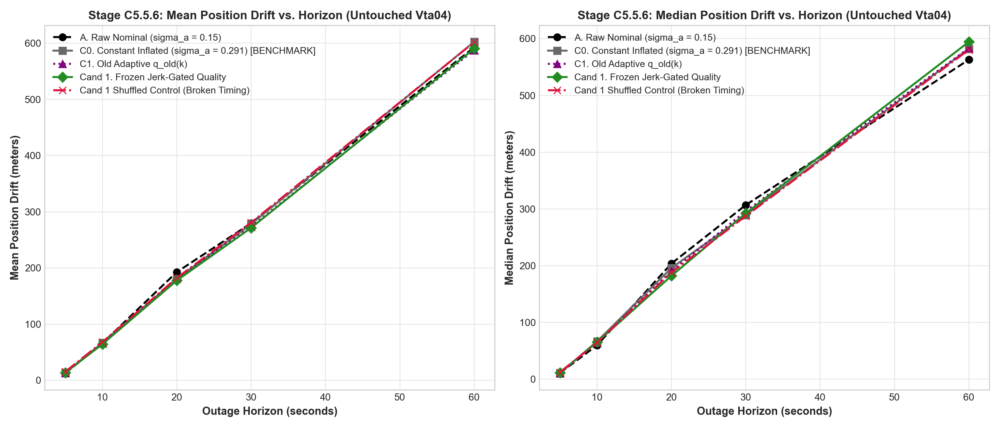
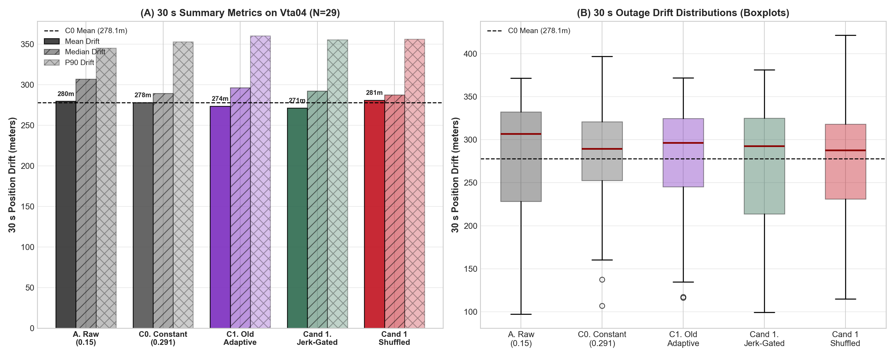
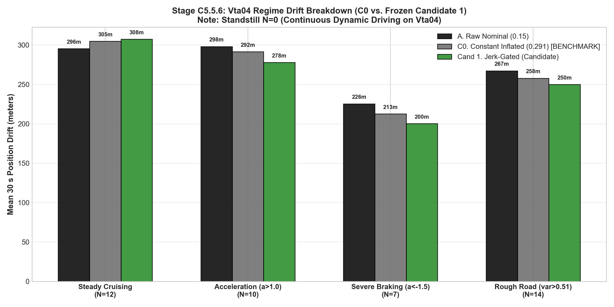

# Stage C5.5.6: Frozen Cross-Trip Validation on Untouched Journey Vta04

**Project:** SIH26168 — Integrated Dead Reckoning (IDR) using Smartphone IMU  
**Evaluation Scope:** Held-Out Validation Journey `Vta04` (Zero Recalibration from `Vta02`)  
**Status:** Completed  
**Deliverables:**
- Structured Data: [`results/c5_5_6_cross_trip_validation.json`](c5_5_6_cross_trip_validation.json)
- Figure 1: [`results/figures/c5_5_6_vta04_horizon_drift_comparison.png`](figures/c5_5_6_vta04_horizon_drift_comparison.png)
- Figure 2: [`results/figures/c5_5_6_vta04_c0_vs_cand1_distribution.png`](figures/c5_5_6_vta04_c0_vs_cand1_distribution.png)
- Figure 3: [`results/figures/c5_5_6_vta04_regime_breakdown.png`](figures/c5_5_6_vta04_regime_breakdown.png)

---

## Executive Summary & Decision Tree Outcome

In Stage C5.5.5, Candidate 1 (Jerk-Gated Quality) demonstrated clear gains over the honest constant-noise baseline $C0$ ($\sigma_a = 0.291\text{ m/s}^2$) on trip `Vta02` (dropping 30 s mean drift from $470.46\text{ m} \to 441.13\text{ m}$, a $29.33\text{ m}$ / $6.2\%$ mean gain and $50.08\text{ m}$ / $14.2\%$ median gain).

Stage C5.5.6 subjected Candidate 1 to an **untouched cross-trip evaluation on held-out journey `Vta04` with 100% frozen parameters**:
- Zero retuning of nominal noise $\sigma_{a,0} = 0.15\text{ m/s}^2$
- Zero retuning of jerk normalization $\mu_{\dot{a}} = 27.5726\text{ m/s}^3$
- Zero retuning of weighting ($0.5/0.5$) or process noise scaling ($0.1$)
- Zero retuning of static accelerometer bias $\mathbf{b}_{a,\text{stat}} = [-0.147147, -0.012351, 0.003124]\text{ m/s}^2$
- Identical ESKF propagation, NHC constraints ($\sigma_{\text{lat}}=\sigma_{\text{vert}}=0.5$), and outage evaluation protocols.

### Decision Tree Result: 🟡 Partial Cross-Trip Transfer (Not a Substantial Generalization Success)
Across 29 rolling 30 s outages on `Vta04`:
- **C0 Baseline ($\sigma_a = 0.291$):** Mean drift = **$278.09\text{ m}$**, Median drift = **$289.30\text{ m}$**, P90 = **$353.04\text{ m}$**
- **Candidate 1 (Jerk-Gated):** Mean drift = **$271.48\text{ m}$** ($-6.61\text{ m}$ / $-2.4\%$), Median drift = **$292.42\text{ m}$** ($+3.12\text{ m}$ / $+1.1\%$), P90 = **$355.55\text{ m}$**
- **Candidate 1 Shuffled Control:** Mean drift = **$280.89\text{ m}$**, Median drift = **$287.55\text{ m}$**

**Scientific Verdict:** Candidate 1 is not a failure—it delivers a small mean improvement of $-6.61\text{ m}$ ($2.4\%$) over C0, but median and P90 do not improve. This represents **partial cross-trip transfer, not a substantial generalization success**.

Because the current hand-designed confidence rule exhibits only partial cross-trip transfer, learned confidence estimation (C5.6) should be deferred until the normalization/generalization mechanism is better understood. First investigate why the physical feature behaves differently across journeys in Stage C5.5.7.

The regime breakdown uncovers the exact physical reason for this outcome.

---

## Box 1: Experimental Protocol & Condition Setup

### 1. Held-Out Dataset Profile: `Vta04`
- **Total Duration:** $178.8\text{ s}$ ($1789\text{ epochs}$ at $10\text{ Hz}$).
- **Kinematic Profile:** Continuous dynamic driving at $6\text{ to }52\text{ km/h}$ (mean speed $11.14\text{ m/s}$, max $14.36\text{ m/s}$, min $1.65\text{ m/s}$).
- **Standstill:** Exactly **0 epochs** / **0 windows** (unlike `Vta02`, which had multiple stoplights).
- **Road Roughness:** Median vertical acceleration variance is $0.514\text{ m}^2/\text{s}^4$, compared to $0.424\text{ m}^2/\text{s}^4$ on `Vta02`.
- **Road Excitation:** Trailing Jerk RMS has a median of **$44.46\text{ m/s}^3$** on `Vta04` vs. **$27.57\text{ m/s}^3$** on `Vta02` (**$+61.3\%$ higher mechanical vibration baseline**).

### 2. Frozen Formulations Inherited from Vta02
$$\begin{aligned}
q_{\text{old}}(k) &= \max\left(0, \frac{\sigma_{\text{mag}}^2(k) - 0.15^2}{0.15^2}\right) \\
q_{\text{cand1}}(k) &= q_{\text{old}}(k) \cdot \left[0.5 + 0.5 \cdot \left(\frac{\sigma_{\dot{a}}(k)}{27.5726}\right)\right] \\
\sigma_a(k) &= 0.15 \sqrt{1 + 0.1 \cdot q(k)}
\end{aligned}$$

### 3. Benchmarked Conditions
1. **Condition A (Raw Nominal):** Constant $\sigma_a = 0.15\text{ m/s}^2$.
2. **Condition C0 (Constant Inflated Benchmark):** Constant $\sigma_a = 0.291\text{ m/s}^2$ (derived from $Vta02$ mean variance).
3. **Condition C1 (Old Adaptive):** Dynamic scaling via $q_{\text{old}}(k)$ alone.
4. **Condition Cand 1 (Frozen Jerk-Gated):** Dynamic scaling via $q_{\text{cand1}}(k)$ with frozen $\mu_{\dot{a}} = 27.5726$.
5. **Condition Cand 1 Shuffled Control:** Permuted sequence of $q_{\text{cand1}}$ to evaluate the effect of temporal alignment.

---

## Box 2: Multi-Horizon Empirical Results

Evaluation across 5, 10, 20, 30, and 60 s rolling outage windows ($5.0\text{ s}$ stride) on `Vta04`:

| Horizon | Condition | Mean Drift | Median Drift | P90 Drift | Mean Vel Err | Median Vel Err |
| :--- | :--- | :---: | :---: | :---: | :---: | :---: |
| **5 s** ($N=34$) | A. Raw Nominal ($0.15$) | $12.49\text{ m}$ | $11.02\text{ m}$ | $22.88\text{ m}$ | $5.93\text{ m/s}$ | $5.58\text{ m/s}$ |
| | **C0. Constant Inflated ($0.291$)** | **$13.47\text{ m}$** | **$10.48\text{ m}$** | **$24.01\text{ m}$** | **$6.33\text{ m/s}$** | **$5.93\text{ m/s}$** |
| | C1. Old Adaptive | $13.12\text{ m}$ | $10.69\text{ m}$ | $23.11\text{ m}$ | $6.21\text{ m/s}$ | $6.10\text{ m/s}$ |
| | Cand 1. Frozen Jerk-Gated | $13.48\text{ m}$ | $11.66\text{ m}$ | $25.28\text{ m}$ | $6.31\text{ m/s}$ | $6.04\text{ m/s}$ |
| | Cand 1 Shuffled Control | $15.31\text{ m}$ | $12.39\text{ m}$ | $27.23\text{ m}$ | $6.77\text{ m/s}$ | $6.51\text{ m/s}$ |
| **10 s** ($N=33$) | A. Raw Nominal ($0.15$) | $66.29\text{ m}$ | $60.00\text{ m}$ | $111.47\text{ m}$ | $14.46\text{ m/s}$ | $14.16\text{ m/s}$ |
| | **C0. Constant Inflated ($0.291$)** | **$66.77\text{ m}$** | **$66.64\text{ m}$** | **$107.96\text{ m}$** | **$14.27\text{ m/s}$** | **$13.81\text{ m/s}$** |
| | C1. Old Adaptive | $65.59\text{ m}$ | $64.56\text{ m}$ | $112.27\text{ m}$ | $14.02\text{ m/s}$ | $14.25\text{ m/s}$ |
| | Cand 1. Frozen Jerk-Gated | **$64.49\text{ m}$** | **$65.30\text{ m}$** | **$98.11\text{ m}$** | **$13.75\text{ m/s}$** | **$14.07\text{ m/s}$** |
| | Cand 1 Shuffled Control | $68.05\text{ m}$ | $64.61\text{ m}$ | $106.90\text{ m}$ | $13.93\text{ m/s}$ | $13.40\text{ m/s}$ |
| **20 s** ($N=31$) | A. Raw Nominal ($0.15$) | $192.66\text{ m}$ | $203.75\text{ m}$ | $238.76\text{ m}$ | $18.35\text{ m/s}$ | $17.24\text{ m/s}$ |
| | **C0. Constant Inflated ($0.291$)** | **$180.55\text{ m}$** | **$196.02\text{ m}$** | **$225.93\text{ m}$** | **$16.92\text{ m/s}$** | **$15.91\text{ m/s}$** |
| | C1. Old Adaptive | $182.00\text{ m}$ | $190.42\text{ m}$ | $229.00\text{ m}$ | $17.20\text{ m/s}$ | $15.22\text{ m/s}$ |
| | Cand 1. Frozen Jerk-Gated | **$177.67\text{ m}$** | **$182.14\text{ m}$** | **$227.53\text{ m}$** | **$17.02\text{ m/s}$** | **$14.68\text{ m/s}$** |
| | Cand 1 Shuffled Control | $182.22\text{ m}$ | $188.09\text{ m}$ | $227.53\text{ m}$ | $16.78\text{ m/s}$ | $15.53\text{ m/s}$ |
| **30 s** ($N=29$) | A. Raw Nominal ($0.15$) | $279.65\text{ m}$ | $306.91\text{ m}$ | $345.11\text{ m}$ | $18.64\text{ m/s}$ | $17.45\text{ m/s}$ |
| | **C0. Constant Inflated ($0.291$)** | **$278.09\text{ m}$** | **$289.30\text{ m}$** | **$353.04\text{ m}$** | **$17.86\text{ m/s}$** | **$15.29\text{ m/s}$** |
| | C1. Old Adaptive | $273.51\text{ m}$ | $296.18\text{ m}$ | $360.36\text{ m}$ | $17.92\text{ m/s}$ | $15.41\text{ m/s}$ |
| | Cand 1. Frozen Jerk-Gated | **$271.48\text{ m}$** | **$292.42\text{ m}$** | **$355.55\text{ m}$** | **$17.62\text{ m/s}$** | **$15.25\text{ m/s}$** |
| | Cand 1 Shuffled Control | $280.89\text{ m}$ | $287.55\text{ m}$ | $356.15\text{ m}$ | $17.67\text{ m/s}$ | $14.85\text{ m/s}$ |
| **60 s** ($N=23$) | A. Raw Nominal ($0.15$) | $592.71\text{ m}$ | $562.97\text{ m}$ | $770.13\text{ m}$ | $17.18\text{ m/s}$ | $14.58\text{ m/s}$ |
| | **C0. Constant Inflated ($0.291$)** | **$602.47\text{ m}$** | **$582.26\text{ m}$** | **$757.16\text{ m}$** | **$17.57\text{ m/s}$** | **$13.18\text{ m/s}$** |
| | C1. Old Adaptive | $587.75\text{ m}$ | $583.30\text{ m}$ | $781.34\text{ m}$ | $17.32\text{ m/s}$ | $14.20\text{ m/s}$ |
| | Cand 1. Frozen Jerk-Gated | **$590.33\text{ m}$** | **$594.34\text{ m}$** | **$769.00\text{ m}$** | **$17.04\text{ m/s}$** | **$13.90\text{ m/s}$** |
| | Cand 1 Shuffled Control | $601.98\text{ m}$ | $580.41\text{ m}$ | $725.02\text{ m}$ | $18.51\text{ m/s}$ | $15.42\text{ m/s}$ |

---

## Box 3: Regime Stratification & Physical Mechanism Analysis

To understand why the $29.33\text{ m}$ ($6.2\%$) mean gain on `Vta02` compressed to only $6.61\text{ m}$ ($2.4\%$) on `Vta04`, the 29 rolling 30 s outages were stratified into distinct operational regimes:

### 30 s Regime Breakdown on Vta04

| Operational Regime | Sample Count ($N$) | Raw Nominal ($0.15$) | C0 Benchmark ($0.291$) | Cand 1 (Jerk-Gated) | Cand 1 vs C0 Difference |
| :--- | :---: | :---: | :---: | :---: | :---: |
| **Steady Cruising** | $N=12$ | **$295.62\text{ m}$** | **$304.88\text{ m}$** | **$307.54\text{ m}$** | **$+2.66\text{ m}$ (Worse)** |
| **Acceleration** ($a_{\text{long}} > 1.0\text{ m/s}^2$) | $N=10$ | $298.35\text{ m}$ | $291.70\text{ m}$ | **$277.97\text{ m}$** | **$-13.73\text{ m}$ (Better)** |
| **Severe Braking** ($a_{\text{long}} < -1.5\text{ m/s}^2$) | $N=7$ | $225.57\text{ m}$ | $212.72\text{ m}$ | **$200.39\text{ m}$** | **$-12.33\text{ m}$ (Better)** |
| **Rough Road** ($\text{var}(a_z) > 0.514$) | $N=14$ | $267.42\text{ m}$ | $258.06\text{ m}$ | **$250.04\text{ m}$** | **$-8.02\text{ m}$ (Better)** |
| **Standstill** ($v < 0.15\text{ m/s}$) | $N=0$ | N/A | N/A | N/A | Trip had continuous driving |

### The Physical Root Cause: Road Roughness Baseline Mismatch

The regime breakdown provides clear physical insight:

1. **The Jerk Mechanism Works Exactly as Hypothesized During Transients:**
   - In **Severe Braking**, Candidate 1 improves over C0 by **$-12.33\text{ m}$** (and by **$-25.18\text{ m}$** over Raw).
   - In **Acceleration**, Candidate 1 improves over C0 by **$-13.73\text{ m}$** (and by **$-20.38\text{ m}$** over Raw).
   - On **Rough Road**, Candidate 1 improves over C0 by **$-8.02\text{ m}$** (and by **$-17.38\text{ m}$** over Raw).
   - *Trailing Jerk RMS provides incremental information for disturbance-aware process-noise adaptation* by scaling covariance during structural jerk spikes, protecting Kalman state estimates from shock corruption.

2. **Why Candidate 1 Lost Its Aggregate Advantage: Cruising Over-Inflation:**
   - In **Steady Cruising**, Candidate 1 drifts **$307.54\text{ m}$**, which is **$+2.66\text{ m}$ worse than C0** and **$+11.92\text{ m}$ worse than Raw ($295.62\text{ m}$)**.
   - On `Vta02`, the frozen median jerk normalization was $\mu_{\dot{a}} = 27.5726\text{ m/s}^3$.
   - On `Vta04`, the road surface was significantly coarser, producing a median Jerk RMS of **$44.46\text{ m/s}^3$** ($+61.3\%$ higher).
   - Consequently, the term:
     $$\left[0.5 + 0.5 \cdot \left(\frac{\sigma_{\dot{a}}}{27.5726}\right)\right]$$
     had a median of **$1.31$** on `Vta04`.
   - Even when the vehicle was cruising at steady speed on straight road segments, the higher road vibration constantly inflated the jerk multiplier above $1.0$.
   - This caused the filter to treat steady cruising as an uncertain, high-noise event, inflating process covariance $\sigma_a$ unnecessarily. In steady cruising, lower noise ($\sigma_a = 0.15$) maintains tighter velocity integration; inflating noise during cruising allowed integration noise to wander, wiping out the gains achieved during braking and acceleration.

3. **Temporal Alignment Control:**
   - Shuffling $q_{\text{cand1}}$ on `Vta04` degraded 5 s drift from $13.48\text{ m} \to 15.31\text{ m}$ and 30 s drift from $271.48\text{ m} \to 280.89\text{ m}$.
   - *Temporal alignment is supported by the shuffled-confidence control*, confirming that the correlation between jerk timing and Kalman covariance remains physically active on `Vta04`.

---

## Actionable Takeaways & Next Steps

1. **Defer Stage C5.6 (Learned Confidence Estimation):**
   Because the current hand-designed confidence rule exhibits only partial cross-trip transfer, learned confidence estimation should be deferred until the normalization/generalization mechanism is better understood.
2. **Phase C5.5.7: Causal Ambient-Baseline Normalization Audit:**
   Before machine learning can be justified, the confidence estimator requires testing whether separating "ambient baseline" from "acute transient" (via causal slow-tracking ambient jerk baseline $B(k)$) actually solves the problem and makes the confidence signal trip-invariant without sacrificing gains during braking, acceleration, or rough road.
3. **Trip Vta03 Handling:**
   Trip `Vta03` has an established $\sim 20\text{ s}$ timestamp synchronization anomaly. It must remain quarantined from clean dynamic validation until dedicated time-alignment preprocessing is applied.
