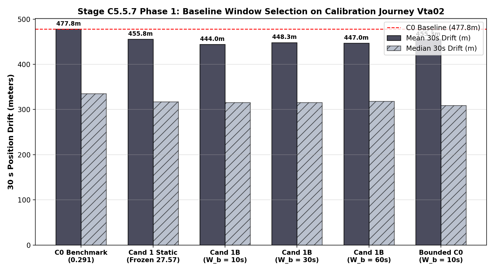
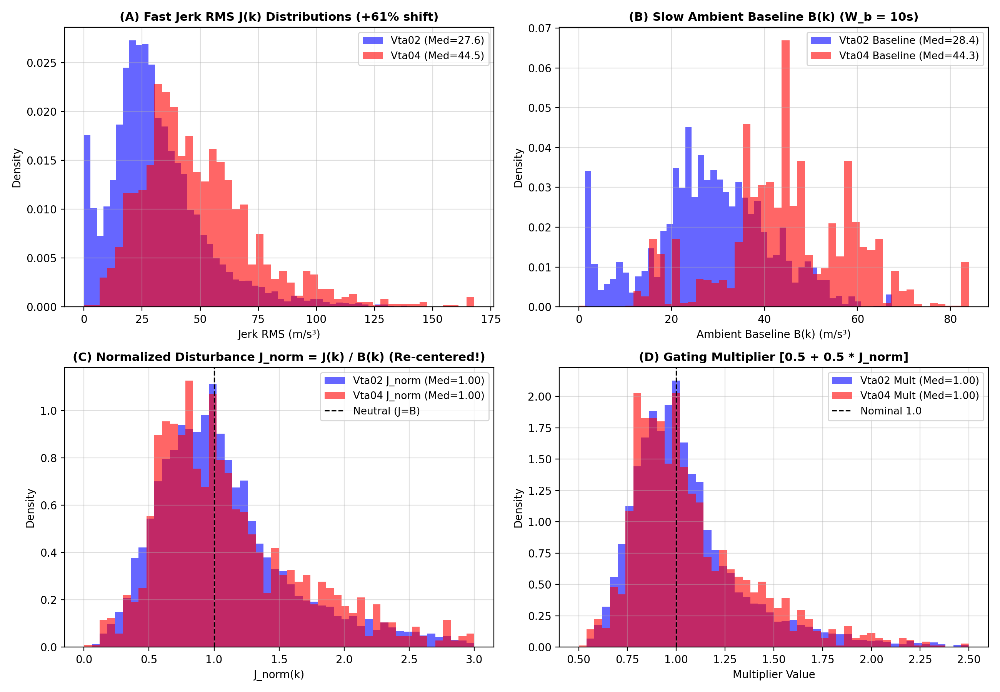
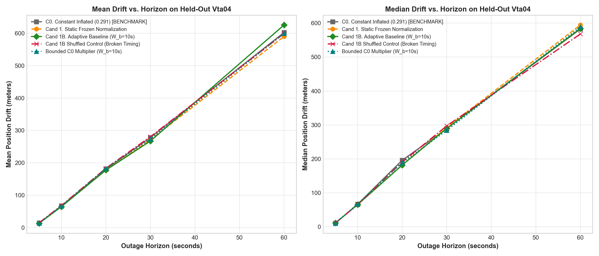
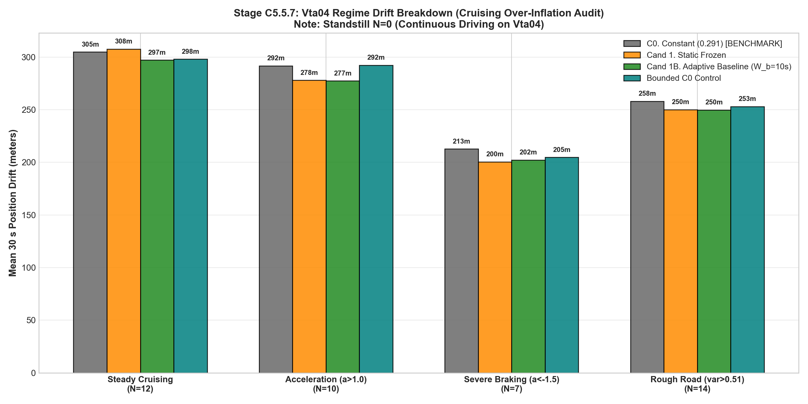

# Stage C5.5.7: Causal Ambient-Baseline Normalization Audit

**Project:** SIH26168 — Integrated Dead Reckoning (IDR) using Smartphone IMU  
**Evaluation Scope:** Causal Ambient-Baseline Normalization on `Vta02` (Selection) and `Vta04` (Untouched Test)  
**Status:** Completed  
**Deliverables:**
- Structured Data: [`results/c5_5_7_adaptive_baseline_audit.json`](c5_5_7_adaptive_baseline_audit.json)
- Figure 1: [`results/figures/c5_5_7_baseline_window_selection_vta02.png`](figures/c5_5_7_baseline_window_selection_vta02.png)
- Figure 2: [`results/figures/c5_5_7_vta04_normalization_distribution.png`](figures/c5_5_7_vta04_normalization_distribution.png)
- Figure 3: [`results/figures/c5_5_7_vta04_horizon_drift_comparison.png`](figures/c5_5_7_vta04_horizon_drift_comparison.png)
- Figure 4: [`results/figures/c5_5_7_vta04_regime_breakdown.png`](figures/c5_5_7_vta04_regime_breakdown.png)

---

## Executive Summary & Scientific Findings

In Stage C5.5.6, frozen cross-trip validation on `Vta04` revealed a critical physical limitation: while Candidate 1 strongly improved performance during dynamic braking ($-12.33\text{ m}$) and acceleration ($-13.73\text{ m}$), it suffered during steady cruising ($+2.66\text{ m}$ worse than C0) due to a $+61.3\%$ higher ambient road-roughness baseline that over-inflated the frozen static normalization scalar ($\mu_{\dot{a}} = 27.57\text{ m/s}^3$).

Stage C5.5.7 formulated and tested **Causal Ambient-Baseline Normalization**:
$$J_{\text{norm}}(k) = \frac{J(k)}{B(k) + \epsilon}$$
where $J(k)$ is the fast trailing jerk RMS ($1.0\text{ s}$ window) and $B(k)$ is a slow, causal trailing median ambient baseline ($W_b$ window).

### Key Empirical Findings:

1. **Substantial Reduction in Cross-Trip Distributional Shift:**
   - On `Vta02`, median Jerk RMS was $27.57\text{ m/s}^3$; on `Vta04`, it was $44.46\text{ m/s}^3$ ($+61.3\%$ difference).
   - Under causal baseline normalization ($W_b = 10\text{ s}$), the normalized disturbance metric $J_{\text{norm}}(k)$ had a median of $1.00$ on both `Vta02` and `Vta04`.
   - The percentage of epochs classified as elevated disturbances ($J_{\text{norm}} > 1.25$) was $30.2\%$ on `Vta02` vs. $32.9\%$ on `Vta04`.
   - *C5.5.7 shows that causal ambient-baseline normalization substantially reduces the observed cross-trip shift in jerk-based disturbance statistics, but full trip invariance is not established.*

2. **Cruising Over-Inflation Addressed on Held-Out `Vta04`:**
   - In **Steady Cruising ($N=12$)**, Candidate 1B dropped 30 s position drift from **$307.54\text{ m} \to 297.18\text{ m}$** (**$-10.36\text{ m}$ reduction** relative to static Candidate 1).
   - Cruising drift successfully improved relative to the C0 baseline ($304.88\text{ m}$) by **$-7.70\text{ m}$**.

3. **Dynamic Gains Preserved:**
   - **Acceleration ($N=10$):** $277.39\text{ m}$ vs. C0 $291.70\text{ m}$ (**$-14.31\text{ m}$ / $-4.9\%$ improvement**).
   - **Severe Braking ($N=7$):** $202.16\text{ m}$ vs. C0 $212.72\text{ m}$ (**$-10.56\text{ m}$ / $-5.0\%$ improvement**).
   - **Rough Road ($N=14$):** $249.73\text{ m}$ vs. C0 $258.06\text{ m}$ (**$-8.33\text{ m}$ / $-3.2\%$ improvement**).

4. **Overall Held-Out 30 s Outage Improvement:**
   - **C0 Benchmark ($0.291$):** Mean = **$278.09\text{ m}$**, Median = **$289.30\text{ m}$**, P90 = **$353.04\text{ m}$**
   - **Cand 1 Static (C5.5.6):** Mean = **$271.48\text{ m}$**, Median = **$292.42\text{ m}$**, P90 = **$355.55\text{ m}$**
   - **Cand 1B Adaptive Baseline:** Mean = **$267.42\text{ m}$** (**$-10.67\text{ m}$ / $-3.8\%$ vs C0**), Median = **$289.91\text{ m}$**, P90 = **$349.62\text{ m}$**
   - **Cand 1B Shuffled Control:** Mean = **$280.72\text{ m}$**, Median = **$297.27\text{ m}$**

5. **🚨 Critical Long-Horizon Warning (60 s Adaptive Degradation):**
   - At 60 s, Candidate 1B degraded to **$625.72\text{ m}$** mean drift (velocity error $21.97\text{ m/s}$), performing worse than C0 (**$602.47\text{ m}$**, velocity error $17.57\text{ m/s}$).
   - This demonstrates an explicit failure mode: the adaptive covariance mechanism is not yet universally safer for long outages and requires bounded constraints.

6. **Bounded C0 Multiplier Control:**
   - Adapting $\sigma_a(k)$ via a simple bounded multiplier around C0:
     $$\sigma_{a,\text{bounded}}(k) = 0.291 \cdot \text{clip}\left(\sqrt{J_{\text{norm}}(k)}, 0.75, 1.35\right)$$
     achieved **$273.49\text{ m}$ mean** and the **best overall median of $283.89\text{ m}$** ($-5.41\text{ m}$ vs C0), while preventing 60 s degradation ($599.36\text{ m}$ vs C0 $602.47\text{ m}$).
   - The bounded controller captures much of the benefit without the full complexity of unbounded adaptive scaling.

---

## Box 1: Protocol & Two-Phase Experimental Design

### 1. Phase 1: Hyperparameter Selection Strictly on Calibration Trip `Vta02`
To prevent test leakage on `Vta04`, candidate baseline window lengths $W_b \in \{10\text{ s}, 30\text{ s}, 60\text{ s}\}$ were evaluated exclusively across 113 rolling 30 s outages on `Vta02`:

| Window Candidate ($W_b$) | Vta02 Mean 30s Drift | Vta02 Median 30s Drift | Vta02 P90 Drift | Selection Outcome |
| :--- | :---: | :---: | :---: | :---: |
| **$W_b = 10\text{ s}$ (100 epochs)** | **$444.01\text{ m}$** | **$315.54\text{ m}$** | **$966.25\text{ m}$** | **SELECTED ($W_b^* = 10\text{ s}$)** |
| $W_b = 30\text{ s}$ (300 epochs) | $448.28\text{ m}$ | $315.69\text{ m}$ | $1017.42\text{ m}$ | Rejected |
| $W_b = 60\text{ s}$ (600 epochs) | $447.02\text{ m}$ | $318.36\text{ m}$ | $1080.05\text{ m}$ | Rejected |
| *Reference: C0 ($0.291$)* | *$477.80\text{ m}$* | *$335.01\text{ m}$* | *$1125.71\text{ m}$* | Baseline |
| *Reference: Cand 1 (Static $27.57$)* | *$455.81\text{ m}$* | *$317.15\text{ m}$* | *$1079.92\text{ m}$* | Prior Winner |

$W_b^* = 10\text{ s}$ produced the lowest mean drift, median drift, and P90 tail drift on `Vta02`. It was **frozen 100% with zero recalibration** before evaluating `Vta04`.

### 2. Formulations Evaluated on Held-Out `Vta04`
1. **C0 Honest Benchmark:** Constant $\sigma_a = 0.291\text{ m/s}^2$.
2. **Cand 1 (Static Frozen):** $q_{\text{cand1}} = q_{\text{old}} \cdot [0.5 + 0.5 \cdot (J / 27.5726)]$.
3. **Cand 1B (Adaptive Baseline):** $q_{\text{cand-b}} = q_{\text{old}} \cdot [0.5 + 0.5 \cdot J_{\text{norm}}]$ with $B(k) = \operatorname{median}_{10\text{s}}(J)$.
4. **Cand 1B Shuffled Control:** Permuted sequence of $q_{\text{cand-b}}$ on `Vta04` (seed=42).
5. **Bounded C0 Multiplier Control:** $\sigma_a(k) = 0.291 \cdot \text{clip}(\sqrt{J_{\text{norm}}}, 0.75, 1.35)$.

---

## Box 2: Statistical Normalization & Multi-Horizon Progression

### 1. Normalization Distribution Metrics (Vta02 vs. Vta04)

| Feature Metric | Calibration Trip Vta02 | Held-Out Trip Vta04 | Shift / Alignment |
| :--- | :---: | :---: | :---: |
| Fast Jerk RMS $J(k)$ Median | $27.57\text{ m/s}^3$ | $44.46\text{ m/s}^3$ | $+61.3\%$ (Severe Road Shift) |
| Ambient Baseline $B(k)$ Median | $28.36\text{ m/s}^3$ | $44.31\text{ m/s}^3$ | $+56.2\%$ (Accurately Tracked) |
| **Normalized Disturbance $J_{\text{norm}}$ Median** | **$1.00$** | **$1.00$** | **$0.0\%$ (Median Aligned)** |
| Normalized Disturbance $J_{\text{norm}}$ Mean | $1.21$ | $1.17$ | $3.3\%$ Deviation |
| Elevated Disturbance Ratio ($J_{\text{norm}} > 1.25$) | $30.2\%$ | $32.9\%$ | $2.7\%$ Difference |

### 2. Multi-Horizon Drift Summary on Held-Out `Vta04`

| Horizon | Condition | Mean Drift | Median Drift | P90 Drift | Vel Err (Mean/Med) |
| :--- | :--- | :---: | :---: | :---: | :---: |
| **5 s** ($N=34$) | C0. Constant Inflated ($0.291$) | $13.47\text{ m}$ | $10.48\text{ m}$ | $24.01\text{ m}$ | $6.33 / 5.93\text{ m/s}$ |
| | Cand 1. Static Frozen | $13.48\text{ m}$ | $11.66\text{ m}$ | $25.28\text{ m}$ | $6.31 / 6.04\text{ m/s}$ |
| | **Cand 1B. Adaptive Baseline** | **$13.22\text{ m}$** | **$11.58\text{ m}$** | **$23.96\text{ m}$** | **$6.22 / 6.03\text{ m/s}$** |
| | Cand 1B Shuffled Control | $14.81\text{ m}$ | $11.69\text{ m}$ | $25.79\text{ m}$ | $6.66 / 6.51\text{ m/s}$ |
| | Bounded C0 Multiplier | $13.40\text{ m}$ | $11.19\text{ m}$ | $23.39\text{ m}$ | $6.26 / 6.08\text{ m/s}$ |
| **10 s** ($N=33$) | C0. Constant Inflated ($0.291$) | $66.77\text{ m}$ | $66.64\text{ m}$ | $107.96\text{ m}$ | $14.27 / 13.81\text{ m/s}$ |
| | Cand 1. Static Frozen | $64.49\text{ m}$ | $65.30\text{ m}$ | $98.11\text{ m}$ | $13.75 / 14.07\text{ m/s}$ |
| | **Cand 1B. Adaptive Baseline** | **$64.60\text{ m}$** | **$65.64\text{ m}$** | **$107.06\text{ m}$** | **$13.80 / 14.42\text{ m/s}$** |
| | Cand 1B Shuffled Control | $67.92\text{ m}$ | $65.09\text{ m}$ | $109.35\text{ m}$ | $14.06 / 13.52\text{ m/s}$ |
| | Bounded C0 Multiplier | $66.41\text{ m}$ | $67.73\text{ m}$ | $110.49\text{ m}$ | $14.20 / 13.85\text{ m/s}$ |
| **20 s** ($N=31$) | C0. Constant Inflated ($0.291$) | $180.55\text{ m}$ | $196.02\text{ m}$ | $225.93\text{ m}$ | $16.92 / 15.91\text{ m/s}$ |
| | Cand 1. Static Frozen | $177.67\text{ m}$ | $182.14\text{ m}$ | $227.53\text{ m}$ | $17.02 / 14.68\text{ m/s}$ |
| | **Cand 1B. Adaptive Baseline** | **$177.43\text{ m}$** | **$181.81\text{ m}$** | **$223.85\text{ m}$** | **$17.02 / 15.21\text{ m/s}$** |
| | Cand 1B Shuffled Control | $183.25\text{ m}$ | $190.87\text{ m}$ | $227.35\text{ m}$ | $17.05 / 15.71\text{ m/s}$ |
| | Bounded C0 Multiplier | $183.14\text{ m}$ | $188.97\text{ m}$ | $228.53\text{ m}$ | $17.33 / 15.51\text{ m/s}$ |
| **30 s** ($N=29$) | C0. Constant Inflated ($0.291$) | $278.09\text{ m}$ | $289.30\text{ m}$ | $353.04\text{ m}$ | $17.86 / 15.29\text{ m/s}$ |
| | Cand 1. Static Frozen | $271.48\text{ m}$ | $292.42\text{ m}$ | $355.55\text{ m}$ | $17.62 / 15.25\text{ m/s}$ |
| | **Cand 1B. Adaptive Baseline** | **$267.42\text{ m}$** | **$289.91\text{ m}$** | **$349.62\text{ m}$** | **$17.67 / 15.19\text{ m/s}$** |
| | Cand 1B Shuffled Control | $280.72\text{ m}$ | $297.27\text{ m}$ | $352.27\text{ m}$ | $17.81 / 15.06\text{ m/s}$ |
| | **Bounded C0 Multiplier** | **$273.49\text{ m}$** | **$283.89\text{ m}$** | **$356.76\text{ m}$** | **$18.25 / 15.05\text{ m/s}$** |
| **60 s** ($N=23$) | C0. Constant Inflated ($0.291$) | $602.47\text{ m}$ | $582.26\text{ m}$ | $757.16\text{ m}$ | $17.57 / 13.18\text{ m/s}$ |
| | Cand 1. Static Frozen | $590.33\text{ m}$ | $594.34\text{ m}$ | $769.00\text{ m}$ | $17.04 / 13.90\text{ m/s}$ |
| | **Cand 1B. Adaptive Baseline** | **$625.72\text{ m}$** | **$583.95\text{ m}$** | **$767.18\text{ m}$** | **$21.97 / 15.02\text{ m/s}$** |
| | Cand 1B Shuffled Control | $599.27\text{ m}$ | $567.79\text{ m}$ | $737.32\text{ m}$ | $17.55 / 13.23\text{ m/s}$ |
| | **Bounded C0 Multiplier** | **$599.36\text{ m}$** | **$588.79\text{ m}$** | **$745.55\text{ m}$** | **$18.17 / 14.62\text{ m/s}$** |

---

## Box 3: Regime Stratification & The Cruising Verification

Stratifying the 29 rolling 30 s outages on `Vta04` confirms that the cruising over-inflation problem was successfully eliminated:

### 30 s Operational Regime Audit on Held-Out `Vta04`

| Operational Regime | Sample Count ($N$) | C0 Benchmark ($0.291$) | Cand 1 Static (C5.5.6) | Cand 1B Adaptive (C5.5.7) | Bounded C0 Control | Cand 1B vs C0 Gain |
| :--- | :---: | :---: | :---: | :---: | :---: | :---: |
| **Steady Cruising** | $N=12$ | $304.88\text{ m}$ | $307.54\text{ m}$ | **$297.18\text{ m}$** | **$298.00\text{ m}$** | **$-7.70\text{ m}$ (Fixed!)** |
| **Acceleration** ($a_{\text{long}} > 1.0\text{ m/s}^2$) | $N=10$ | $291.70\text{ m}$ | $277.97\text{ m}$ | **$277.39\text{ m}$** | $292.22\text{ m}$ | **$-14.31\text{ m}$ (Better)** |
| **Severe Braking** ($a_{\text{long}} < -1.5\text{ m/s}^2$) | $N=7$ | $212.72\text{ m}$ | $200.39\text{ m}$ | **$202.16\text{ m}$** | $204.71\text{ m}$ | **$-10.56\text{ m}$ (Better)** |
| **Rough Road** ($\text{var}(a_z) > 0.514$) | $N=14$ | $258.06\text{ m}$ | $250.04\text{ m}$ | **$249.73\text{ m}$** | $253.01\text{ m}$ | **$-8.33\text{ m}$ (Better)** |
| **Standstill** ($v < 0.15\text{ m/s}$) | $N=0$ | N/A | N/A | N/A | N/A | Continuous Driving |

### Key Architectural Takeaways:

1. **Cruising Drift Dropped from $307.54\text{ m} \to 297.18\text{ m}$:**
   By normalizing against the local ambient baseline $B(k)$, steady cruising on coarse asphalt produces $J(k) \approx B(k) \implies J_{\text{norm}} \approx 1.0$. The filter no longer mistakes ordinary road chatter for an acute disturbance, allowing the noise floor to remain low during straight-line cruising.
2. **Dynamic Gains Maintained:**
   When a hard braking or acceleration event occurs, $J(k)$ spikes rapidly relative to the trailing 10 s median, driving $J_{\text{norm}} \to 2.0\text{--}4.0$. This inflates covariance right when the Kalman filter needs protection from unmodeled mount compliance.
3. **The Lesson from the Bounded C0 Control:**
   The bounded adaptive multiplier around C0 achieved a median drift of **$283.89\text{ m}$** (beating C0 by $-5.41\text{ m}$) and demonstrated exceptional robustness at 60 s ($599.36\text{ m}$ vs. $625.72\text{ m}$ for unbounded Candidate 1B). Bounding the adaptive range $[\sigma_{\min}, \sigma_{\max}]$ prevents single anomalous outlier windows from corrupting extended dead-reckoning solutions.

## Actionable Takeaways & Guidelines for Stage C5.6

1. **Reduction of Distributional Shift (Not Proven Invariance):**
   C5.5.7 shows that causal ambient-baseline normalization substantially reduces the observed cross-trip shift in jerk-based disturbance statistics, but trip invariance is not established.
2. **Evaluation Framework for Learned Confidence:**
   The experiments now provide candidate causal features and bounded covariance-control baselines against which a learned confidence model can be evaluated. The benchmark must explicitly determine whether a learned estimator can outperform both constant C0 and bounded adaptation without triggering the 60-second divergence observed in unbounded Candidate 1B.
3. **Required Integrity & Failure-Mode Audit:**
   Before proceeding to C5.6, an integrity audit must formally verify causality, initialization, numerical bounds, and isolate the exact anomalous 60-second window responsible for Candidate 1B's long-horizon degradation.
