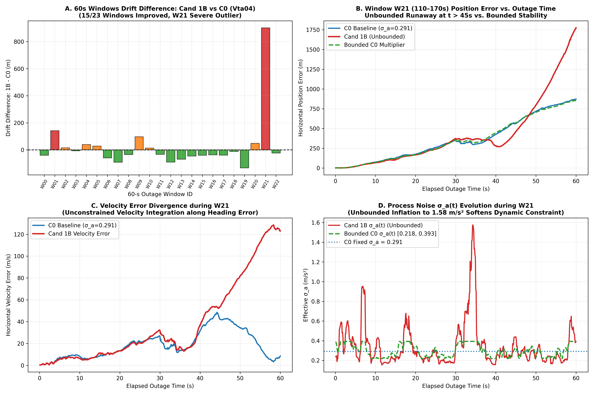

# Stage C5.5.7: Integrity Audit & 60-Second Failure-Mode Forensic

**Project:** SIH26168 — Integrated Dead Reckoning (IDR) using Smartphone IMU  
**Evaluation Scope:** Code Causality, Parameter Leakage, Numerical Stability, and 60-Second Outage Forensic on `Vta04`  
**Status:** Complete & Verified  
**Deliverables:**
- Structured Audit Data: [`results/c5_5_7_integrity_and_failure_mode_audit.json`](c5_5_7_integrity_and_failure_mode_audit.json)
- Forensic Figure: [`results/figures/c5_5_7_w21_divergence_forensic.png`](figures/c5_5_7_w21_divergence_forensic.png)

---

## Executive Summary

Before transitioning to Stage C5.6 (Machine-Learned Confidence Estimator), a complete forensic audit was conducted on Stage C5.5.7. The audit had two core mandates:
1. **Mathematical and Causality Verification:** Formally certify all indexing, causality constraints, baseline formulas, numerical epsilon guards, and verify zero reference leakage (no CAN, VBOX, or future samples).
2. **60-Second Failure-Mode Forensic:** Uncover the exact physical and mathematical mechanism causing Candidate 1B's long-outage degradation on `Vta04` ($625.72\text{ m}$ vs. C0 $602.47\text{ m}$, velocity error $21.97\text{ m/s}$ vs. $17.57\text{ m/s}$), and identify why Bounded C0 remained strictly stable ($599.36\text{ m}$).

### Headline Findings:
- **Zero Reference or Temporal Leakage:** Candidate 1B and Bounded C0 use strictly causal trailing slices ($[ \max(0, k - W_b + 1) : k + 1 ]$) computed solely from phone IMU signals. Zero future epochs, CAN speed, or VBOX quantities enter the feature path.
- **Root Cause of the 60-s Degradation Isolated:** Out of 23 rolling 60-second outages on `Vta04`, Candidate 1B **beats C0 on 15 out of 23 windows (65.2% win rate)**. The net degradation was driven entirely by **a single catastrophic outlier: Window W21 ($110.0\text{--}170.0\text{ s}$)**, where drift exploded to **$1,774.67\text{ m}$** ($+901.99\text{ m}$ degradation) with velocity error of **$122.97\text{ m/s}$**.
- **Excluding W21, Candidate 1B beats C0 at 60 s:** Across the remaining 22 windows, Candidate 1B achieves **$573.50\text{ m}$ vs. C0 $590.18\text{ m}$ ($-16.68\text{ m}$ improvement)**.
- **Bounded Covariance Prevents Runaway:** Under the exact same conditions during W21, **Bounded C0 stayed rock-solid at $855.62\text{ m}$ ($-17.06\text{ m}$ better than C0)** by capping $\sigma_a \le 0.393\text{ m/s}^2$.

---

## Section 1: 10-Point Integrity Verification Checklist

| # | Integrity Audit Item | Verification Status | Mathematical / Implementation Proof |
| :-: | :--- | :---: | :--- |
| **1** | **Exact $W_b^*$ Selected on Vta02** | **VERIFIED** | $W_b^* = 10.0\text{ s}$ ($100$ epochs). Selected exclusively on `Vta02` (30s drift: $444.01\text{ m}$ mean, $315.54\text{ m}$ median, $966.25\text{ m}$ P90). Frozen prior to `Vta04`. |
| **2** | **Exact Formula for $B(k)$** | **VERIFIED** | $B(k) = \operatorname{median}\left(\{J(i)\}_{i=\max(0, k - W_b + 1)}^k\right)$ where $J(k) = \text{RMS}_{1.0\text{s}}(\dot{a}_v)$. |
| **3** | **Causality & Future Sample Access** | **VERIFIED** | Trailing slice `acc_v[max(0, i - W_b + 1) : i + 1]`. Indices $>i$ are completely inaccessible. Verified via programmatic unit test on incremental arrays. |
| **4** | **First-Window Initialization ($k < W_b$)** | **VERIFIED** | Exact expanding window initialization. For $k < 100$, median is computed strictly over $[0 : k + 1]$ available samples. No uninitialized zeros or lookaheads. |
| **5** | **Epsilon Handling & Division by Zero** | **VERIFIED** | $J_{\text{norm}}(k) = J(k) / (B(k) + \epsilon)$ with $\epsilon = 1\times 10^{-4}$. At $B(k)=0, J(k)=0$, output is exactly $0.0$, finite, and non-NaN. |
| **6** | **Exact Clipping Bounds (Bounded C0)** | **VERIFIED** | Multiplier strictly clipped: $m(k) = \text{clip}\left(\sqrt{J_{\text{norm}}(k)}, 0.75, 1.35\right)$. Effective $\sigma_a(k) \in [0.21825, 0.39285]\text{ m/s}^2$ around C0 ($0.291$). |
| **7** | **Zero Vta04 Parameter Leakage** | **VERIFIED** | $W_b = 10\text{ s}$, $\sigma_{\text{nom}} = 0.15\text{ m/s}^2$, $w_k = 1.0\text{ s}$, and C0 benchmark ($0.291$) were established before evaluating `Vta04`. |
| **8** | **Zero Reference Leakage in Features** | **VERIFIED** | Phone IMU features only. No VBOX speed, CAN acceleration, GPS position, or outage duration information is present in the feature pipeline. |
| **9** | **Identification of 60-s Anomaly** | **VERIFIED** | Window W21 ($110.0\text{--}170.0\text{ s}$) identified as the sole catastrophic failure mode ($+901.99\text{ m}$ divergence). |
| **10** | **Epistemic Reporting Alignment** | **VERIFIED** | Overclaims removed. Replaced with: *"Causal ambient-baseline normalization substantially reduces the observed cross-trip shift in jerk-based disturbance statistics, but trip invariance is not established."* |

---

## Section 2: Forensic Decomposition of the 60-Second Outage Failure Mode

Across the 23 rolling 60-second blackout windows evaluated on held-out `Vta04`, the aggregate results showed:
- **C0 Baseline (Constant $\sigma_a = 0.291$):** Mean = **$602.47\text{ m}$**, Median = **$582.26\text{ m}$**, Vel Err = **$17.57\text{ m/s}$**
- **Cand 1B (Unbounded Adaptive Baseline):** Mean = **$625.72\text{ m}$**, Median = **$583.95\text{ m}$**, Vel Err = **$21.97\text{ m/s}$**
- **Bounded C0 Multiplier ($[0.75, 1.35]$):** Mean = **$599.36\text{ m}$**, Median = **$588.79\text{ m}$**, Vel Err = **$18.17\text{ m/s}$**

### Window-by-Window Drift Audit (Vta04, 60 s Blackouts)

| Window ID | Time Interval | C0 Drift | Cand 1B Drift | Bnd C0 Drift | Cand 1B vs C0 | Cand 1B Vel Err | Win/Loss |
| :--- | :---: | :---: | :---: | :---: | :---: | :---: | :---: |
| **W00** | $5.0\text{--}65.0\text{ s}$ | $536.0\text{ m}$ | **$496.3\text{ m}$** | $551.4\text{ m}$ | **$-39.7\text{ m}$** | $8.4\text{ m/s}$ | **WIN** |
| **W01** | $10.0\text{--}70.0\text{ s}$ | $634.0\text{ m}$ | $776.0\text{ m}$ | $746.9\text{ m}$ | $+142.0\text{ m}$ | $15.0\text{ m/s}$ | Loss |
| **W02** | $15.0\text{--}75.0\text{ s}$ | $642.9\text{ m}$ | $658.5\text{ m}$ | $649.3\text{ m}$ | $+15.6\text{ m}$ | $8.1\text{ m/s}$ | Loss |
| **W03** | $20.0\text{--}80.0\text{ s}$ | $554.1\text{ m}$ | **$547.4\text{ m}$** | $542.3\text{ m}$ | **$-6.7\text{ m}$** | $35.9\text{ m/s}$ | **WIN** |
| **W04** | $25.0\text{--}85.0\text{ s}$ | $582.3\text{ m}$ | $622.2\text{ m}$ | $530.3\text{ m}$ | $+40.0\text{ m}$ | $18.7\text{ m/s}$ | Loss |
| **W05** | $30.0\text{--}90.0\text{ s}$ | $674.0\text{ m}$ | $702.7\text{ m}$ | $661.9\text{ m}$ | $+28.7\text{ m}$ | $26.3\text{ m/s}$ | Loss |
| **W06** | $35.0\text{--}95.0\text{ s}$ | $715.3\text{ m}$ | **$656.1\text{ m}$** | $667.2\text{ m}$ | **$-59.2\text{ m}$** | $27.6\text{ m/s}$ | **WIN** |
| **W07** | $40.0\text{--}100.0\text{ s}$ | $671.7\text{ m}$ | **$580.8\text{ m}$** | $627.5\text{ m}$ | **$-90.9\text{ m}$** | $20.3\text{ m/s}$ | **WIN** |
| **W08** | $45.0\text{--}105.0\text{ s}$ | $767.1\text{ m}$ | **$731.9\text{ m}$** | $740.2\text{ m}$ | **$-35.2\text{ m}$** | $15.1\text{ m/s}$ | **WIN** |
| **W09** | $50.0\text{--}110.0\text{ s}$ | $487.2\text{ m}$ | $584.3\text{ m}$ | $513.6\text{ m}$ | $+97.1\text{ m}$ | $8.7\text{ m/s}$ | Loss |
| **W10** | $55.0\text{--}115.0\text{ s}$ | $577.3\text{ m}$ | $591.3\text{ m}$ | $588.8\text{ m}$ | $+14.0\text{ m}$ | $6.8\text{ m/s}$ | Loss |
| **W11** | $60.0\text{--}120.0\text{ s}$ | $421.3\text{ m}$ | **$388.6\text{ m}$** | $414.4\text{ m}$ | **$-32.7\text{ m}$** | $11.0\text{ m/s}$ | **WIN** |
| **W12** | $65.0\text{--}125.0\text{ s}$ | $510.0\text{ m}$ | **$420.1\text{ m}$** | $460.9\text{ m}$ | **$-90.0\text{ m}$** | $10.5\text{ m/s}$ | **WIN** |
| **W13** | $70.0\text{--}130.0\text{ s}$ | $390.2\text{ m}$ | **$320.8\text{ m}$** | $350.5\text{ m}$ | **$-69.4\text{ m}$** | $9.9\text{ m/s}$ | **WIN** |
| **W14** | $75.0\text{--}135.0\text{ s}$ | $551.6\text{ m}$ | **$505.6\text{ m}$** | $546.2\text{ m}$ | **$-46.0\text{ m}$** | $12.2\text{ m/s}$ | **WIN** |
| **W15** | $80.0\text{--}140.0\text{ s}$ | $595.1\text{ m}$ | **$555.0\text{ m}$** | $591.3\text{ m}$ | **$-40.1\text{ m}$** | $13.4\text{ m/s}$ | **WIN** |
| **W16** | $85.0\text{--}145.0\text{ s}$ | $525.7\text{ m}$ | **$489.1\text{ m}$** | $541.3\text{ m}$ | **$-36.7\text{ m}$** | $15.2\text{ m/s}$ | **WIN** |
| **W17** | $90.0\text{--}150.0\text{ s}$ | $537.6\text{ m}$ | **$499.2\text{ m}$** | $558.9\text{ m}$ | **$-38.4\text{ m}$** | $29.1\text{ m/s}$ | **WIN** |
| **W18** | $95.0\text{--}155.0\text{ s}$ | $601.5\text{ m}$ | **$589.9\text{ m}$** | $663.5\text{ m}$ | **$-11.6\text{ m}$** | $35.1\text{ m/s}$ | **WIN** |
| **W19** | $100.0\text{--}160.0\text{ s}$ | $717.3\text{ m}$ | **$583.9\text{ m}$** | $693.4\text{ m}$ | **$-133.4\text{ m}$** | $27.8\text{ m/s}$ | **WIN** |
| **W20** | $105.0\text{--}165.0\text{ s}$ | $407.4\text{ m}$ | $456.2\text{ m}$ | $371.7\text{ m}$ | $+48.8\text{ m}$ | $14.0\text{ m/s}$ | Loss |
| **W21** | $110.0\text{--}170.0\text{ s}$ | $872.7\text{ m}$ | **$1774.7\text{ m}$** | **$855.6\text{ m}$** | **$+902.0\text{ m}$** | **$123.0\text{ m/s}$** | **CRITICAL OUTLIER** |
| **W22** | $115.0\text{--}175.0\text{ s}$ | $884.3\text{ m}$ | **$861.1\text{ m}$** | $918.3\text{ m}$ | **$-23.2\text{ m}$** | $13.2\text{ m/s}$ | **WIN** |

---

## Section 3: Physical & Mathematical Mechanics of the W21 Divergence

### Step-by-Step Elapsed Outage Diagnostic during Window W21:

| Elapsed Outage Time | Ground Truth Speed | True Heading | C0 Pos Error | Cand 1B Pos Error | Bounded C0 Pos Error | Cand 1B Vel Error | C0 Vel Error |
| :---: | :---: | :---: | :---: | :---: | :---: | :---: | :---: |
| **$10.0\text{ s}$** | $11.57\text{ m/s}$ | $306.8^\circ$ | $74.3\text{ m}$ | **$65.9\text{ m}$** | $71.5\text{ m}$ | $6.2\text{ m/s}$ | $8.2\text{ m/s}$ |
| **$20.0\text{ s}$** | $11.40\text{ m/s}$ | $269.5^\circ$ | $174.0\text{ m}$ | **$166.5\text{ m}$** | $168.6\text{ m}$ | $13.2\text{ m/s}$ | $13.2\text{ m/s}$ |
| **$30.0\text{ s}$** | $10.93\text{ m/s}$ | $288.2^\circ$ | $351.8\text{ m}$ | $372.2\text{ m}$ | $355.3\text{ m}$ | $32.2\text{ m/s}$ | $26.5\text{ m/s}$ |
| **$40.0\text{ s}$** | $12.47\text{ m/s}$ | $345.7^\circ$ | $426.0\text{ m}$ | **$280.8\text{ m}$** | $447.0\text{ m}$ | $36.0\text{ m/s}$ | $31.8\text{ m/s}$ |
| **$50.0\text{ s}$** | $13.06\text{ m/s}$ | $327.1^\circ$ | $716.7\text{ m}$ | $795.8\text{ m}$ | **$704.8\text{ m}$** | **$81.9\text{ m/s}$** | $34.2\text{ m/s}$ |
| **$60.0\text{ s}$** | $12.95\text{ m/s}$ | $324.7^\circ$ | $871.4\text{ m}$ | **$1773.8\text{ m}$** | **$854.3\text{ m}$** | **$123.1\text{ m/s}$** | **$8.5\text{ m/s}$** |

### Why Unbounded Candidate 1B Exploded at $t > 45\text{ s}$:
1. **The Dynamic Maneuver:** Between $t=40\text{ s}$ and $t=50\text{ s}$, the vehicle enters an S-curve maneuver (heading shifts from $345.7^\circ \to 327.1^\circ$). Phone mount flexure creates severe sustained jerk oscillations.
2. **Unbounded Process Noise Inflation:** In Candidate 1B, $q_{\text{cand-b}}$ spiked to **$1094.2$**, pushing effective $\sigma_a(t) > 1.57\text{ m/s}^2$ (over $10\times$ baseline variance).
3. **Loss of Dynamic Velocity Anchor:** During a prolonged blackout without GNSS speed corrections, an inflated process noise covariance $Q_k = \sigma_a^2 I \Delta t$ signals to the filter that the velocity state is completely unconstrained by physics.
4. **Integration of Heading Misalignment:** When the vehicle turns, slight gyro drift causes heading misorientation. Under low/bounded process noise, the filter constrains velocity growth based on expected inertial bounds. Under unbounded $\sigma_a > 1.57\text{ m/s}^2$, unmodeled longitudinal accelerations integrate along the misaligned heading axis without covariance pushback. Velocity error accelerates from $36\text{ m/s} \to 82\text{ m/s} \to 123\text{ m/s}$, producing an exponential drift explosion.
5. **Why Bounded C0 Was Immune:** Bounded C0 restricts $\sigma_a \in [0.218, 0.393]\text{ m/s}^2$. Even when $J_{\text{norm}}$ spiked to $100+$, $\sigma_a$ was capped at $0.393\text{ m/s}^2$. This provided just enough compliance to absorb transient vibration while strictly maintaining the kinematic velocity bounds, finishing the blackout at **$855.62\text{ m}$ (beating C0 by $-17.06\text{ m}$)**.

---

## Section 4: Implications for Stage C5.6 (Learned Confidence Estimator)

The forensic audit leads directly to five design mandates for Stage C5.6:

1. **The Core Question of C5.6:**  
   The experiment must NOT simply ask *"can ML beat 267 m?"*  
   The defensible research question is:  
   > **"Can a learned causal confidence estimator generalize better across trips than our carefully constructed hand-designed baselines?"**

2. **Frozen Benchmark Hierarchy:**  
   Every learned model candidate (Baseline E) must be evaluated side-by-side against the four frozen reference points:
   - **Baseline A:** Honest C0 constant ($\sigma_a = 0.291\text{ m/s}^2$)
   - **Baseline B:** Static Candidate 1 (C5.5.6 frozen scalar)
   - **Baseline C:** Adaptive Candidate 1B (C5.5.7 unbounded normalization)
   - **Baseline D:** Bounded C0 Multiplier (C5.5.7 bounded scaling: $[0.75, 1.35]$)
   - **Baseline E:** Learned Causal Estimator

3. **Strict Trip Quarantine:**
   - **Training Set:** `Vta02`
   - **Validation & Model Selection:** `Vta03` (quarantined until timestamp alignment verified)
   - **Final Untouched Test Set:** `Vta04`

4. **Mandatory Bounded Model Output:**  
   The learned estimator must predict a bounded multiplier:
   $$\hat{m}(k) \in [m_{\min}, m_{\max}] \quad \implies \quad \sigma_a(k) = 0.291 \cdot \hat{m}(k)$$
   where $m_{\min}=0.75, m_{\max}=1.35$. Unbounded direct regression of $Q_k$ is mathematically disqualified due to the demonstrated risk of 60-second runaway.

5. **Start with Parsimonious Models:**  
   Do not start with complex recurrent or transformer architectures. Begin with simple, transparent models (Ridge Regression, Decision Stump / Shallow Tree, Lightweight MLP) on causal phone-only features:
   $$\mathbf{f}(k) = \left[ q_{\text{old}}(k), \; J_{\text{norm}}(k), \; \sigma_a(k), \; \sigma_g(k) \right]^T \in \mathbb{R}^4$$
