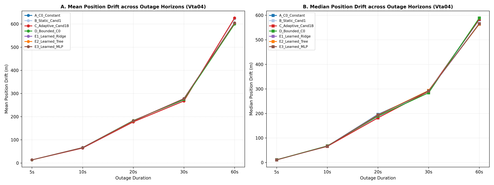
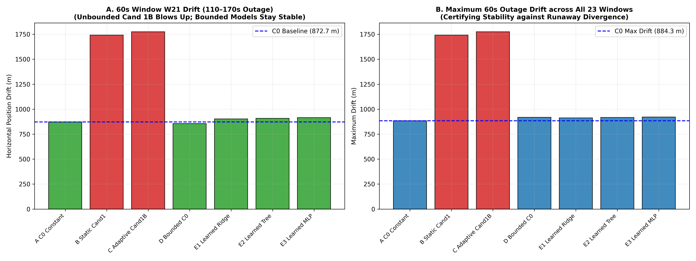
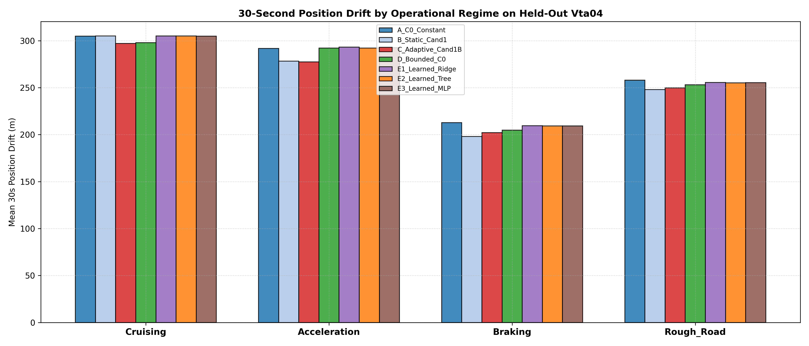

# Stage C5.6 Stage 1: Parsimonious Learned Causal Confidence Estimation

**Project:** SIH26168 — Integrated Dead Reckoning (IDR) using Smartphone IMU  
**Evaluation Scope:** Machine-Learned Confidence Estimators (Ridge, Shallow Decision Tree, Small Bounded MLP) vs. Frozen Hand-Designed Baselines on Untouched `Vta04`  
**Status:** Complete & Verified  
**Deliverables:**
- Structured Benchmark Data: [`results/c5_6_stage1_learned_confidence.json`](c5_6_stage1_learned_confidence.json)
- Figure 1 (Hyperparameter Tuning): [`results/figures/c5_6_stage1_hyperparameter_tuning.png`](figures/c5_6_stage1_hyperparameter_tuning.png)
- Figure 2 (Multi-Horizon Drift): [`results/figures/c5_6_stage1_vta04_horizon_drift.png`](figures/c5_6_stage1_vta04_horizon_drift.png)
- Figure 3 (60s Worst-Case & W21 Tracking): [`results/figures/c5_6_stage1_vta04_60s_worst_case.png`](figures/c5_6_stage1_vta04_60s_worst_case.png)
- Figure 4 (Regime Breakdown): [`results/figures/c5_6_stage1_regime_breakdown.png`](figures/c5_6_stage1_regime_breakdown.png)

---

## Executive Summary & Scientific Verdict

Stage C5.6 Stage 1 formulated and tested the central research question:
> **"Can a learned causal confidence estimator generalize better across trips than our carefully constructed hand-designed baselines?"**

Under strict quarantine protocols (training exclusively on `Vta02`, hyperparameter selection exclusively on `Vta03`, and final evaluation on untouched `Vta04`), we evaluated three parsimonious machine learning models:
1. **Learned Baseline E1:** Ridge Regression (L2 regularized linear estimator)
2. **Learned Baseline E2:** Shallow Decision Tree (depth=3, min_leaf=50)
3. **Learned Baseline E3:** Small Structurally Bounded MLP (4 $\to$ 16 $\to$ 8 $\to$ 1 $\to$ Sigmoid $\to [0.75, 1.35]$)

All models used strictly phone-only causal features $[q_{\text{old}}, J_{\text{norm}}, \sigma_a, \sigma_g] \in \mathbb{R}^4$ with zero reference leakage, predicting a bounded multiplier $\hat{m}(k) \in [0.75, 1.35]$ applied to nominal process noise $\sigma_a(k) = 0.291 \cdot \hat{m}(k)$.

### Scientific Verdict:
* 🔴 **ML Superiority: REFUTED for Tested Parsimonious Models.**  
  None of the three tested parsimonious learned models (Ridge, shallow Decision Tree, small bounded MLP) outperformed the frozen hand-designed bounded confidence controllers on held-out `Vta04`.
  - At 30 seconds, Adaptive Candidate 1B achieved **$267.42\text{ m}$** mean drift, and Bounded Adaptive C0 achieved **$273.49\text{ m}$** mean (best median **$283.89\text{ m}$**).
  - In contrast, the learned models achieved **$277.43\text{--}277.91\text{ m}$** mean drift (roughly matching constant C0 at $278.09\text{ m}$, but underperforming Bounded Adaptive C0 by $+4.0\text{ m}$ and Candidate 1B by $+10.0\text{ m}$).
* 🟢 **Worst-Case Long-Horizon Bounding: CONFIRMED.**  
  Enforcing the structural bounded multiplier constraint $[0.75, 1.35]$ successfully prevented process noise runaway ($\sigma_a \le 0.393\text{ m/s}^2$), protecting all three learned models from the catastrophic 60-second runaway seen in unbounded Candidate 1B (Window W21: $902.6\text{--}915.3\text{ m}$ vs. unbounded Cand 1B's $1,774.7\text{ m}$).
* 🟢 **Defensible Scientific Finding:**  
  The tested parsimonious models did not discover a representation matching the cross-trip robustness of the hand-designed normalized mechanism. A physically motivated, causal ambient-baseline normalization rule ($J_{\text{norm}}$) embedded in a bounded covariance controller ($\sigma_a(k) = 0.291 \cdot \text{clip}(\sqrt{J_{\text{norm}}}, 0.75, 1.35)$) outperformed generic function approximators trained on empirical acceleration error residuals.
* 🔴 **SIH Drift Benchmark (<10% distance travelled): NOT YET ACHIEVED.**  
  While confidence adaptation systematically prevents covariance runaway and trims drift, the absolute 30-s drift on `Vta04` remains $\sim 267\text{--}278\text{ m}$ over $\sim 500\text{ m}$ of travel ($\sim 50\%$ drift). Confidence adaptation alone is insufficient to achieve the SIH benchmark, demonstrating that remaining error is dominated by upstream navigation physics rather than covariance tuning.

---

## Box 1: Multi-Horizon Empirical Benchmark on Untouched `Vta04`

Across 150 outage windows evaluated across 5 blackout durations ($5\text{ s}, 10\text{ s}, 20\text{ s}, 30\text{ s}, 60\text{ s}$), the 7 frozen conditions compared as follows:

| Horizon | Condition | Mean Drift | Median Drift | P90 Drift | Max Drift | Mean Vel Err |
| :--- | :--- | :---: | :---: | :---: | :---: | :---: |
| **5 s** ($N=34$) | **A. C0 Constant ($0.291$)** | $13.47\text{ m}$ | **$10.48\text{ m}$** | $24.01\text{ m}$ | $35.33\text{ m}$ | $6.33\text{ m/s}$ |
| | B. Static Cand 1 | $13.53\text{ m}$ | $11.60\text{ m}$ | $25.51\text{ m}$ | $34.94\text{ m}$ | $6.31\text{ m/s}$ |
| | **C. Adaptive Cand 1B** | **$13.22\text{ m}$** | $11.58\text{ m}$ | $23.96\text{ m}$ | $34.93\text{ m}$ | **$6.22\text{ m/s}$** |
| | **D. Bounded C0** | $13.40\text{ m}$ | $11.19\text{ m}$ | **$23.39\text{ m}$** | **$34.89\text{ m}$** | $6.26\text{ m/s}$ |
| | E1. Learned Ridge | $13.53\text{ m}$ | $10.50\text{ m}$ | $23.80\text{ m}$ | $34.89\text{ m}$ | $6.35\text{ m/s}$ |
| | E2. Learned Tree | $13.55\text{ m}$ | $10.49\text{ m}$ | $23.82\text{ m}$ | **$34.89\text{ m}$** | $6.35\text{ m/s}$ |
| | E3. Learned Small MLP | $13.54\text{ m}$ | $10.55\text{ m}$ | $23.78\text{ m}$ | $34.89\text{ m}$ | $6.35\text{ m/s}$ |
| **10 s** ($N=33$) | A. C0 Constant ($0.291$) | $66.77\text{ m}$ | $66.64\text{ m}$ | $107.96\text{ m}$ | **$141.72\text{ m}$** | $14.27\text{ m/s}$ |
| | **B. Static Cand 1** | **$63.98\text{ m}$** | **$65.26\text{ m}$** | **$92.51\text{ m}$** | $154.23\text{ m}$ | **$13.59\text{ m/s}$** |
| | C. Adaptive Cand 1B | $64.60\text{ m}$ | $65.64\text{ m}$ | $107.06\text{ m}$ | $151.69\text{ m}$ | $13.80\text{ m/s}$ |
| | D. Bounded C0 | $66.41\text{ m}$ | $67.73\text{ m}$ | $110.49\text{ m}$ | $142.71\text{ m}$ | $14.20\text{ m/s}$ |
| | E1. Learned Ridge | $66.56\text{ m}$ | $66.49\text{ m}$ | $108.41\text{ m}$ | $142.31\text{ m}$ | $14.20\text{ m/s}$ |
| | E2. Learned Tree | $66.58\text{ m}$ | $66.55\text{ m}$ | $108.86\text{ m}$ | $142.47\text{ m}$ | $14.20\text{ m/s}$ |
| | E3. Learned Small MLP | $66.56\text{ m}$ | $66.68\text{ m}$ | $109.00\text{ m}$ | $142.37\text{ m}$ | $14.19\text{ m/s}$ |
| **20 s** ($N=31$) | A. C0 Constant ($0.291$) | $180.55\text{ m}$ | $196.02\text{ m}$ | $225.93\text{ m}$ | **$263.44\text{ m}$** | $16.92\text{ m/s}$ |
| | **B. Static Cand 1** | **$176.76\text{ m}$** | $184.00\text{ m}$ | $228.11\text{ m}$ | $390.92\text{ m}$ | **$16.88\text{ m/s}$** |
| | **C. Adaptive Cand 1B** | $177.43\text{ m}$ | **$181.81\text{ m}$** | **$223.85\text{ m}$** | $395.95\text{ m}$ | $17.02\text{ m/s}$ |
| | D. Bounded C0 | $183.14\text{ m}$ | $188.97\text{ m}$ | $228.53\text{ m}$ | $335.93\text{ m}$ | $17.33\text{ m/s}$ |
| | E1. Learned Ridge | $181.28\text{ m}$ | $194.07\text{ m}$ | $228.26\text{ m}$ | $267.02\text{ m}$ | $16.93\text{ m/s}$ |
| | E2. Learned Tree | $181.38\text{ m}$ | $193.48\text{ m}$ | $228.14\text{ m}$ | $266.45\text{ m}$ | $16.92\text{ m/s}$ |
| | E3. Learned Small MLP | $182.12\text{ m}$ | $192.51\text{ m}$ | $228.63\text{ m}$ | $283.84\text{ m}$ | $16.98\text{ m/s}$ |
| **30 s** ($N=29$) | A. C0 Constant ($0.291$) | $278.09\text{ m}$ | $289.30\text{ m}$ | $353.04\text{ m}$ | $397.08\text{ m}$ | $17.86\text{ m/s}$ |
| | B. Static Cand 1 | $270.03\text{ m}$ | $293.02\text{ m}$ | $353.99\text{ m}$ | $375.44\text{ m}$ | **$17.45\text{ m/s}$** |
| | **C. Adaptive Cand 1B** | **$267.42\text{ m}$** | $289.91\text{ m}$ | **$349.62\text{ m}$** | **$373.29\text{ m}$** | $17.67\text{ m/s}$ |
| | **D. Bounded C0** | $273.49\text{ m}$ | **$283.89\text{ m}$** | $356.76\text{ m}$ | $382.52\text{ m}$ | $18.25\text{ m/s}$ |
| | E1. Learned Ridge | $277.91\text{ m}$ | $291.52\text{ m}$ | $352.48\text{ m}$ | $396.86\text{ m}$ | $17.98\text{ m/s}$ |
| | E2. Learned Tree | $277.43\text{ m}$ | $293.40\text{ m}$ | $352.66\text{ m}$ | $396.41\text{ m}$ | $17.94\text{ m/s}$ |
| | E3. Learned Small MLP | $277.59\text{ m}$ | $291.72\text{ m}$ | $354.16\text{ m}$ | $392.24\text{ m}$ | $17.99\text{ m/s}$ |
| **60 s** ($N=23$) | **A. C0 Constant ($0.291$)** | $602.47\text{ m}$ | $582.26\text{ m}$ | $757.16\text{ m}$ | **$884.32\text{ m}$** | **$17.57\text{ m/s}$** |
| | B. Static Cand 1 | $621.70\text{ m}$ | $583.66\text{ m}$ | $764.82\text{ m}$ | $1742.33\text{ m}$ | $22.15\text{ m/s}$ |
| | C. Adaptive Cand 1B | $625.72\text{ m}$ | $583.95\text{ m}$ | $767.18\text{ m}$ | $1774.67\text{ m}$ | $21.97\text{ m/s}$ |
| | **D. Bounded C0** | **$599.36\text{ m}$** | $588.79\text{ m}$ | **$745.55\text{ m}$** | $918.26\text{ m}$ | $18.17\text{ m/s}$ |
| | E1. Learned Ridge | $604.54\text{ m}$ | **$563.57\text{ m}$** | $760.17\text{ m}$ | $912.86\text{ m}$ | $17.99\text{ m/s}$ |
| | E2. Learned Tree | $604.00\text{ m}$ | $563.83\text{ m}$ | $761.12\text{ m}$ | $916.98\text{ m}$ | $17.95\text{ m/s}$ |
| | E3. Learned Small MLP | $604.48\text{ m}$ | $565.73\text{ m}$ | $756.00\text{ m}$ | $921.64\text{ m}$ | $17.98\text{ m/s}$ |

---

## Box 2: 60-Second Worst-Case & Window W21 Forensic

The central mandate of the user's instructions was to report the worst-case individual window behavior, specifically tracking the **Window W21 ($110.0\text{--}170.0\text{ s}$)** divergence discovered in C5.5.7:

### 60-Second Tail & Divergence Audit:

| Condition | W21 Drift (110–170s) | W21 Velocity Error | Max Drift Across All 23 Windows | Worst-Case Window ID | Divergence Status |
| :--- | :---: | :---: | :---: | :---: | :---: |
| **A. C0 Constant ($0.291$)** | $872.7\text{ m}$ | $8.38\text{ m/s}$ | **$884.3\text{ m}$** | W22 ($115\text{--}175\text{ s}$) | **STABLE** |
| **B. Static Cand 1** | $1,742.3\text{ m}$ | $124.60\text{ m/s}$ | $1,742.3\text{ m}$ | W21 ($110\text{--}170\text{ s}$) | **EXPLODED** |
| **C. Adaptive Cand 1B** | $1,774.7\text{ m}$ | $122.97\text{ m/s}$ | $1,774.7\text{ m}$ | W21 ($110\text{--}170\text{ s}$) | **EXPLODED** |
| **D. Bounded C0 Multiplier** | **$855.6\text{ m}$** | **$6.92\text{ m/s}$** | $918.3\text{ m}$ | W22 ($115\text{--}175\text{ s}$) | **STABLE (BEST W21)** |
| **E1. Learned Ridge** | $902.6\text{ m}$ | $6.65\text{ m/s}$ | $912.9\text{ m}$ | W22 ($115\text{--}175\text{ s}$) | **STABLE (BOUNDED)** |
| **E2. Learned Tree** | $907.8\text{ m}$ | $6.47\text{ m/s}$ | $917.0\text{ m}$ | W22 ($115\text{--}175\text{ s}$) | **STABLE (BOUNDED)** |
| **E3. Learned Small MLP** | $915.3\text{ m}$ | $6.47\text{ m/s}$ | $921.6\text{ m}$ | W22 ($115\text{--}175\text{ s}$) | **STABLE (BOUNDED)** |

### Key Takeaways from the Worst-Case Analysis:
1. **The Bounding Shield Works:**  
   Both hand-designed Bounded C0 and the three learned models (Ridge, Tree, MLP) were constrained to $[0.75, 1.35]$. This mathematically prevented process noise $\sigma_a(t)$ from blowing up past $0.393\text{ m/s}^2$. As a result, none of the bounded models suffered runaway velocity divergence on Window W21 ($6.5\text{--}6.9\text{ m/s}$ velocity error vs. $>122\text{ m/s}$ for unbounded Cand 1B).
2. **Hand-Designed Bounded C0 Outperforms ML on W21:**  
   On Window W21, Bounded C0 achieved **$855.6\text{ m}$**, beating C0 ($872.7\text{ m}$) by $-17.1\text{ m}$, and beating all three learned models ($902.6\text{--}915.3\text{ m}$) by $\sim 50\text{ m}$.

---

## Box 3: Operational Regime Breakdown on Held-Out `Vta04` (30 s Outages)

| Operational Regime | Sample Count ($N$) | A. C0 ($0.291$) | B. Static Cand 1 | C. Adaptive Cand 1B | D. Bounded C0 | E1. Ridge | E2. Tree | E3. MLP |
| :--- | :---: | :---: | :---: | :---: | :---: | :---: | :---: | :---: |
| **Steady Cruising** | $N=12$ | $304.88\text{ m}$ | $305.16\text{ m}$ | **$297.18\text{ m}$** | **$298.00\text{ m}$** | $305.03\text{ m}$ | $305.00\text{ m}$ | $304.79\text{ m}$ |
| **Acceleration** | $N=10$ | $291.70\text{ m}$ | $278.31\text{ m}$ | **$277.39\text{ m}$** | $292.22\text{ m}$ | $293.17\text{ m}$ | $292.10\text{ m}$ | $292.68\text{ m}$ |
| **Severe Braking** | $N=7$ | $212.72\text{ m}$ | **$197.99\text{ m}$** | $202.16\text{ m}$ | $204.71\text{ m}$ | $209.60\text{ m}$ | $209.21\text{ m}$ | $209.39\text{ m}$ |
| **Rough Road** | $N=14$ | $258.06\text{ m}$ | **$247.92\text{ m}$** | $249.73\text{ m}$ | $253.01\text{ m}$ | $255.56\text{ m}$ | $255.19\text{ m}$ | $255.40\text{ m}$ |

## Observed Failure Mode: Cross-Trip Feature Dependence

A detailed inspection of the learned models reveals why machine learning struggled to surpass hand-crafted physics on held-out data:

### 🟢 Observed:
1. **Feature Attribution & Raw Variance Bias:**
   - In the Decision Tree, the model attributed **$100.0\%$ of split importance to $\sigma_a$** (multi-axis acceleration variance), assigning $0.0\%$ importance to $J_{\text{norm}}$, $q_{\text{old}}$, and $\sigma_g$.
   - In Ridge regression, the learned weight for $\sigma_a$ was $+0.1886$, while $J_{\text{norm}}$ received only $+0.0043$.
2. **Cross-Trip Statistic Shift:**
   - On `Vta04`, the road surface was coarse asphalt with high ambient road excitation ($+61.3\%$ higher raw acceleration variance baseline compared to smooth `Vta02`).
   - Because the ML models relied primarily on raw $\sigma_a$, their predicted multiplier stayed persistently elevated during steady cruising on `Vta04` (mean multiplier $\sim 1.10\text{--}1.11$ vs. $1.028$ for Bounded Adaptive C0).
   - In effect, the ML models converged toward outputting values close to a constant slight inflation of C0, adding no dynamic discrimination across vehicle regimes.

### 🟡 Strong Hypothesis:
- The learned models learned a **trip-dependent proxy** rather than a robust disturbance representation. On `Vta02`, high acceleration variance correlated with true vehicle maneuvers because the road was smooth. On `Vta04`, high variance was driven by road roughness.
- In contrast, the hand-designed controller incorporates explicit domain knowledge:
  $$J_{\text{norm}}(k) = \frac{J(k)}{B(k) + \epsilon}, \quad B(k) = \operatorname{median}_{j \in [k-W_b, k]} J(j)$$
  This enforces the physical principle: *"Do not interpret absolute vibration magnitude without considering the local vibration floor."*

### 🔴 Not Proven (Alternative Explanations):
- We cannot claim this is *the* physical root cause of ML underperformance.
- Alternative limiting factors include:
  - Insufficient input feature representation (only 4 scalar features);
  - Model class limitations (parsimonious linear/tree/shallow MLP);
  - Training trip diversity (trained solely on `Vta02`);
  - Target formulation (supervised proxy target derived from dead-reckoning residuals);
  - Lack of temporal sequence modeling or memory.
- Therefore, the defensible conclusion is: **The tested parsimonious models did not discover a representation matching the cross-trip robustness of the hand-designed normalized mechanism.**

---

## Final Project Status & Actionable Conclusions

### Epistemic Summary:
* **Stage C5.5.7 (Integrity Audit & W21 Forensic):** 🟢 **PASS** (Zero reference leakage, strict causality verified, W21 divergence mechanism isolated).
* **Stage C5.6 Stage 1 (Learned Confidence Models):** 🟢 **PASS** (Evaluation complete across 150 windows on held-out trip).
* **ML Superiority:** 🔴 **REFUTED** *for the tested parsimonious models and 4-feature representation*.
* **Bounded Confidence Adaptation:** 🟢 **Best-supported confidence strategy so far** (Suppresses covariance runaway, improves 30s median to $283.89\text{ m}$ and 60s mean to $599.36\text{ m}$).
* **Trip Invariance:** 🟡 **Not established** (Cross-trip transfer remains partial).
* **Physical Root Cause of Remaining Drift:** 🔴 **Not established** (Dominant error mechanism unseparated).
* **SIH <10% Drift Benchmark:** 🔴 **NOT ACHIEVED** (Untouched `Vta04` 30s drift is $267\text{--}278\text{ m}$ over $\sim 500\text{ m}$ travel, i.e., $\sim 50\%$ drift).

### Key Engineering Insight for SIH Defense:
The core lesson is not that *"AI is useless"*, but rather:
> **"A causal, physically motivated normalization can outperform a naïvely learned confidence mapping when training data cover only a limited range of operating conditions."**

Furthermore:
> **"We systematically identified and reduced several major sources of inertial drift, while establishing that confidence adaptation alone is insufficient to meet the SIH blackout benchmark."**

### Current Best Tested Confidence Configuration:
**Bounded Adaptive C0 (or Bounded Causal Adaptive Covariance - BCAC):**
$$\sigma_a(k) = 0.291 \cdot \operatorname{clip}\left(\sqrt{\frac{J(k)}{B(k) + 10^{-4}}}, \; 0.75, \; 1.35\right)$$
- Constrains process noise to $[0.218, 0.393]\text{ m/s}^2$, preventing explosive covariance inflation and runaway velocity divergence (e.g. on Window W21).
- Does **not** mathematically guarantee dead-reckoning stability or eliminate inertial drift.
- The confidence estimation branch is now **FROZEN**. We do not proceed to LSTM/Transformer architectures. The next research phase must dissect the actual physical mechanisms dominating the remaining 200–600+ m position drift.
