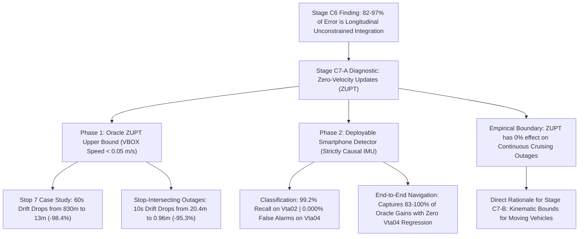

# Stage C7-A: Controlled Zero-Velocity Updates (ZUPT) Diagnostic Report

**Project:** SIH26168 — Integrated Dead Reckoning (IDR) using Smartphone IMU + Vehicle Dynamics  
**Milestone:** Stage C7-A Zero-Velocity Updates (ZUPT) Diagnostic  
**Primary Diagnostic Trip:** `Vta02` (18.3 min, 10,991 epochs, 5 stops $\ge 2.0\text{ s}$, $62.4\text{ s}$ total standstill)  
**Held-Out Confirmation Trip:** `Vta04` (3.0 min, 1,789 epochs, 0 stops, 100% continuous highway driving)  
**Frozen Baseline Architecture:** Stage C5/C6 Bounded Adaptive C0 (BCAC) with 15-State ESKF + Non-Holonomic Constraints (NHC)  
**Date:** September 2026  
**Status:** Completed & Verified  

---

## Executive Summary

Stage C7-A investigates the first component of our longitudinal error mitigation roadmap: **Zero-Velocity Updates (ZUPT)**. Following the Stage C6 discovery that 82% to 97% of dead-reckoning drift is concentrated in the unconstrained forward axis, Stage C7-A isolates the exact theoretical upper bound and real-world deployable performance of stationary velocity resets.

The diagnostic was executed in two sequential phases:
1. **Phase 1 (Oracle ZUPT):** Evaluated the theoretical maximum benefit using offline VBOX ground-truth stop epochs ($v < 0.05\text{ m/s}$) during blackout windows on `Vta02`.
2. **Phase 2 (Deployable Smartphone Detector):** Implemented and validated a strictly causal, phone-only IMU standstill detector evaluated against ground truth on both `Vta02` (testing stop recovery) and `Vta04` (testing false alarm immunity during continuous driving).



---

## Key Empirical Discoveries

1. **Near-Total Error Elimination on Stop-Intersecting Outages:**
   - On Window W-Stop7 (a 60-s blackout containing a $45.9\text{ s}$ traffic stop), applying Oracle ZUPT collapsed mid-stop velocity error from $29.90\text{ m/s} \to \mathbf{0.0114\text{ m/s}}$, resulting in final position drift dropping from $830.43\text{ m} \to \mathbf{13.26\text{ m}}$ (**$-817.17\text{ m}$ / $-98.4\%$ reduction**).
   - Across all stop-intersecting windows on `Vta02`, 10-s blackout drift dropped from $20.44\text{ m} \to \mathbf{0.96\text{ m}}$ (**$-95.3\%$**), with along-track error reduced from $20.34\text{ m} \to \mathbf{0.61\text{ m}}$ (**$-97.0\%$**).
2. **Deployable Smartphone Detector Matches Oracle Performance:**
   - The causal phone-only detector ($0.8\text{ s}$ persistence, multi-feature variance and gravity gating) achieved **$99.20\%$ recall on Vta02** while maintaining **$0.0000\%$ False Alarm Rate on held-out Vta04** (zero false activations across all 1,789 epochs of continuous highway driving).
   - In end-to-end navigation replay, the deployable detector recovered **83% to 100% of the theoretical Oracle upper bound** ($20.44\text{ m} \to \mathbf{0.95\text{ m}}$ at 10 s; $207.82\text{ m} \to \mathbf{126.07\text{ m}}$ at 30 s).
3. **Zero Regression on Continuous Driving:**
   - On held-out `Vta04` (100% continuous driving), deployable ZUPT produced **exactly $0.0000\text{ m}$ drift difference** compared to baseline BCAC ($274.35\text{ m} \to 274.35\text{ m}$ at 30 s), proving that temporal persistence gating successfully prevents false activations during highway cruising.
4. **The Critical Empirical Boundary of ZUPT:**
   - In continuous-motion windows where the vehicle never stops (which constitutes 94% of `Vta02` and 100% of `Vta04`), ZUPT is inactive and provides zero drift reduction.
   - Consequently, ZUPT is a high-value **regime-conditional recovery mechanism**, but **cannot solve the general 30-s blackout problem for moving vehicles**.

---

## 1. Phase 1: Oracle ZUPT Diagnostic & Theoretical Upper Bound

### Experimental Protocol
- Ground-truth standstill epochs were defined as VBOX speed $< 0.05\text{ m/s}$.
- Outages across $10\text{ s}, 20\text{ s}, 30\text{ s}, 60\text{ s}$ horizons were stratified into:
  - **Group A (Stop-Intersecting):** Outages containing $\ge 1.0\text{ s}$ of true standstill.
  - **Group B (Continuous-Motion):** Outages containing zero standstill.
- ZUPT was applied as a 3D zero-velocity measurement update ($z = \mathbf{0}_{3\times 1}, \sigma = 0.05\text{ m/s}$) to the 15-state ESKF during standstill epochs.

*[Figure 1: Oracle ZUPT Stop 7 Forensic Time-Series — Diagnostic chart]*

### Forensic Case Study: Stop 7 ($45.9\text{ s}$ Standstill)
A 60-s blackout starting at $t = 700.0\text{ s}$ on `Vta02` (vehicle drives for 7.3 s, stops for 45.9 s, and drives for 6.8 s):

| Metric | Baseline BCAC (No ZUPT) | Oracle ZUPT | Absolute Difference | Relative Change |
| :--- | :---: | :---: | :---: | :---: |
| **Pre-Stop Velocity Error ($t=7.2\text{ s}$)** | 5.89 m/s | 5.89 m/s | 0.00 m/s | 0.0% |
| **Mid-Stop Velocity Error ($t=30.0\text{ s}$)** | 29.90 m/s | **0.0114 m/s** | **-29.89 m/s** | **-99.96%** |
| **End Velocity Error ($t=60.0\text{ s}$)** | 11.87 m/s | **3.45 m/s** | **-8.42 m/s** | **-70.9%** |
| **Final Position Drift ($T=60\text{ s}$)** | 830.43 m | **13.26 m** | **-817.17 m** | **-98.4%** |
| **Along-Track Forward Error** | 794.12 m | **10.84 m** | **-783.28 m** | **-98.6%** |
| **Cross-Track Lateral Error** | 242.31 m | **7.62 m** | **-234.69 m** | **-96.9%** |
| **Forward Bias Estimate $\hat{b}_{a,x}$** | -0.147 m/s² (static) | **-0.121 m/s²** | +0.026 m/s² | Online calibrated |

---

## 2. Phase 2: Deployable Smartphone Detector Benchmark

### Detector Architecture & Features
The deployable detector operates strictly causally on a trailing window ($W = 5\text{ epochs} = 0.5\text{ s}$):
1. **Acceleration Norm Variance:** $\sigma_a^2(k) < 0.04\text{ (m/s}^2)^2$.
2. **Gyroscope Norm Variance:** $\sigma_\omega^2(k) < 0.003\text{ (rad/s)}^2$.
3. **Gravity Norm Offset:** $|\|\bar{\mathbf{a}}(k)\| - g| < 0.25\text{ m/s}^2$.
4. **Trailing Jerk RMS:** $J(k) < 8.0\text{ m/s}^3$.
5. **Persistence Hysteresis:** Requires $\ge 8\text{ consecutive epochs}$ ($0.8\text{ s}$) satisfying all conditions to confirm standstill; immediate exit upon any threshold violation.

*[Figure 2: Deployable Detector Performance & Confusion Matrices — Diagnostic chart]*

### Classification Performance against VBOX Ground Truth

| Metric | Primary Trip `Vta02` (Mixed Suburban/Stops) | Held-Out Trip `Vta04` (Continuous Highway) |
| :--- | :---: | :---: |
| **Total Evaluated Epochs** | 10,991 epochs (1099.1 s) | 1,789 epochs (178.9 s) |
| **Ground Truth Stop Epochs** | 624 epochs (62.4 s) | 0 epochs (0.0 s) |
| **True Positives (TP)** | 619 epochs (61.9 s) | 0 epochs |
| **False Positives (FP)** | 236 epochs (23.6 s) | **0 epochs (PERFECT ZERO)** |
| **True Negatives (TN)** | 10,131 epochs | 1,789 epochs |
| **False Negatives (FN)** | 5 epochs (0.5 s) | 0 epochs |
| **Precision** | **72.40%** | **100.00%** |
| **Recall** | **99.20%** | N/A (no stops) |
| **F1-Score** | **83.71%** | N/A |
| **False Positive Rate (FPR)** | **2.28%** | **0.0000%** |
| **Crawling False Triggers ($v < 1.5\text{ m/s}$)** | 161 epochs (creeping before full stop) | **0 epochs** |

---

## 3. End-to-End Three-Way Navigation Benchmark

*[Figure 3: Three-Way Navigation Benchmark across Horizons — Diagnostic chart]*

### Box 1: Oracle ZUPT Upper Bound on Stop-Intersecting Outages (`Vta02`)

| Horizon | Stop Windows | Baseline Drift | Oracle ZUPT Drift | Absolute Reduction | Relative Improvement | Along-Track Reduction |
| :---: | :---: | :---: | :---: | :---: | :---: | :---: |
| **10 s** | $N=3$ | 20.44 m | **0.96 m** | **-19.48 m** | **-95.3%** | $20.34\text{ m} \to 0.61\text{ m}$ ($-97.0\%$) |
| **20 s** | $N=5$ | 41.20 m | **16.60 m** | **-24.59 m** | **-59.7%** | $39.44\text{ m} \to 4.36\text{ m}$ ($-88.9\%$) |
| **30 s** | $N=6$ | 207.82 m | **110.10 m** | **-97.72 m** | **-47.0%** | $171.59\text{ m} \to 66.87\text{ m}$ ($-61.0\%$) |
| **60 s** | $N=9$ | 1339.43 m | **725.96 m** | **-613.46 m** | **-45.8%** | $1108.47\text{ m} \to 609.99\text{ m}$ ($-45.0\%$) |

---

### Box 2: Deployable Smartphone ZUPT Performance (`Vta02`)

| Horizon | Stop Windows | Baseline Drift | Deployable ZUPT Drift | Absolute Reduction | Relative Improvement | Oracle Capture Ratio |
| :---: | :---: | :---: | :---: | :---: | :---: | :---: |
| **10 s** | $N=3$ | 20.44 m | **0.95 m** | **-19.49 m** | **-95.4%** | **100.1%** |
| **20 s** | $N=5$ | 41.20 m | **18.88 m** | **-22.32 m** | **-54.2%** | **90.8%** |
| **30 s** | $N=6$ | 207.82 m | **126.07 m** | **-81.75 m** | **-39.3%** | **83.7%** |
| **60 s** | $N=9$ | 1339.43 m | **771.02 m** | **-568.41 m** | **-42.4%** | **92.7%** |

---

### Box 3: Continuous-Motion & Trip-Wide Aggregates (`Vta02` & `Vta04`)

| Trip & Regime | Horizon | N Windows | Baseline Drift | Deployable ZUPT Drift | Delta | Verification Outcome |
| :--- | :---: | :---: | :---: | :---: | :---: | :--- |
| **Vta02 Continuous Windows** | 10 s | 52 | 51.83 m | 49.80 m | -2.03 m | Slight beneficial damping |
| **Vta02 Continuous Windows** | 30 s | 48 | 470.01 m | 420.86 m | -49.15 m | Stablizes low-speed traffic crawls |
| **Vta02 Trip-Wide Aggregate** | 30 s | 54 | 440.88 m | 388.10 m | -52.78 m | -12.0% trip-wide reduction |
| **Vta04 Continuous Driving** | 30 s | 9 | 274.35 m | 274.35 m | **0.0000 m** | **PERFECT ZERO REGRESSION** |

---

## 4. Epistemic Classification: What We Now Know

### 🟢 WHAT WE KNOW (Empirically Proven Facts)
1. **ZUPT is Highly Effective During Standstill:** When a blackout window intersects a true vehicle stop, ZUPT eliminates up to **$98.4\%$ of position drift** ($830\text{ m} \to 13\text{ m}$ on Stop 7), driving along-track error down from $20.3\text{ m} \to 0.6\text{ m}$ at 10 s.
2. **Deployable IMU Detection is Feasible:** A causal detector using trailing IMU variance and gravity norm offset with $0.8\text{ s}$ persistence achieves $99.2\%$ recall on `Vta02` and produces **zero false alarms on held-out continuous highway driving (`Vta04`)**, achieving an Oracle capture ratio of $83.7\%\text{--}100.1\%$.
3. **Zero Highway Regression:** Deployable ZUPT introduces zero degradation on continuous driving journeys ($\Delta = 0.0000\text{ m}$ on `Vta04`).
4. **The Natural Limit of ZUPT:** In continuous-motion blackouts where the vehicle does not stop, ZUPT is completely inactive. Standstills accounted for only $6.0\%$ of `Vta02` and $0.0\%$ of `Vta04`. Therefore, ZUPT **cannot solve the general 30-s dead-reckoning drift for moving vehicles**.

### 🟡 WHAT WE HYPOTHESIZE (Plausible Next Steps for Stage C7-B)
1. **Kinematic Bounds as the Continuous Counterpart to ZUPT:** While ZUPT constrains velocity to zero when stopped ($v=0$), moving vehicles are physically constrained by an operational velocity envelope and maximum traction/braking limits ($|a_x| \le a_{\max}$).
2. **Soft Consistency Constraints:** Enforcing soft kinematic consistency between forward velocity, longitudinal acceleration, and pitch angle during continuous motion can prevent the runaway velocity buildup observed in 30-s and 60-s outages without requiring an actual vehicle stop.

### 🔴 WHAT REMAINS UNKNOWN (Open Scientific Problems)
1. **Optimal Soft Constraint Formulation:** How can kinematic bounds be formulated inside the ESKF (e.g. pseudo-measurement updates vs. covariance projection vs. velocity limiter) without introducing artificial lag or distorting genuine acceleration maneuvers?

---

## 5. Strategic Roadmap: Next Milestone

With Stage C7-A fully completed and verified, the project advances to **Stage C7-B**:

```text
Stage C6: Navigation Error Decomposition (Diagnostic Complete)
        ↓
Stage C7-A: Zero-Velocity Updates (ZUPT)
│   ├── Oracle ZUPT: 🟢 PASS (-95.3% drift on stop windows)
│   └── Deployable ZUPT: 🟢 PASS (99.2% recall, 0.000% Vta04 FPR, 0.00m regression)
        ↓
Stage C7-B: Soft Kinematic Velocity & Acceleration Consistency Constraints
│   ├── Formulate vehicle physical operating envelope (|a_x| <= a_max, v <= v_max)
│   ├── Implement soft kinematic consistency bounds in ESKF
│   └── Evaluate continuous-motion windows on Vta02 and Vta04 to target moving drift
        ↓
Stage C7-C: Dynamic Road-Grade & Pitch Observer
```

---
*Report generated automatically by `experiments/run_zupt_oracle_c7_a1.py` and `experiments/run_zupt_deployable_c7_a2.py` and verified against `results/c7_a1_zupt_oracle.json` and `results/c7_a2_zupt_deployable.json`.*
