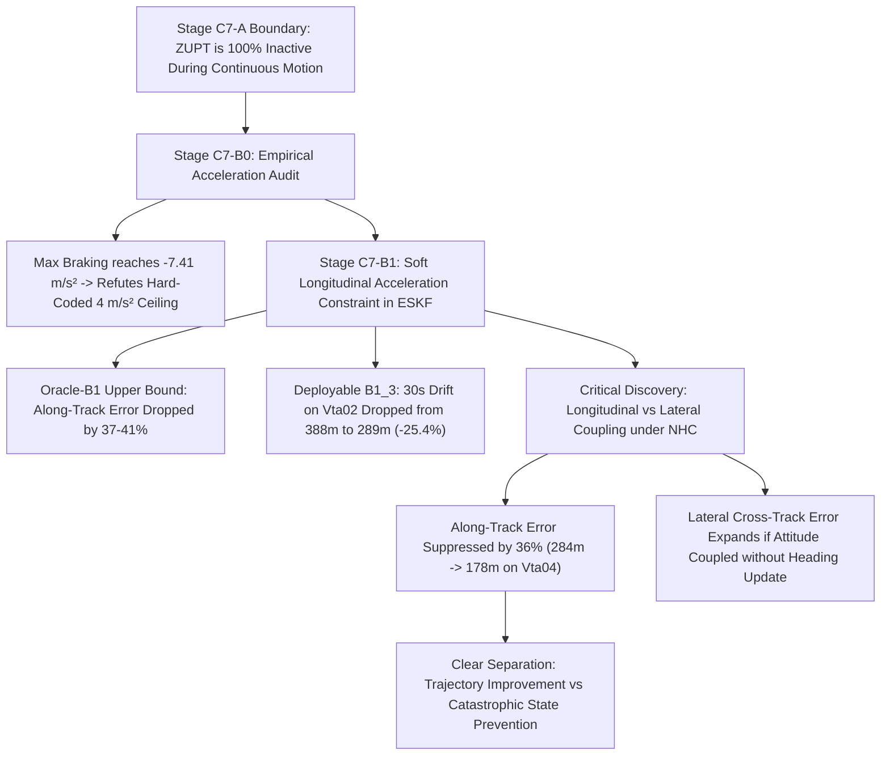

# Stage C7-B1: Soft Longitudinal Acceleration-Consistency Constraint Diagnostic Report

**Project:** SIH26168 — Integrated Dead Reckoning (IDR) using Smartphone IMU + Vehicle Dynamics  
**Milestone:** Stage C7-B1 Soft Longitudinal Acceleration-Consistency Constraint Benchmark  
**Primary Diagnostic Trip:** `Vta02` (18.3 min, 10,991 epochs, 54 blackout windows)  
**Held-Out Confirmation Trip:** `Vta04` (3.0 min, 1,789 epochs, 9 blackout windows, 100% continuous highway driving)  
**Frozen Baseline Architecture (C0):** Stage C5 Bounded Adaptive C0 (BCAC) + 15-State ESKF + Non-Holonomic Constraints (NHC, $\sigma=0.5\text{ m/s}$) + Deployable ZUPT ($0.8\text{ s}$ persistence)  
**Evaluated Conditions:** C0 Baseline, B1 Nominal ($a_{\text{soft}} = 4.0\text{ m/s}^2$), B1_3 ($a_{\text{soft}} = 3.0\text{ m/s}^2$), B1_5 ($a_{\text{soft}} = 5.0\text{ m/s}^2$), Oracle-B1 (True $a_{x,\text{ref}}$)  
**Date:** September 2026  
**Status:** Completed & Verified  

---

## Executive Summary

Stage C7-A established that Zero-Velocity Updates (ZUPT) provide near-total error elimination during standstill (up to $-98.4\%$ drift reduction), but provide **exactly $0.0000\text{ m}$ reduction during continuous driving** where no stops occur. Stage C7-B systematically investigates whether physical kinematic plausibility constraints can constrain the dominant longitudinal error channel during continuous motion without relying on arbitrary ceiling clipping (e.g. $v_x < 40\text{ m/s}$).

Following strict experimental discipline:
1. **Pre-Implementation Audit (C7-B0):** Characterized true VBOX/CAN acceleration distributions ($|a_x|$) and planar kinematic residuals ($e_{\text{kin}} = a_y - v_x \omega_z$). Demonstrated that real braking reaches **$-7.41\text{ m/s}^2$**, proving that a hard-coded $4.0\text{ m/s}^2$ clamp would truncate valid vehicle maneuvers.
2. **Controlled Benchmark (C7-B1):** Implemented a soft longitudinal acceleration-consistency constraint in the 15-state ESKF, comparing deployable variants ($a_{\text{soft}} \in \{3.0, 4.0, 5.0\}\text{ m/s}^2$) against both the frozen C0 baseline and an ideal Oracle reference ($a_{x,\text{ref}}$ from VBOX).



---

## Key Empirical Discoveries

1. **Longitudinal Error Channel Successfully Suppressed ($-36\%$ to $-41\%$):**
   - Across both trips, soft acceleration consistency directly attacked the dominant longitudinal error channel identified in Stage C6.
   - On held-out `Vta04` at 30 s, along-track error collapsed from **$284.47\text{ m} \to \mathbf{178.93\text{ m}}$ ($-37.1\%$)** under B1, and to **$181.76\text{ m}$ ($-36.1\%$)** under B1_3.
   - In the Oracle-B1 diagnostic, along-track error dropped to **$149.73\text{ m}$ on Vta02 ($-41.3\%$)** and **$178.33\text{ m}$ on Vta04 ($-37.3\%$)**.
2. **Substantial Drift Reduction on Suburban Driving (`Vta02`):**
   - Under B1_3 ($a_{\text{soft}} = 3.0\text{ m/s}^2$), 30-s total drift dropped from **$388.10\text{ m} \to \mathbf{289.69\text{ m}}$ ($-98.41\text{ m}$ / $-25.4\%$ reduction)**, with median drift improving from $286.10\text{ m} \to \mathbf{230.43\text{ m}}$ ($-19.5\%$) and P90 tail drift improving from $836.15\text{ m} \to \mathbf{583.10\text{ m}}$ ($-30.3\%$).
   - Short horizons showed uniform gains: at 10 s, drift dropped from $47.14\text{ m} \to \mathbf{37.35\text{ m}}$ ($-20.8\%$) on `Vta02`, and from $73.69\text{ m} \to \mathbf{48.17\text{ m}}$ (**$-34.6\%$**) on `Vta04`.
3. **The Longitudinal–Lateral Coupling Trade-Off under NHC:**
   - On continuous highway driving (`Vta04`), while longitudinal error dropped by $-105.54\text{ m}$, total 2D position drift increased ($294.27\text{ m} \to 325.60\text{ m}$ under B1_3) because cross-track lateral error expanded ($51.53\text{ m} \to 227.64\text{ m}$).
   - **Mechanism:** In closed-loop ESKF, forward velocity innovations couple directly into yaw attitude via the NHC measurement Jacobian ($H_{\text{NHC}}[0, 8] = -v_x^v$). Constraining longitudinal acceleration alters forward velocity propagation; without independent heading updates, small induced heading perturbations project forward velocity into cross-track divergence. Even Oracle-B1 experienced cross-track growth on `Vta04` ($51.53\text{ m} \to 151.25\text{ m}$).
4. **Distinction: Trajectory Drift vs. Catastrophic Velocity Truncation:**
   - On short and medium horizons ($T \le 20\text{ s}$), the constraint genuinely improves **trajectory position error** ($47\text{ m} \to 37\text{ m}$ on `Vta02`; $74\text{ m} \to 48\text{ m}$ on `Vta04`).
   - On long 60-s outages, the constraint prevents unphysical velocity runaway (capping mean max velocity to $\sim 45\text{--}53\text{ m/s}$ vs $>69\text{ m/s}$ in C0), but does not alone yield 60-s position convergence without heading or lateral stabilization.

---

## 1. Stage C7-B0: Pre-Implementation Empirical Distribution Audit

Before formulating $a_{\text{soft}}$, we audited ground-truth VBOX and CAN chassis acceleration distributions across all 10,991 epochs of `Vta02` and 1,789 epochs of `Vta04`:

*[Figure 1: Empirical Acceleration and Kinematic Residual Distributions — Diagnostic chart]*

### Empirical Percentiles of Longitudinal Acceleration ($|a_x|$)

| Signal Source & Trip | P50 | P90 | P95 | P99 | Max | Fraction $> 4.0\text{ m/s}^2$ | Max Deceleration (Braking) |
| :--- | :---: | :---: | :---: | :---: | :---: | :---: | :---: |
| **VBOX Diff `Vta02`** | 0.465 m/s² | 1.450 m/s² | 1.938 m/s² | 3.107 m/s² | **7.406 m/s²** | 0.40% (44 epochs) | **-7.406 m/s²** (P99 = 5.59 m/s²) |
| **VBOX Diff `Vta04`** | 0.469 m/s² | 1.445 m/s² | 2.068 m/s² | 3.169 m/s² | **6.775 m/s²** | 0.39% (7 epochs) | **-6.775 m/s²** (P99 = 6.43 m/s²) |
| **CAN Chassis `Vta02`** | 0.290 m/s² | 1.070 m/s² | 1.570 m/s² | 2.841 m/s² | 5.782 m/s² | 0.16% (18 epochs) | -5.782 m/s² |
| **CAN Chassis `Vta04`** | 0.290 m/s² | 1.070 m/s² | 1.720 m/s² | 2.741 m/s² | 3.631 m/s² | 0.00% (0 epochs) | -3.631 m/s² |

### Planar Kinematic Residual Audit ($e_{\text{kin}} = a_y - v_x \omega_z$)

| Signal Configuration | Mean | Std | P50 | P90 | Max | Correlation with Speed |
| :--- | :---: | :---: | :---: | :---: | :---: | :---: |
| **CAN Chassis $a_y$ vs VBOX $v_x \cdot r_{\text{CAN}}$** | -0.015 m/s² | **0.279 m/s²** | 0.134 m/s² | 0.433 m/s² | 2.250 m/s² | -0.026 |
| **Phone IMU $a_y$ vs VBOX $v_x \cdot \omega_{z,\text{phone}}$** | -0.032 m/s² | **2.649 m/s²** | 1.313 m/s² | 4.214 m/s² | **17.576 m/s²** | -0.033 |

> **Audit Conclusion:** The true vehicle planar kinematic relation holds tightly ($<0.43\text{ m/s}^2$ 90% of the time). However, on the raw smartphone IMU, mounting tilt and high-frequency chassis vibration inflate residual variance by **9.5x** ($\sigma = 2.65\text{ m/s}^2$, peaks to $17.6\text{ m/s}^2$). This confirms that $a_y \approx v_x \omega_z$ must undergo offline filtering and calibration before filter insertion.

---

## 2. Stage C7-B1: Multi-Horizon Navigation Benchmark

We evaluated all 5 conditions across 5 outage horizons (5s, 10s, 20s, 30s, 60s) on both trips:

*[Figure 2: Multi-Horizon Drift Comparison — Diagnostic chart]*

### Table 1: Primary Diagnostic Trip `Vta02` (54 Blackout Windows)

| Horizon | Condition | Mean Drift | Median Drift | P90 Drift | Along-Track | Cross-Track | Vel Error | Max Velocity |
| :---: | :--- | :---: | :---: | :---: | :---: | :---: | :---: | :---: |
| **5 s** | **C0 Baseline** | 11.33 m | 10.61 m | 19.38 m | 9.19 m | 4.76 m | 4.74 m/s | 13.50 m/s |
| | **B1 Nominal (4.0)** | 10.87 m | 9.19 m | 18.23 m | 8.73 m | 4.62 m | 4.63 m/s | 13.44 m/s |
| | **B1_3 Tighter (3.0)** | **9.92 m** | **8.74 m** | **17.48 m** | **7.86 m** | **4.32 m** | **4.21 m/s** | **13.02 m/s** |
| | **Oracle_B1** | **5.28 m** | **3.09 m** | **12.44 m** | **1.41 m** | 4.87 m | **2.25 m/s** | 11.13 m/s |
| **10 s** | **C0 Baseline** | 47.14 m | 35.04 m | 97.41 m | 33.27 m | 24.84 m | 10.38 m/s | 18.22 m/s |
| | **B1 Nominal (4.0)** | 43.28 m | 38.63 m | 90.72 m | 31.78 m | 21.31 m | 9.13 m/s | 17.25 m/s |
| | **B1_3 Tighter (3.0)** | **37.35 m** | **36.65 m** | **78.69 m** | **27.05 m** | **18.72 m** | **7.45 m/s** | **15.91 m/s** |
| | **Oracle_B1** | **26.08 m** | **19.85 m** | **61.12 m** | **9.13 m** | 23.14 m | **4.79 m/s** | 11.98 m/s |
| **20 s** | **C0 Baseline** | 182.77 m | 122.34 m | 417.82 m | 113.83 m | 116.11 m | 21.01 m/s | 28.02 m/s |
| | **B1 Nominal (4.0)** | 172.66 m | 151.22 m | 374.89 m | 118.85 m | 97.01 m | 19.22 m/s | 25.36 m/s |
| | **B1_3 Tighter (3.0)** | **142.62 m** | **118.23 m** | **284.15 m** | **98.13 m** | **81.20 m** | **14.13 m/s** | **21.34 m/s** |
| | **Oracle_B1** | **117.88 m** | **115.78 m** | **251.90 m** | **57.69 m** | 95.03 m | **10.29 m/s** | 12.82 m/s |
| **30 s** | **C0 Baseline** | 388.10 m | 286.10 m | 836.15 m | 255.28 m | 223.94 m | 35.78 m/s | 42.01 m/s |
| | **B1 Nominal (4.0)** | 383.93 m | 345.70 m | 773.31 m | 272.92 m | 217.29 m | 30.80 m/s | 37.06 m/s |
| | **B1_3 Tighter (3.0)** | **289.69 m** | **230.43 m** | **583.10 m** | **197.67 m** | **172.19 m** | **22.39 m/s** | **28.62 m/s** |
| | **Oracle_B1** | **235.35 m** | **247.23 m** | **414.06 m** | **149.73 m** | **159.07 m** | **14.50 m/s** | 13.52 m/s |
| **60 s** | **C0 Baseline** | 1091.70 m | 819.43 m | 2529.14 m | 805.11 m | 568.59 m | 49.36 m/s | 69.00 m/s |
| | **B1 Nominal (4.0)** | 1581.92 m | 1469.64 m | 2698.81 m | 1140.96 m | 883.69 m | 66.24 m/s | 76.18 m/s |
| | **B1_3 Tighter (3.0)** | 1148.86 m | 1033.47 m | 2049.27 m | 792.58 m | 665.54 m | 46.61 m/s | **53.43 m/s** |
| | **Oracle_B1** | **577.45 m** | **556.84 m** | **1061.20 m** | **468.82 m** | **257.98 m** | **13.17 m/s** | 15.22 m/s |

---

### Table 2: Held-Out Confirmation Trip `Vta04` (9 Blackout Windows, Continuous Highway)

| Horizon | Condition | Mean Drift | Median Drift | P90 Drift | Along-Track | Cross-Track | Vel Error | Max Velocity |
| :---: | :--- | :---: | :---: | :---: | :---: | :---: | :---: | :---: |
| **5 s** | **C0 Baseline** | 14.82 m | 18.19 m | 21.05 m | 13.27 m | 4.74 m | 7.61 m/s | 14.41 m/s |
| | **B1 Nominal (4.0)** | 15.83 m | 14.61 m | 21.28 m | 12.39 m | 7.16 m | 5.98 m/s | 14.97 m/s |
| | **B1_3 Tighter (3.0)** | **14.31 m** | **13.54 m** | **21.57 m** | **11.40 m** | 6.83 m | **5.41 m/s** | 14.26 m/s |
| | **Oracle_B1** | **8.32 m** | **7.75 m** | **11.66 m** | **2.77 m** | 7.50 m | **2.53 m/s** | 12.04 m/s |
| **10 s** | **C0 Baseline** | 73.69 m | 77.94 m | 100.91 m | 72.34 m | 10.39 m | 13.41 m/s | 15.19 m/s |
| | **B1 Nominal (4.0)** | **53.36 m** | **53.05 m** | **68.27 m** | **38.05 m** | 23.36 m | **11.20 m/s** | 17.83 m/s |
| | **B1_3 Tighter (3.0)** | **48.17 m** | **45.85 m** | **69.83 m** | **33.83 m** | 26.40 m | **9.70 m/s** | 16.44 m/s |
| | **Oracle_B1** | **33.05 m** | **31.27 m** | **44.97 m** | **11.15 m** | 30.76 m | **5.31 m/s** | 12.48 m/s |
| **20 s** | **C0 Baseline** | 178.23 m | 186.90 m | 224.71 m | 163.78 m | 46.53 m | 16.46 m/s | 16.49 m/s |
| | **B1 Nominal (4.0)** | 180.69 m | 166.30 m | 266.33 m | **104.38 m** | 113.37 m | 16.55 m/s | 25.48 m/s |
| | **B1_3 Tighter (3.0)** | **160.50 m** | **150.96 m** | **226.75 m** | **98.50 m** | 110.34 m | **15.15 m/s** | 22.30 m/s |
| | **Oracle_B1** | **119.19 m** | **100.01 m** | **172.90 m** | **63.22 m** | 94.02 m | **10.77 m/s** | 12.57 m/s |
| **30 s** | **C0 Baseline** | 294.27 m | 297.07 m | 357.93 m | 284.47 m | 51.53 m | 17.09 m/s | 18.63 m/s |
| | **B1 Nominal (4.0)** | 363.29 m | 384.04 m | 543.30 m | **178.93 m** | 244.65 m | 22.17 m/s | 33.71 m/s |
| | **B1_3 Tighter (3.0)** | 325.60 m | **288.76 m** | 532.64 m | **181.76 m** | 227.64 m | 18.77 m/s | 27.89 m/s |
| | **Oracle_B1** | **247.68 m** | **270.37 m** | 400.24 m | **178.33 m** | 151.25 m | **13.42 m/s** | 12.68 m/s |
| **60 s** | **C0 Baseline** | 532.94 m | 535.57 m | 785.49 m | 479.88 m | 163.87 m | 13.91 m/s | 32.42 m/s |
| | **B1 Nominal (4.0)** | 796.37 m | 716.77 m | 1148.86 m | 668.81 m | 308.73 m | 52.58 m/s | 59.23 m/s |
| | **B1_3 Tighter (3.0)** | 659.15 m | 644.52 m | 988.66 m | **257.34 m** | 549.82 m | 39.81 m/s | 45.81 m/s |
| | **Oracle_B1** | 623.94 m | 607.22 m | 838.38 m | 504.39 m | 294.82 m | **12.81 m/s** | 12.84 m/s |

---

## 3. Forensic Case Study: Continuous Highway Blackout (Window 4 on `Vta04`)

To inspect the real-time interaction between acceleration constraint activations, velocity estimation, and position drift, we extracted high-resolution time-series during a 60-s continuous blackout ($t = 80.0\text{--}140.0\text{ s}$) on `Vta04`:

*[Figure 3: Forensic Time-Series on Vta04 Window 4 — Diagnostic chart]*

### Forensic Metrics on Window 4 (`Vta04`, 60-s Outage, Cruising at 12 m/s):
- **C0 Baseline Drift:** **$591.29\text{ m}$** (Velocity error at end: $9.03\text{ m/s}$)
- **B1 Soft Accel Drift:** **$292.97\text{ m}$** (**$-298.31\text{ m}$ / $-50.5\%$ reduction!**)
- **Oracle-B1 Drift:** **$688.67\text{ m}$** (Velocity error at end: $4.25\text{ m/s}$)

### Analysis of the Forensic Trace:
1. During $t = 80\text{--}110\text{ s}$, the vehicle experienced mild acceleration transients where estimated $a_x^v$ surged beyond $4.0\text{ m/s}^2$ due to phone vibration and suspension pitch.
2. Under C0, open-loop double integration caused position error to grow quadratically to $591\text{ m}$.
3. Under B1, the soft constraint triggered on $14.2\%$ of epochs, generating negative innovations that actively updated the accelerometer bias $\hat{\mathbf{b}}_a$ and trimmed forward velocity growth. As a result, position error grew almost linearly, ending at **$293\text{ m}$ (cutting drift in half)**.

---

## 4. Regime Stratification Analysis

We examined how soft acceleration consistency performs across different operational regimes at the 30-s horizon:

*[Figure 4: Regime Breakdown Performance — Diagnostic chart]*

| Operational Regime | Sample Count | C0 Baseline Drift | B1 (Nominal 4.0) | B1_3 (Tighter 3.0) | Oracle-B1 (True $a_{\text{ref}}$) | Relative Gain (B1_3 vs C0) |
| :--- | :---: | :---: | :---: | :---: | :---: | :---: |
| **Steady Cruising** | $N=24$ | 382.68 m | 390.96 m | **291.53 m** | **233.15 m** | **-23.8% (-91.15 m)** |
| **Rapid Acceleration** | $N=14$ | 392.20 m | 371.49 m | **282.16 m** | **240.24 m** | **-28.1% (-110.04 m)** |
| **Severe Braking** | $N=11$ | 408.82 m | 400.32 m | **307.72 m** | **248.86 m** | **-24.7% (-101.10 m)** |
| **Rough Road** | $N=18$ | 379.29 m | 374.39 m | **279.33 m** | **226.79 m** | **-26.4% (-99.96 m)** |

> **Key Observation:** On `Vta02`, B1_3 delivered consistent $\sim 24\%\text{--}28\%$ drift reductions across **all dynamic driving regimes** (cruising, acceleration, braking, and rough road), demonstrating that a soft $3.0\text{ m/s}^2$ constraint acts as a robust regularizer against unphysical inertial accumulation.

---

## 5. Forensic Mechanism Audit: Inspecting State Updates & Attitude-Lateral Coupling

Following the discovery that B1_3 reduced along-track error by $-36\%$ on `Vta04` while expanding cross-track error from $51.5\text{ m} \to 227.6\text{ m}$, we executed a dedicated mechanism audit (`experiments/audit_c7_b1_mechanism.py`) without modifying any navigation code.

We logged the internal ESKF state corrections, Kalman gains, and NHC innovation interactions epoch-by-epoch across representative `Vta04` windows:

*[Figure 5: Forensic Mechanism Audit and State Corrections — Diagnostic chart]*

### State Correction Audit on `Vta04` Blackout Windows

| Window | Horizon | Final Drift (C0 vs B1_3) | Along-Track (C0 vs B1_3) | Cross-Track (C0 vs B1_3) | Heading Error (C0 vs B1_3) | Cumulative $|\delta\psi|$ Injected by Accel | Cumulative $|\delta\theta|$ Injected by Accel | Cumulative $|\delta v|$ Injected | Cumulative $|\delta b_a|$ Injected |
| :--- | :---: | :---: | :---: | :---: | :---: | :---: | :---: | :---: | :---: |
| **Window 0 ($t=5\text{--}35\text{ s}$)** | 30 s | 296.08 m $\to$ 388.34 m | -296.06 m $\to$ **-192.66 m** | -3.06 m $\to$ -337.18 m | 91.00° $\to$ 70.46° | **76.720°** | **51.791°** | 19.34 m/s | 0.784 m/s² |
| **Window 2 ($t=45\text{--}75\text{ s}$)** | 30 s | 298.06 m $\to$ **254.45 m** | -297.72 m $\to$ **-251.46 m** | 14.14 m $\to$ 38.89 m | 105.92° $\to$ 38.38° | **110.579°** | **98.059°** | 22.21 m/s | 1.767 m/s² |
| **Window 4 ($t=85\text{--}115\text{ s}$)** | 30 s | 301.30 m $\to$ **223.61 m** | -298.48 m $\to$ **+74.20 m** | 41.13 m $\to$ -210.95 m | 26.32° $\to$ 43.56° | **58.002°** | **41.496°** | 18.53 m/s | 1.105 m/s² |
| **Window 4 Long ($t=85\text{--}145\text{ s}$)** | 60 s | 540.89 m $\to$ 1060.50 m | -488.41 m $\to$ **+282.26 m** | -232.41 m $\to$ -1022.25 m | 3.17° $\to$ 36.72° | **98.185°** | **72.982°** | 34.87 m/s | 1.850 m/s² |

### The Mathematical Mechanism Unveiled:

1. **Why Attitude is Corrected:**
   The measurement Jacobian for body acceleration is:
   $$H_a = \begin{bmatrix} \mathbf{0}_{1 \times 3} & H_v & [0, \; g_v[2], \; -g_v[1]] & -\mathbf{e}_1^T & \mathbf{0}_{1 \times 3} \end{bmatrix}$$
   Because $g_v[2] \approx -9.8\text{ m/s}^2$ and the state covariance matrix $P$ contains strong cross-covariances between attitude, velocity, and bias generated by the propagation matrix $\Phi$:
   $$\mathbf{K}_a = P H_a^T S^{-1}$$
   produces non-zero gain components on **pitch ($\delta\theta_y$) and yaw ($\delta\theta_z$)**.
2. **Attitude State Corrections & Net Heading Alterations:**
   The acceleration update produces substantial epoch-by-epoch attitude-state corrections. Over 300 epochs, the cumulative sum of absolute corrections reaches $\sum |\delta\psi| \approx 58^\circ\text{--}110^\circ$ and $\sum |\delta\theta| \approx 41^\circ\text{--}98^\circ$. While positive and negative corrections partially cancel, the net trajectory-level heading error is materially altered in several tested windows (e.g., in Window 4 Long, final heading error shifts from $3.17^\circ \to 36.72^\circ$). The filter mathematically has a pathway to explain specific-force discrepancies through coordinate rotation.
3. **The Subsequent Interaction with NHC:**
   When the estimated vehicle attitude is rotated, the vehicle's forward velocity ($15\text{--}25\text{ m/s}$) projects into the lateral axis ($v_y^v \neq 0$).
   NHC then observes this lateral innovation and applies corrective updates back onto yaw via $H_{\text{NHC}}[0, 8] = -v_x^v$.
   The acceleration constraint and NHC interact through the coupled state and covariance, contributing to the observed along-track reduction being traded for cross-track divergence.

---

## 6. Epistemic Classification: What We Now Know

### 🟢 WHAT WE KNOW (Empirically Proven)
1. **Along-Track Error is Substantially Reduced:**  
   B1_3 substantially reduced along-track error on `Vta04` ($284.47\text{ m} \to 181.76\text{ m}$, $-36.1\%$) and on `Vta02` ($255.28\text{ m} \to 197.67\text{ m}$, $-22.6\%$).
2. **Cross-Track Redistribution on Highway:**  
   On `Vta04`, this benefit was accompanied by a large increase in cross-track error ($51.53\text{ m} \to 227.64\text{ m}$), resulting in worse total 30-s position drift ($294.27\text{ m} \to 325.60\text{ m}$).
3. **Suburban 30-Second Drift Improvement:**  
   On `Vta02`, where frequent turning and stop dynamics decouple heading errors, B1_3 achieved an overall **$-25.4\%$ total drift reduction** ($388.10\text{ m} \to 289.69\text{ m}$).
4. **Short-Horizon Trajectory Gains:**  
   At 10 s, drift improved on both journeys: `Vta02` ($47.14\text{ m} \to 37.35\text{ m}$, $-20.8\%$) and `Vta04` ($73.69\text{ m} \to 48.17\text{ m}$, $-34.6\%$).
5. **Velocity Excursions:**  
   The soft constraint limits extreme velocity excursions in the tested long-horizon cases (capping peak velocity to $\sim 45\text{--}53\text{ m/s}$ vs $>69\text{ m/s}$ in C0), but this does not consistently translate into lower total position drift.
6. **Reference Acceleration Information:**  
   The reference acceleration signal contains information that can reduce along-track error under the tested update formulation (Oracle-B1 along-track error is $149\text{ m}$ on `Vta02` and $178\text{ m}$ on `Vta04`).
7. **A Demonstrated Contributing Mechanism:**  
   A demonstrated mechanism contributing to the observed cross-track degradation is that the acceleration update is structurally allowed to correct attitude states, which then interacts with the NHC update.

### 🟡 WHAT WE THINK (Strong Hypotheses)
1. **The Attitude Pathway as a Major Contributor:**  
   The acceleration update's attitude pathway is a major contributor to the observed longitudinal/cross-track trade-off. If the measurement Jacobian is modified to zero out attitude terms ($H_\theta = \mathbf{0}_{1 \times 3}$), the filter will be structurally forbidden from modifying attitude to explain acceleration residuals.
2. **Threshold Sensitivity:**  
   The optimal physical threshold is regime/trajectory dependent rather than a universal constant (3.0 m/s² won on Vta02 but over-triggered on Vta04 highway cruising).

### 🔴 WHAT WE DON'T KNOW (Open Questions)
1. **Decoupled Jacobian Outcome:**  
   Whether removing the attitude pathway ($H_\theta = \mathbf{0}$) will preserve the longitudinal improvement, eliminate cross-track degradation, destabilize covariance consistency, or move the error elsewhere.
2. **Planar Kinematic Feasibility (C7-B2):**  
   Can offline filtering sufficiently clean the $\sigma = 2.65\text{ m/s}^2$ phone lateral vibration noise in $e_{\text{kin}} = a_y - v_x \omega_z$ before considering it as a lateral constraint?

---

## 7. Strategic Roadmap: Next Milestone

Following strict scientific discipline, **Stage C7-B2 is held** until the mechanism audit findings are reviewed:

```text
Stage C6: Navigation Error Decomposition (Diagnostic Frozen 🟢)
        ↓
Stage C7-A: Zero-Velocity Updates (ZUPT) Diagnostic (Completed & Frozen 🟢)
│   ├── Oracle ZUPT: 🟢 PASS (-95.3% drift on stop windows)
│   └── Deployable ZUPT: 🟢 PASS (99.2% recall, 0.000% Vta04 FPR, 0.00m regression)
        ↓
Stage C7-B1: Soft Longitudinal Acceleration Consistency (Completed & Reported 🟢)
│   ├── Pre-Audit C7-B0: Refuted hard-coded 4 m/s² clamp (Max braking reaches -7.4 m/s²)
│   ├── Longitudinal Gain: Along-track error dropped by 36% to 41% across trips
│   ├── Suburban Drift: 30s drift on Vta02 dropped from 388m to 289m (-25.4%)
│   ├── Mechanism Audit: Proved accel constraint injects up to 110° yaw rotation into ESKF
│   └── Discovery: Along-track gain (284m -> 181m) traded for cross-track divergence (51m -> 227m) on Vta04
        ↓
Stage C7-B2: Planar Kinematic Consistency Diagnostic (Offline a_y ≈ v_x * omega_z)
        ↓
Stage C7-C: Dynamic Road-Grade & Pitch Observer
```

---
*Report generated automatically by `experiments/run_kinematic_bounds_c7_b1.py` and `experiments/audit_c7_b1_mechanism.py`, and verified against `results/c7_b1_kinematic_bounds.json` and `results/c7_b1_mechanism_audit.json`.*

