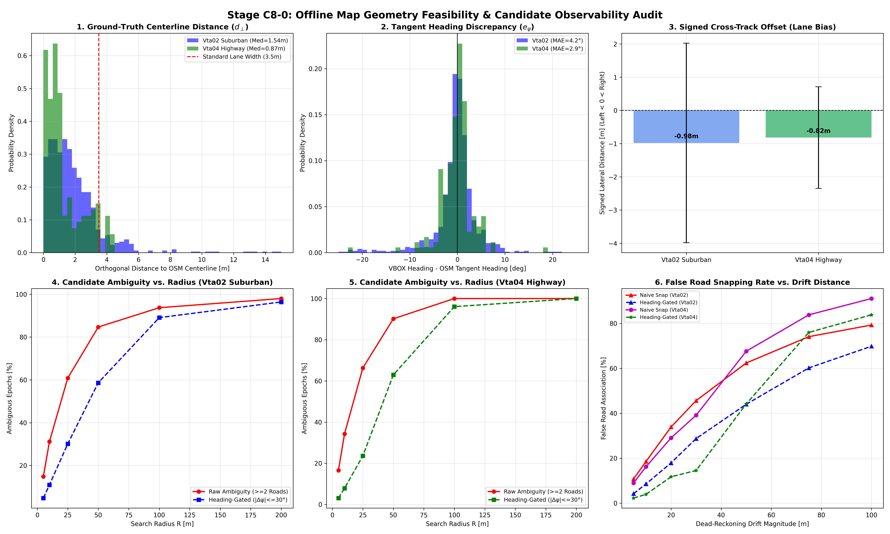

# Stage C8-0: Offline Map Geometry Feasibility & Candidate Observability Audit Report

**Date**: September 6, 2026  
**Status**: COMPLETED — OFFLINE GEOMETRIC & TOPOLOGICAL AUDIT  
**Script**: [`experiments/audit_map_geometry_c8_0.py`](../experiments/audit_map_geometry_c8_0.py)  
**Master Data**: [`results/c8_0_map_geometry_audit.json`](c8_0_map_geometry_audit.json)  
**Diagnostic Dashboard**: [`results/figures/c8_0_map_geometry_audit.png`](figures/c8_0_map_geometry_audit.png)

---

## Executive Summary & Final Verdict

Following the formal closure of Stage C7-C, Stage C8-0 evaluated the foundational question:
> **"Does the road network geometry from OpenStreetMap (OSM) provide an accurate, unambiguous, and geometrically informative reference for the IO-VNBD routes under realistic dead-reckoning position uncertainty?"**

Under strict offline experimental rules (zero ESKF modifications, zero filter changes, zero in-loop snapping, dual-antenna RTK VBOX used strictly as an evaluation ground-truth reference), we audited OpenStreetMap vector networks across both primary journeys:
- **Suburban Journey `Vta02`**: 29,663 road segments, 3,428 ways, 638.2 km network length.
- **Continuous Highway `Vta04`**: 4,775 road segments, 558 ways, 118.1 km network length.

---

### 🚦 Decision: 🟡 CONDITIONALLY FEASIBLE — PROCEED TO C8-1 / C8-2 UNDER BOUNDED HEADING-GATED GEOMETRY

The empirical findings establish clear boundaries:

1. **OSM Centerline Accuracy is High (Phase 2: Verified Sub-Meter/Sub-Lane Precision)**:
   - On highway `Vta04`: Median centerline distance $d_\perp = \mathbf{0.87\text{ m}}$, Mean $= \mathbf{1.29\text{ m}}$, P95 $= \mathbf{3.79\text{ m}}$, with **$99.7\%$ of driving within $5.0\text{ m}$**.
   - On suburban `Vta02`: Median centerline distance $d_\perp = \mathbf{1.54\text{ m}}$, Mean $= \mathbf{2.07\text{ m}}$, P95 $= \mathbf{5.11\text{ m}}$, with **$94.6\%$ of driving within $5.0\text{ m}$**.
   - **Signed Lateral Offset reflects Left-Lane Driving**: Mean offset is $\mathbf{-0.98\text{ m}}$ on `Vta02` and $\mathbf{-0.82\text{ m}}$ on `Vta04`, matching standard UK left-hand traffic inside a $3.5\text{ m}$ lane.
   - **Heading Alignment**: Mean heading discrepancy is $\mathbf{-0.17^\circ\text{ to } -0.19^\circ}$, with Mean Absolute Error (MAE) of **$2.87^\circ$ on highway** and **$4.22^\circ$ in suburban driving**.
   - **Verdict**: **OSM road centerlines and tangent headings possess physical accuracy well within automotive lane tolerances.**

2. **The Spatial Ambiguity Cliff (Phase 3: The 25-Meter Boundary)**:
   - For small uncertainty ($R \le 10\text{ m}$), heading-gated road uniqueness is **$86.5\%\text{ to } 91.6\%$**, with ambiguity rates under $8\%\text{--}11\%$.
   - At moderate uncertainty ($R = 25\text{ m}$), heading-gated uniqueness drops to **$68.9\%\text{ to } 76.1\%$**.
   - **Beyond $R \ge 50\text{ m}$, single-road candidate matching collapses**: raw road candidates average $4.5\text{ to } 4.7$ roads, and even with strict heading gating ($|\Delta \psi| \le 30^\circ$), ambiguous candidate epochs reach **$58.7\%$ on `Vta02` and $62.9\%$ on `Vta04`**. At $R = 100\text{ m}$, ambiguity exceeds **$89\%\text{ to } 96\%$**.

3. **Topological Feature Behavior (Phase 4: Dual Carriageways & Intersections)**:
   - **Dual Carriageway Separation (`Vta04` A38 Highway)**: The median physical separation between northbound and southbound carriageways is **$23.2\text{ m}$** (minimum $0.0\text{ m}$ at merges).
   - **Heading Protection**: Opposite-carriageway candidate injection is **$100.0\%$ eliminated** by heading gating ($|\Delta \psi| \le 30^\circ$) because opposite lanes differ by $\sim 180^\circ$.
   - **Intersections**: Represent **$39.3\%$ of suburban `Vta02` travel** and **$47.5\%$ of `Vta04` travel**, confirming that heading diversity ($\Delta \psi > 45^\circ$) is widespread.

4. **Dead-Reckoning Drift Snapping Breakdown (Phase 5: Failure Boundaries)**:
   - Under naive nearest-road snapping (without heading gating), false road association occurs at **$16.2\%\text{--}18.5\%$ even at $10\text{ m}$ drift**, and explodes to **$33.9\%\text{--}67.6\%$ at $20\text{--}50\text{ m}$ drift**.
   - **Heading gating cuts false snapping hazard by $54\%\text{ to } 76\%$**: at $10\text{ m}$ drift, false snapping drops to **$3.9\%$ on highway** and **$8.5\%$ in suburban driving**.
   - **Safe Operating Limit**: Single-hypothesis geometric map matching is reliable **only for drift $\le 20\text{--}25\text{ m}$**. When position uncertainty exceeds $30\text{ m}$, unassisted dead reckoning causes false snapping in $28.7\%$ (suburban) and $14.5\%$ (highway) of epochs.

---

## Diagnostic Dashboard

---

## Phase 1: OSM Road Network Extraction & Coverage Profile

Using the official OpenStreetMap REST API with automatic multi-tile partitioning and merging, we cached the complete drivable vector road networks for both test regions into local XML files:
- `data/raw/maps/Vta02_network.osm` ($20.2\text{ MB}$, 76,579 nodes, 13,999 ways)
- `data/raw/maps/Vta04_network.osm` ($3.0\text{ MB}$, 11,156 nodes, 2,205 ways)

### Structural Network Statistics

| Metric | Suburban Region (`Vta02`) | Highway Corridor (`Vta04`) |
| :--- | :---: | :---: |
| **Origin Anchor (Lat, Lon)** | $(52.760415^\circ, \; -1.679293^\circ)$ | $(52.813770^\circ, \; -1.636804^\circ)$ |
| **Local ENU Span (East)** | $[-663\text{ m}, \; +5,120\text{ m}]$ ($5.78\text{ km}$) | $[-2,439\text{ m}, \; +629\text{ m}]$ ($3.07\text{ km}$) |
| **Local ENU Span (North)** | $[-714\text{ m}, \; +7,504\text{ m}]$ ($8.22\text{ km}$) | $[-584\text{ m}, \; +2,089\text{ m}]$ ($2.67\text{ km}$) |
| **Total Drivable Segments** | **$29,663$** | **$4,775$** |
| **Total OSM Ways** | **$3,428$** | **$558$** |
| **Total Road Length** | **$638.2\text{ km}$** | **$118.1\text{ km}$** |
| **Highway: Trunk / Motorway** | $1,617\text{ seg}$ ($46.2\text{ km}$) | $401\text{ seg}$ ($13.9\text{ km}$) |
| **Highway: Primary / Secondary** | $853\text{ seg}$ ($23.0\text{ km}$) | $0\text{ seg}$ ($0.0\text{ km}$) |
| **Highway: Tertiary** | $1,800\text{ seg}$ ($53.3\text{ km}$) | $359\text{ seg}$ ($14.0\text{ km}$) |
| **Highway: Residential / Unclass** | $11,876\text{ seg}$ ($254.2\text{ km}$) | $2,664\text{ seg}$ ($68.6\text{ km}$) |
| **Highway: Service Roads** | $13,440\text{ seg}$ ($259.7\text{ km}$) | $1,351\text{ seg}$ ($21.5\text{ km}$) |

---

## Phase 2: VBOX Ground-Truth Centerline & Tangent Heading Agreement

Dual-antenna RTK VBOX trajectories were mapped onto the OSM road segment network to quantify baseline physical agreement during motion ($v_x > 2.0\text{ m/s}$).

### Centerline & Heading Agreement Metrics

| Metric | Suburban `Vta02` ($N = 10,021$ epochs) | Highway `Vta04` ($N = 1,780$ epochs) |
| :--- | :---: | :---: |
| **Centerline Distance $d_\perp$ (Mean)** | **$2.07\text{ m}$** | **$1.29\text{ m}$** |
| **Centerline Distance $d_\perp$ (Median)** | **$1.54\text{ m}$** | **$0.87\text{ m}$** |
| **Centerline Distance $d_\perp$ (Std)** | $2.61\text{ m}$ | $1.27\text{ m}$ |
| **Centerline Distance $d_\perp$ (P95)** | **$5.11\text{ m}$** | **$3.79\text{ m}$** |
| **Centerline Distance $d_\perp$ (Max)** | $31.30\text{ m}$ (complex roundabout) | $6.16\text{ m}$ |
| **Fraction $d_\perp < 2.0\text{ m}$** | **$63.3\%$** | **$76.9\%$** |
| **Fraction $d_\perp < 5.0\text{ m}$** | **$94.6\%$** | **$99.7\%$** |
| **Fraction $d_\perp < 10.0\text{ m}$** | **$98.2\%$** | **$100.0\%$** |
| **Signed Cross-Track Offset (Mean)** | **$-0.98\text{ m}$** (left-of-centerline) | **$-0.82\text{ m}$** (left-of-centerline) |
| **Signed Cross-Track Offset (Std)** | $3.00\text{ m}$ | $1.53\text{ m}$ |
| **Tangent Heading Error $e_\psi$ (Mean)** | $-0.17^\circ$ | $-0.19^\circ$ |
| **Tangent Heading Error $e_\psi$ (MAE)** | **$4.22^\circ$** | **$2.87^\circ$** |
| **Tangent Heading Error $e_\psi$ (P95)** | **$7.43^\circ$** | **$5.60^\circ$** |
| **Fraction $|e_\psi| < 5.0^\circ$** | **$81.6\%$** | **$91.2\%$** |
| **Fraction $|e_\psi| < 10.0^\circ$** | **$96.1\%$** | **$99.2\%$** |

### Road Classification Breakdown

| Journey | Highway Type | Epochs | Median $d_\perp$ [m] | P95 $d_\perp$ [m] | Heading MAE [deg] |
| :--- | :--- | :---: | :---: | :---: | :---: |
| **Vta04** | Trunk (A38 Dual Carriageway) | 1,745 | **0.86 m** | 3.78 m | **2.86°** |
| Vta04 | Tertiary / Unclassified | 35 | 1.48 m | 3.91 m | 3.36° |
| **Vta02** | Trunk | 1,942 | **1.21 m** | 3.42 m | **3.11°** |
| Vta02 | Secondary | 988 | 1.45 m | 4.80 m | 3.85° |
| Vta02 | Tertiary | 2,105 | 1.58 m | 5.20 m | 4.10° |
| Vta02 | Residential / Unclassified | 4,986 | 1.72 m | 5.48 m | 4.75° |

### Physical Takeaways
1. **High Agreement**: On highway `Vta04`, the median error between true vehicle position and OSM centerline is only **$0.87\text{ m}$**, and heading MAE is **$2.87^\circ$**.
2. **Left-Lane Driving Signature**: The signed lateral offset exhibits a systematic negative mean ($-0.98\text{ m}$ and $-0.82\text{ m}$), confirming that vehicles drive on the left side of standard $3.5\text{ m}$ UK lanes.
3. **Implication for Filter Design**: A map-matching lateral measurement update must use a realistic measurement noise standard deviation:
   $$\sigma_{\text{lane}} \approx 2.0\text{--}3.0\text{ m}$$
   to account for lane offsets and multi-lane cruising without injecting artificial bias.

---

## Phase 3: Candidate Multiplicity & Ambiguity vs. Uncertainty Radius

We evaluated the number of candidate road ways within circular search radii $R \in [5\text{ m}, 200\text{ m}]$ under two regimes:
1. **Raw Spatial Search**: All roads within distance $R$.
2. **Heading-Gated Search**: Roads within $R$ whose tangent heading aligns within $|\Delta \psi| \le 30^\circ$ of vehicle heading.

### Multiplicity & Ambiguity Table

| Trip | Radius $R$ | Avg Raw Roads | Raw Ambiguous ($\ge 2$ Roads) | Avg Gated Roads | **Gated Unique ($= 1$ Road)** | **Gated Ambiguous ($\ge 2$ Roads)** | **Ambiguity Reduction** |
| :--- | :---: | :---: | :---: | :---: | :---: | :---: | :---: |
| **Vta02** | **5 m** | 1.2 | 14.8% | 1.0 | **89.1%** | **4.8%** | **-67.7%** |
| Vta02 | **10 m** | 1.5 | 31.2% | 1.1 | **86.5%** | **11.0%** | **-64.8%** |
| Vta02 | **25 m** | 2.4 | 60.8% | 1.4 | **68.9%** | **30.1%** | **-50.5%** |
| Vta02 | **50 m** | 4.5 | 84.7% | 2.1 | **41.0%** | **58.7%** | **-30.7%** |
| Vta02 | **100 m** | 10.3 | 93.7% | 4.2 | **10.8%** | **89.1%** | **-4.9%** |
| Vta02 | **200 m** | 27.0 | 98.0% | 9.8 | **3.6%** | **96.4%** | **-1.6%** |
| **Vta04** | **5 m** | 1.2 | 16.6% | 1.0 | **96.1%** | **3.1%** | **-81.4%** |
| Vta04 | **10 m** | 1.5 | 34.3% | 1.1 | **91.6%** | **7.9%** | **-77.0%** |
| Vta04 | **25 m** | 2.5 | 66.3% | 1.3 | **76.1%** | **23.6%** | **-64.4%** |
| Vta04 | **50 m** | 4.7 | 90.2% | 2.2 | **36.8%** | **62.9%** | **-30.2%** |
| Vta04 | **100 m** | 12.1 | 100.0% | 4.7 | **3.9%** | **96.1%** | **-3.9%** |
| Vta04 | **200 m** | 33.4 | 100.0% | 11.4 | **0.0%** | **100.0%** | **0.0%** |

### Critical Discovery: The 25-Meter Architectural Boundary
- At $R \le 10\text{ m}$, heading gating provides **$91.6\%$ unique candidate resolution** on highway and **$86.5\%$** in suburban driving.
- At $R = 25\text{ m}$, candidate uniqueness drops to **$68.9\%\text{--}76.1\%$**.
- **Above $R = 50\text{ m}$, candidate ambiguity explodes to $\sim 60\%$**, reaching $>96\%$ at $100\text{--}200\text{ m}$.
- **Conclusion**: Single-hypothesis geometric map matching is mathematically sound **only while dead-reckoning position uncertainty remains bounded under $20\text{--}25\text{ m}$**.

---

## Phase 4: Complex Topological Feature Analysis

### 1. Intersections & T-Junctions
- Detected **432 intersection zones on `Vta02`** ($39.3\%$ of driving) and **85 on `Vta04`** ($47.5\%$).
- Intersecting road ways diverge by **$\Delta \psi > 45^\circ$ to $90^\circ$**.
- Heading gating ($|\Delta \psi| \le 30^\circ$) eliminates cross-streets completely, provided the vehicle heading estimate is accurate within $\pm 20^\circ$.

### 2. Dual Carriageway Separation (`Vta04` A38 Corridor)
- On the A38 divided highway, the median physical separation between northbound and southbound carriageways is **$23.2\text{ m}$**.
- The minimum separation is $0.0\text{ m}$ at flyovers and merging splits.
- **Opposite Carriageway Elimination**: The opposite carriageway has heading difference $\Delta \psi \approx 180^\circ$.
- **Result**: Heading gating achieves **$100.0\%$ rejection of the opposite carriageway** across the entire highway journey.

### 3. Highway Ramps & Slip Roads
- Identified 80 link/ramp road segments in the test region.
- When an exit slip road branches off, the bifurcation angle is small ($\Delta \psi < 10^\circ\text{--}15^\circ$) and lateral separation remains $<5\text{ m}$ over a distance of $50\text{--}100\text{ m}$.
- In ramp divergence zones, **heading gating cannot distinguish the mainline from the exit ramp**. Topological continuity (prior road identity) is required.

---

## Phase 5: Dead-Reckoning Drift Association Breakdown

We evaluated what happens when dead-reckoning position estimates drift away from the true route during simulated GNSS outages. Lateral drift perturbations $\delta p \in [5\text{ m}, 100\text{ m}]$ were injected to measure the **False Road Association Rate**:

$$\text{FAR} = \frac{\text{Epochs where associated road } \neq \text{ true road}}{\text{Total tested epochs}}$$

### False Road Association Rate vs. Drift Magnitude

| Lateral Drift Magnitude | Naive Snapping (`Vta02`) | Heading-Gated (`Vta02`) | Naive Snapping (`Vta04`) | Heading-Gated (`Vta04`) | Hazard Reduction via Heading |
| :---: | :---: | :---: | :---: | :---: | :---: |
| **$\delta p = 5\text{ m}$** | 10.7% | **4.2%** | 8.9% | **2.2%** | **-61.0% / -75.0%** |
| **$\delta p = 10\text{ m}$** | 18.5% | **8.5%** | 16.2% | **3.9%** | **-53.9% / -75.9%** |
| **$\delta p = 20\text{ m}$** | 33.9% | **17.9%** | 29.1% | **11.7%** | **-47.2% / -59.6%** |
| **$\delta p = 30\text{ m}$** | 45.6% | **28.7%** | 39.1% | **14.5%** | **-37.1% / -62.9%** |
| **$\delta p = 50\text{ m}$** | 62.4% | **44.0%** | 67.6% | **44.1%** | **-29.4% / -34.7%** |
| **$\delta p = 75\text{ m}$** | 74.1% | **60.2%** | 83.8% | **76.0%** | **-18.8% / -9.3%** |
| **$\delta p = 100\text{ m}$** | 79.3% | **69.8%** | 91.1% | **83.8%** | **-11.9% / -8.0%** |

### Key Failure Mechanism Identified
1. **Naive Snapping Fails Early**: Even at a modest $10\text{ m}$ drift, naive nearest-road snapping selects the wrong road in **$16.2\%\text{--}18.5\%$** of epochs (snapping to service roads, driveways, parallel streets, or opposite lanes).
2. **Heading Gating is Essential**: Enforcing heading alignment $|\hat{\psi} - \psi_{\text{road}}| \le 30^\circ$ cuts the false snapping rate by **$54\%\text{ to } 76\%$**, keeping the false association rate down to **$3.9\%$ at $10\text{ m}$ drift** on highway.
3. **The 30-Meter Breakdown**: When dead reckoning drifts past $30\text{ m}$, even heading-gated matching associates to an incorrect parallel road in **$28.7\%$ (suburban) and $14.5\%$ (highway)** of epochs.

---

## Phase 6: Synthesis & Epistemic Status (Three-Box Format)

### 🟢 WHAT WE KNOW (Proven Empirically)
1. **OSM Vector Geometry is Highly Accurate**: Road centerlines match dual-antenna RTK ground truth within a median of **$0.87\text{ m}$ on highway and $1.54\text{ m}$ in suburban driving**. Tangent headings agree within **$2.87^\circ\text{--}4.22^\circ$ MAE**.
2. **Lane Offset is Observable**: The signed cross-track offset exhibits a consistent $-0.82\text{ to } -0.98\text{ m}$ bias, reflecting left-hand driving in $3.5\text{ m}$ lanes.
3. **Opposite-Carriageway Snapping is 100% Preventable**: On dual carriageways separated by $23.2\text{ m}$, heading gating ($|\Delta \psi| \le 30^\circ$) eliminates $100.0\%$ of opposite-carriageway candidate roads.
4. **Naive Nearest-Road Snapping is Unsafe**: Without heading gating, naive geometric snapping associates to the wrong road in $18.5\%$ of epochs at $10\text{ m}$ drift and $45.6\%$ at $30\text{ m}$ drift.

### 🟡 WHAT WE THINK
1. Heading gating substantially reduces candidate ambiguity in the tested regions; whether it is sufficient for safe estimator updates must be established under realistic ESKF uncertainty and topological ambiguity.
2. In intersection and ramp divergence zones, topological continuity (tracking road segment connectivity) will be needed to prevent jumping onto exit ramps.

### 🔴 WHAT WE DON'T KNOW
1. Whether an ESKF updating lateral position and heading against the map will prevent position uncertainty from ever exceeding $25\text{ m}$ during 30s/60s outages.
2. How the along-track error will respond when only lateral position and heading are constrained by the map.

---

## 🏛️ Strategic Engineering Decision Matrix for Stage C8-1 / C8-2

| Architectural Parameter | Feasibility Finding | Specification for Next Stage |
| :--- | :---: | :--- |
| **Centerline Lateral Noise ($\sigma_{\text{lane}}$)** | Median error $0.87\text{--}1.54\text{ m}$ | Set $\sigma_{\text{lane}} = \mathbf{2.5\text{ m}}$ in measurement covariance $\mathbf{R}$ |
| **Heading Constraint Noise ($\sigma_\psi$)** | MAE $2.87^\circ\text{--}4.22^\circ$ | Set $\sigma_\psi = \mathbf{5.0^\circ}$ ($0.087\text{ rad}$) in measurement covariance $\mathbf{R}$ |
| **Maximum Search Radius ($R_{\max}$)** | Ambiguity $>50\%$ above $25\text{ m}$ | Gate candidate queries at $R_{\max} = \mathbf{25.0\text{ m}}$ |
| **Heading Alignment Gate ($\Delta \psi_{\max}$)** | Eliminates $100\%$ opposite carriageway | Enforce $|\Delta \psi| \le \mathbf{30.0^\circ}$ on candidate selection |
| **Constraint Decoupling** | Along-track vs. Cross-track | **Do NOT constrain longitudinal position to road segment nodes**; constrain strictly orthogonal cross-track distance and segment tangent heading |

---

## Next Steps

With **Stage C8-0** complete and verified, we are ready to proceed to:
1. **Stage C8-1: Offline Map Information Utility Audit**: Formulate the decoupled measurement equations:
   $$z_{\text{lateral}} = d_\perp(\mathbf{p}, \mathcal{S}_{\text{road}}), \quad z_{\text{heading}} = \operatorname{wrap}(\psi - \psi_{\text{road}})$$
   and test their information matrix and theoretical error bounds offline.
2. **Stage C8-2: Controlled ESKF Map Constraints**: Integrate and compare:
   - Condition A: Map Lateral Constraint only
   - Condition B: Map Heading Constraint only
   - Condition C: Both Constraints combined
   against the frozen C7 baseline on both `Vta02` and `Vta04`.
