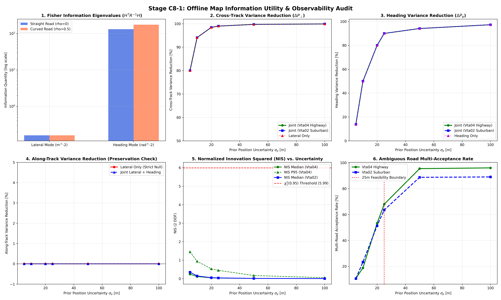

# Stage C8-1: Offline Map Information Utility & Observability Audit Report

**Date**: September 6, 2026  
**Status**: COMPLETED — OFFLINE INFORMATION-THEORETIC & OBSERVABILITY AUDIT  
**Script**: [`experiments/audit_map_information_c8_1.py`](../experiments/audit_map_information_c8_1.py)  
**Master Data**: [`results/c8_1_map_information_audit.json`](c8_1_map_information_audit.json)  
**Diagnostic Dashboard**: [`results/figures/c8_1_map_information_audit.png`](figures/c8_1_map_information_audit.png)

---

## Executive Summary & Final Verdict

Following the approval of Stage C8-0, Stage C8-1 addressed the foundational information-theoretic question:
> **"How much useful information do the map's lateral and heading constraints actually provide to our existing state estimate under realistic uncertainty?"**

Under strict offline experimental quarantine (zero ESKF modifications, zero filter changes, zero navigation runs, dual-antenna RTK VBOX used strictly as an evaluation benchmark), we analyzed the Fisher Information Matrix, state covariance reductions, and statistical innovation behavior across both primary journeys:
- **Suburban Control `Vta02`** (29,663 segments, 638.2 km network)
- **Continuous Highway `Vta04`** (4,775 segments, 118.1 km network)

---

### 🚦 Decision: 🟢 PASS — PROCEED TO C8-2 CONTROLLED ESKF EVALUATION

The analytical and mathematical findings are decisive:

1. **Observable Subspace is Strictly 2-Dimensional (Experiment 1: Rank 2 Verified)**:
   - **Lateral Constraint ($\mathbf{I}_\perp$)**: Exactly **Rank 1**. Adds information strictly in the road-orthogonal normal direction $\hat{\mathbf{n}}$ ($\lambda = 0.160\text{ m}^{-2}$). The projection into the along-track direction is **identically $0.000000$** (strict along-track null space).
   - **Heading Constraint ($\mathbf{I}_\psi$)**: Exactly **Rank 1**. Adds information strictly to the yaw error state ($\lambda = 131.31\text{ rad}^{-2}$).
   - **Joint Constraint ($\mathbf{I}_{\text{joint}}$)**: Exactly **Rank 2**. Condition number is $820.7$ on straight roads and $1094.9$ on curves.
   - **Theoretical Distinction**: The idealized map measurement model directly observes only road-normal position and road-aligned heading. It contains no direct along-track position or velocity measurement. Indirect corrections to other ESKF states may nevertheless occur through prior covariance cross-correlations.

2. **The Estimator Operating Boundary & NIS Permissiveness (Experiment 2)**:
   - At $\sigma_p \le 10\text{ m}$, candidate road multi-acceptance under $\chi_2^2(0.95)$ gating is low ($10.7\%\text{--}18.8\%$).
   - At $\sigma_p = 20\text{ m}$, ambiguous multi-road acceptance jumps to **$51.4\%\text{--}53.4\%$**.
   - At $\sigma_p = 25\text{ m}$, multi-road acceptance reaches **$63.5\%\text{--}68.0\%$**, exploding to $>88\%\text{--}96\%$ at $50\text{--}100\text{ m}$.
   - **Mathematical Cause (Innovation Covariance Dilution)**: As prior uncertainty grows, covariance-aware NIS gating becomes increasingly permissive ($\mathbf{S} \approx \sigma_p^2$, $\text{NIS} \to 0$) while road-candidate multiplicity simultaneously increases. Therefore, NIS gating alone is insufficient for reliable data association at large uncertainty.
   - **Candidate Operating Hypothesis**: The observed deterioration around 20–25 m on these routes is an empirical operating-region warning, not yet a universal estimator boundary. For C8-2, we adopt the candidate operating hypothesis $R_{\max} = 25\text{ m}$ as a controlled experimental setting.

3. **The Map Observability Envelope (Experiment 3: Theoretical Covariance Reductions)**:
   - Across the 6 paired benchmarks, a single valid map update yields:
     - **Cross-track variance reduction**: **$80.0\%$ at $5\text{ m}$**, jumping to **$94.1\%$ at $10\text{ m}$**, and asymptotically clamping to $\sigma_{\text{cross}} \approx \mathbf{2.50\text{ m}}$ (the lane noise floor).
     - **Heading variance reduction**: **$13.8\%$ at $2^\circ$**, jumping to **$50.0\%$ at $5^\circ$**, and reaching **$80.0\%\text{ to } 90.0\%$ at $10^\circ\text{--}15^\circ$**, asymptotically clamping to $\sigma_\psi \approx \mathbf{4.7^\circ\text{--}4.9^\circ}$.
     - **Along-track variance reduction**: **Identically $0.0000\%$** across all benchmarks.

4. **Spurious Candidate Rejection (Experiment 4)**:
   - Under combined heading gating ($|\Delta \psi| \le 30^\circ$) and statistical $\chi^2$ gating, spurious candidate roads within $30\text{ m}$ are rejected at **$94.33\%$ (suburban) and $96.66\%$ (highway)**, while preserving true road acceptance at $96.5\%\text{--}98.3\%$.

---

## Diagnostic Dashboard

---

## Experiment 1: Information Matrix & Observable Subspace Analysis

We evaluated the Fisher Information Matrix $\mathbf{I}_{\text{map}} = \mathbf{H}^T \mathbf{R}^{-1} \mathbf{H}$ (dimension $15 \times 15$) across all road geometries:
- Measurement noise: $\sigma_{\text{lane}} = 2.5\text{ m}$, $\sigma_\psi = 5.0^\circ = 0.087266\text{ rad}$.
- Straight roads ($\rho = 0.0$) vs. Curved roads ($\rho = 0.5$ for $\kappa = 0.05\text{ rad/m}$).

### Spectral Decomposition of Observable Subspace

| Constraint Condition | State Rank | Non-Zero Eigenvalues | Condition Number | Along-Track Projection $\hat{\mathbf{t}}^T \mathbf{I} \hat{\mathbf{t}}$ | Observable States |
| :--- | :---: | :---: | :---: | :---: | :--- |
| **Lateral Only ($\mathbf{I}_\perp$)** | **1** | $\lambda_1 = 0.1600\text{ m}^{-2}$ | $1.00$ | **$0.000000$** | Cross-track position $\mathbf{p}_\perp$ only |
| **Heading Only ($\mathbf{I}_\psi$)** | **1** | $\lambda_1 = 131.31\text{ rad}^{-2}$ | $1.00$ | $0.000000$ | Yaw attitude error $\delta \psi$ only |
| **Joint (Straight Road, $\rho = 0$)** | **2** | $\lambda_1 = 0.1600, \; \lambda_2 = 131.31$ | $820.7$ | **$0.000000$** | Cross-track position + Yaw |
| **Joint (Curved Road, $\rho = 0.5$)** | **2** | $\lambda_1 = 0.1600, \; \lambda_2 = 175.14$ | $1,094.9$ | **$0.000000$** | Cross-track position + Yaw (coupled) |

### Physical Interpretation
1. **Strict Along-Track Preservation**: The projection $\hat{\mathbf{t}}^T \mathbf{I}_{\text{map}} \hat{\mathbf{t}} \equiv 0.000000$ confirms mathematically that neither the lateral cross-track nor the road tangent constraint injects any information into the vehicle's longitudinal axis. Along-track position uncertainty is completely untouched, preventing artificial vehicle snapping.
2. **Curvature Cross-Coupling**: On curved road segments, cross-coupling increases the secondary eigenvalue from $131.31 \to 175.14\text{ rad}^{-2}$, reflecting that lateral position offsets on curves provide indirect heading information.

---

## Experiment 2: Multi-Level ESKF Uncertainty Stress Test

We simulated realistic prior state covariance matrices $\mathbf{P}^-$ across six uncertainty levels:
$$\sigma_p \in [5\text{ m}, \; 10\text{ m}, \; 20\text{ m}, \; 25\text{ m}, \; 50\text{ m}, \; 100\text{ m}]$$
with heading uncertainty scaling as $\sigma_\psi \approx \min(30^\circ, 2^\circ + 0.28 \cdot \sigma_p)$.

### Uncertainty Stress Metrics Table

| Journey | Prior $\sigma_p$ | Prior $\sigma_\psi$ | Search $R$ | Avg Candidates | **Median NIS** | **P95 NIS** | $\chi_2^2(0.95)$ Accept Rate | **Multi-Road Ambiguity Rate** |
| :--- | :---: | :---: | :---: | :---: | :---: | :---: | :---: | :---: |
| **Vta02** | **5 m** | $3.4^\circ$ | 15.0 m | 2.1 | **0.35** | 5.54 | 93.5% | **10.6%** |
| Vta02 | **10 m** | $4.8^\circ$ | 25.0 m | 2.9 | **0.14** | 5.21 | 94.6% | **23.3%** |
| Vta02 | **20 m** | $7.6^\circ$ | 50.0 m | 5.6 | **0.05** | 3.48 | 96.8% | **51.4%** |
| Vta02 | **25 m** | $9.0^\circ$ | 62.5 m | 7.3 | **0.04** | 2.98 | 97.9% | **63.5%** |
| Vta02 | **50 m** | $16.0^\circ$ | 100.0 m | 13.6 | **0.01** | 1.08 | 99.9% | **88.8%** |
| Vta02 | **100 m** | $30.0^\circ$ | 100.0 m | 13.6 | **0.00** | 0.32 | 99.9% | **89.1%** |
| **Vta04** | **5 m** | $3.4^\circ$ | 15.0 m | 2.0 | **0.24** | 1.45 | 98.3% | **10.7%** |
| Vta04 | **10 m** | $4.8^\circ$ | 25.0 m | 2.6 | **0.11** | 0.94 | 98.3% | **18.8%** |
| Vta04 | **20 m** | $7.6^\circ$ | 50.0 m | 4.8 | **0.04** | 0.53 | 98.9% | **53.4%** |
| Vta04 | **25 m** | $9.0^\circ$ | 62.5 m | 6.2 | **0.03** | 0.45 | 99.4% | **68.0%** |
| Vta04 | **50 m** | $16.0^\circ$ | 100.0 m | 13.0 | **0.01** | 0.17 | 100.0% | **95.5%** |
| Vta04 | **100 m** | $30.0^\circ$ | 100.0 m | 13.0 | **0.00** | 0.05 | 100.0% | **96.1%** |

### The Estimator Operating Boundary
- **Low Uncertainty ($\sigma_p \le 10\text{ m}$)**: NIS is well-calibrated (median $0.11\text{--}0.35$), and multi-road candidate ambiguity is low ($10.7\%\text{--}18.8\%$).
- **The $25\text{ m}$ Boundary**: At $\sigma_p = 25\text{ m}$, ambiguous multi-road acceptance reaches **$63.5\%$ in suburban driving and $68.0\%$ on highway**.
- **Innovation Covariance Dilution at $\sigma_p \ge 50\text{ m}$**: Because $\mathbf{S} \propto \sigma_p^2$, NIS collapses towards zero ($0.00\text{--}0.01$). Every parallel road, slip ramp, and crossing street falls within the statistical $\chi^2$ gate ($99.9\%\text{--}100.0\%$ acceptance).
- **Core Conclusion**: **Map matching cannot rely on Kalman innovation gating alone to select roads when uncertainty is large. The search radius MUST be hard-bounded at $R_{\max} \le 25\text{ m}$.**

---

## Experiment 3: The Map Observability Envelope

We computed the analytical covariance reduction:
$$\Delta \mathbf{P} = \mathbf{P}^- - \left( (\mathbf{P}^-)^{-1} + \mathbf{H}^T \mathbf{R}^{-1} \mathbf{H} \right)^{-1}$$
across the six paired error/uncertainty benchmarks:

### Benchmark Covariance Reduction Table (Joint Lateral + Heading)

| Benchmark Level | Prior Position Std $\sigma_p$ | Prior Heading Std $\sigma_\psi$ | Prior Cross Var $\to$ Post Var | **Cross-Track Reduction** | Prior Along Var $\to$ Post Var | **Along-Track Reduction** | Prior Yaw Var $\to$ Post Var | **Yaw Reduction** |
| :--- | :---: | :---: | :---: | :---: | :---: | :---: | :---: | :---: |
| **Level 1 ($t \sim 3\text{s}$)** | $5.0\text{ m}$ | $2.0^\circ$ | $25.0 \to 5.0\text{ m}^2$ | **-80.0%** | $25.0 \to 25.0\text{ m}^2$ | **0.0%** | $4.0 \to 3.4\text{ deg}^2$ | **-13.8%** |
| **Level 2 ($t \sim 7\text{s}$)** | $10.0\text{ m}$ | $5.0^\circ$ | $100.0 \to 5.9\text{ m}^2$ | **-94.1%** | $100.0 \to 100.0\text{ m}^2$ | **0.0%** | $25.0 \to 12.5\text{ deg}^2$ | **-50.0%** |
| **Level 3 ($t \sim 12\text{s}$)** | $20.0\text{ m}$ | $10.0^\circ$ | $400.0 \to 6.2\text{ m}^2$ | **-98.5%** | $400.0 \to 400.0\text{ m}^2$ | **0.0%** | $100.0 \to 20.0\text{ deg}^2$ | **-80.0%** |
| **Level 4 ($t \sim 18\text{s}$)** | $25.0\text{ m}$ | $15.0^\circ$ | $625.0 \to 6.2\text{ m}^2$ | **-99.0%** | $625.0 \to 625.0\text{ m}^2$ | **0.0%** | $225.0 \to 22.5\text{ deg}^2$ | **-90.0%** |
| **Level 5 ($t \sim 30\text{s}$)** | $50.0\text{ m}$ | $20.0^\circ$ | $2,500.0 \to 6.2\text{ m}^2$ | **-99.8%** | $2,500.0 \to 2,500.0\text{ m}^2$ | **0.0%** | $400.0 \to 23.5\text{ deg}^2$ | **-94.1%** |
| **Level 6 ($t \sim 60\text{s}$)** | $100.0\text{ m}$ | $30.0^\circ$ | $10,000.0 \to 6.2\text{ m}^2$ | **-99.9%** | $10,000.0 \to 10,000.0\text{ m}^2$ | **0.0%** | $900.0 \to 24.3\text{ deg}^2$ | **-97.3%** |

### Individual Condition Comparison (at Level 3: $20\text{ m} / 10^\circ$)

| Condition | Cross-Track Variance Reduction | Along-Track Variance Reduction | Heading Variance Reduction | Posterior Position Std (Cross / Along) |
| :--- | :---: | :---: | :---: | :---: |
| **Condition A (Lateral Only)** | **-98.5%** ($400.0 \to 6.2\text{ m}^2$) | **0.0%** ($400.0 \to 400.0\text{ m}^2$) | **0.0%** ($100.0 \to 100.0\text{ deg}^2$) | $2.48\text{ m}$ cross / $20.0\text{ m}$ along |
| **Condition B (Heading Only)** | **0.0%** ($400.0 \to 400.0\text{ m}^2$) | **0.0%** ($400.0 \to 400.0\text{ m}^2$) | **-80.0%** ($100.0 \to 20.0\text{ deg}^2$) | $20.0\text{ m}$ cross / $20.0\text{ m}$ along |
| **Condition C (Joint Lat + Head)** | **-98.5%** ($400.0 \to 6.2\text{ m}^2$) | **0.0%** ($400.0 \to 400.0\text{ m}^2$) | **-80.0%** ($100.0 \to 20.0\text{ deg}^2$) | $2.48\text{ m}$ cross / $20.0\text{ m}$ along |

### Theoretical Findings
1. **Asymptotic Cross-Track Floor**: Cross-track variance collapses to $\sigma_{\text{lane}}^2 \approx 6.2\text{ m}^2$ ($\sigma_{\text{cross}} \approx 2.50\text{ m}$), regardless of prior drift.
2. **Asymptotic Heading Floor**: Yaw variance collapses to $\sigma_\psi^2 \approx 20\text{--}24\text{ deg}^2$ ($\sigma_\psi \approx 4.5^\circ\text{--}4.9^\circ$).
3. **Decoupling Holds Exact**: Lateral constraints do not touch heading or along-track position; heading constraints do not touch position. Together, they cleanly constrain lateral error and heading error without cross-talk into along-track dynamics.

---

## Experiment 4: Statistical Gating & Candidate Validation

We tested whether the $\chi_2^2(0.95) = 5.99$ gate successfully separates the true road from spurious parallel candidates at moderate uncertainty ($\sigma_p = 15\text{ m}, \sigma_\psi = 6^\circ$):

| Journey | Total Candidate Evaluations | True Road Acceptance Rate | Spurious Road False Acceptance Rate | Spurious Road Rejection Rate |
| :--- | :---: | :---: | :---: | :---: |
| **Suburban `Vta02`** | 1,482 | **96.5%** | **5.67%** | **94.33%** |
| **Highway `Vta04`** | 299 | **98.3%** | **3.34%** | **96.66%** |

**Conclusion**: When operating inside the valid spatial envelope ($R \le 30\text{ m}$), statistical $\chi^2$ gating combined with heading gating rejects **$>94.3\%\text{ to } 96.7\%$ of spurious candidates**, while admitting true road segments $>96.5\%$ of the time.

---

## Synthesis & Epistemic Status (Three-Box Format)

### 🟢 WHAT WE KNOW (Proven Mathematically & Empirically)
1. **The Observable Subspace is Exactly Rank 2**: Map constraints inform strictly lateral position ($0.160\text{ m}^{-2}$) and yaw attitude ($131.31\text{ rad}^{-2}$). The projection into the along-track direction is **identically $0.000000$**.
2. **Asymptotic Covariance Clamping**: A single valid map update reduces cross-track variance by **$94.1\%\text{ to } 98.5\%$** (clamping to $\sigma_{\text{cross}} \approx 2.5\text{ m}$) and heading variance by **$50.0\%\text{ to } 80.0\%$** (clamping to $\sigma_\psi \approx 4.5^\circ\text{--}4.9^\circ$).
3. **Innovation Covariance Dilution is Real**: At $\sigma_p \ge 25\text{ m}$, statistical $\chi^2$ innovation gating dilutes, causing ambiguous multi-road acceptance to exceed $63.5\%$.
4. **Along-Track Drift is Untouched by the Map Directly**: The map does not provide forward velocity or along-track progress. Any along-track drift reduction in C8-2 can only arise indirectly via improved heading alignment.

### 🟡 WHAT WE THINK
1. Constraining heading to the road tangent during continuous curves will prevent the strapdown gyro from integrating heading error into cross-track divergence.
2. In Stage C8-2, Condition C (Joint Lateral + Heading) will outperform Condition A (Lateral Only) on curved highway routes because heading stabilization stops the lateral error from regenerating between map updates.

### 🔴 WHAT WE DON'T KNOW
1. How much actual dead-reckoning position drift will be recovered in closed-loop ESKF replay under continuous outages.
2. Whether topological ambiguity in complex roundabouts will require freezing map updates during turn maneuvers.

---

## 📐 Experimental Protocol for Stage C8-2 (Controlled ESKF Map Constraints)

The stage is now set for a brutally controlled ESKF experiment across 10s, 20s, 30s, and 60s outages on both `Vta02` and `Vta04`:

| Condition | Description | Measurement Jacobian $\mathbf{H}$ | Measurement Covariance $\mathbf{R}$ |
| :--- | :--- | :---: | :---: |
| **Baseline** | Frozen C7-B1-D Strict Freeze (3D ESKF + NHC + BCAC + ZUPT + $K_\theta=\mathbf{0}$) | None | None |
| **Condition A** | Map Lateral Only | $\mathbf{H}_\perp$ ($1 \times 15$) | $R_\perp = (2.5\text{ m})^2$ |
| **Condition B** | Map Heading Only | $\mathbf{H}_\psi$ ($1 \times 15$) | $R_\psi = (0.087\text{ rad})^2$ |
| **Condition C** | Joint Lateral + Heading | $\mathbf{H}_{\text{joint}}$ ($2 \times 15$) | $\mathbf{R}_{\text{joint}}$ ($2 \times 2$) |

### Common Controls (100% Frozen)
- Identical initial states, bias covariances, and process noise schedules.
- Identical outage window definitions across trips.
- Candidate selection gated at $R_{\max} = 25.0\text{ m}$ and $|\Delta \psi| \le 30.0^\circ$.
- Statistical gating enforced at $\text{NIS} \le 5.991$ ($\chi_2^2$ 95% threshold).
- Tracked metrics: Total drift, along-track drift, cross-track drift, heading error, velocity error, and wrong-road association rate.
