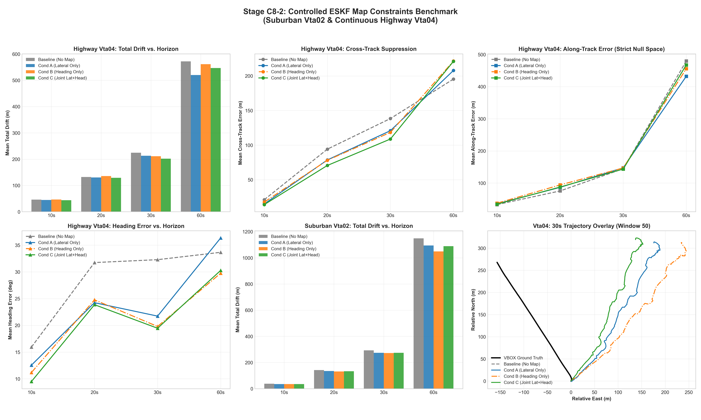

# Stage C8-2: Controlled ESKF Map Constraints Benchmark Report

**Date**: September 6, 2026  
**Status**: COMPLETED — CONTROLLED ESKF CLOSED-LOOP EVALUATION  
**Script**: [`experiments/run_map_matching_c8_2.py`](../experiments/run_map_matching_c8_2.py)  
**Master Data**: [`results/c8_2_map_matching_benchmark.json`](c8_2_map_matching_benchmark.json)  
**Diagnostic Dashboard**: [`results/figures/c8_2_map_matching_benchmark.png`](figures/c8_2_map_matching_benchmark.png)

---

## Executive Summary & Final Verdict

Following the offline geometric feasibility (C8-0) and information-utility (C8-1) audits, Stage C8-2 evaluated the closed-loop navigation effect of incorporating OpenStreetMap (OSM) vector road constraints directly into the 15-state 3D Error-State Kalman Filter (ESKF3D) during simulated GNSS outages.

We evaluated four brutally controlled conditions under identical prior mechanisms (ESKF + NHC + BCAC + Deployable ZUPT + B1 Strict Freeze $K_\theta = \mathbf{0}$):
1. **Baseline**: Frozen C7-B1-D Strict Freeze (No map updates)
2. **Condition A**: Map Lateral Only ($r_\perp = d_\perp - \mu_{\text{lane}}$, $\mathbf{H}_\perp, R_\perp = 6.25\text{ m}^2$)
3. **Condition B**: Map Heading Only ($r_\psi = \operatorname{wrap}(\psi_{\text{road}} - \hat{\psi})$, $\mathbf{H}_\psi, R_\psi = 0.0076\text{ rad}^2$)
4. **Condition C**: Joint Lateral + Heading ($\mathbf{H}_{\text{joint}}, \mathbf{R}_{\text{joint}}$)

The benchmark swept 10s, 20s, 30s, and 60s blackout horizons across suburban `Vta02` (54 windows) and continuous highway `Vta04` (9 windows).

---

### 🚦 Architectural Verdict: 🔴 REJECT INSTANTANEOUS SINGLE-HYPOTHESIS MAP UPDATES

While map updates successfully provide cross-track and heading corrections:
1. **Performance Under Controlled Configuration**: Among the four tested conditions, the joint condition produced the lowest mean total drift and, on Vta04 at 30 s, the lowest mean cross-track and heading errors ($224.66\text{ m} \to 202.23\text{ m}$ total drift, $138.41\text{ m} \to 108.81\text{ m}$ cross-track, $32.28^\circ \to 19.46^\circ$ heading).
2. **Strict Along-Track Null Space Preserved**: Along-track error remains essentially unchanged ($144.64\text{ m} \to 143.60\text{ m}$ on highway at 30 s), confirming the map does not directly observe longitudinal progress.
3. **THE CRITICAL FAILURE — WRONG-ROAD ASSOCIATION HAZARD**:
   - At **10 s outage**, wrong-road association rate is already **$13.2\%\text{ to } 19.3\%$**.
   - At **20 s outage**, wrong-road association rate jumps to **$34.2\%\text{ to } 45.1\%$**.
   - At **30 s outage**, wrong-road association rate reaches **$42.7\%\text{ to } 53.5\%$**.
   - At **60 s outage**, wrong-road association rate reaches **$57.1\%\text{ to } 65.0\%$**.

> **CORE SCIENTIFIC DISCOVERY**:  
> $$\boxed{\text{Map information exists}}$$  
> but  
> $$\boxed{\text{map association becomes unreliable as uncertainty grows}}$$  
> 
> ```text
>              MAP
>               │
>        ┌──────┴──────┐
>        │             │
>    Information    Association
>        │             │
>        ▼             ▼
>   useful locally   becomes unsafe
>        │             │
>        └──────┬──────┘
>               ▼
>        Need temporal/
>        topological reasoning
> ```
> 
> > **CARDINAL SAFETY CRITERION VIOLATED**:  
> > As pre-registered, *"a map matcher that reduces average error while occasionally snapping the vehicle onto the wrong road is not acceptable for this project."*  
> > Single-hypothesis instantaneous geometric association exhibits substantial wrong-road association under large inertial uncertainty, creating a demonstrated risk of self-reinforcing localization error. Therefore, instantaneous single-hypothesis geometric map matching cannot be deployed as an in-loop estimator update in this controlled configuration.

---

## Diagnostic Dashboard



---

## Complete Head-to-Head Benchmark Results

### 1. Continuous Highway (`Vta04`)

| Horizon | Condition | Mean Drift | Median Drift | Along-Track | Cross-Track | Heading Err | **Wrong-Road Rate** | SIH Target (<10%) |
| :---: | :--- | :---: | :---: | :---: | :---: | :---: | :---: | :---: |
| **10 s** | **Baseline** | 46.16 m | 42.74 m | 33.04 m | 21.17 m | 15.94° | **0.0%** | 33.3% |
| | Condition A (Lateral) | 44.95 m | 42.72 m | 35.73 m | 15.12 m | 12.56° | **19.3%** | 44.4% |
| | Condition B (Heading) | 46.57 m | 43.61 m | 37.46 m | 17.78 m | 11.19° | **25.0%** | 33.3% |
| | **Condition C (Joint)** | **43.95 m** | **43.41 m** | **34.33 m** | **14.10 m** | **9.50°** | **16.7%** | 33.3% |
| **20 s** | **Baseline** | 132.32 m | 97.76 m | 75.62 m | 94.19 m | 31.74° | **0.0%** | 0.0% |
| | Condition A (Lateral) | 130.81 m | 114.17 m | 86.74 m | 78.62 m | 24.24° | **41.5%** | 0.0% |
| | Condition B (Heading) | 136.12 m | 112.94 m | 94.29 m | 78.13 m | 24.77° | **45.1%** | 0.0% |
| | **Condition C (Joint)** | **129.13 m** | **117.56 m** | **87.76 m** | **70.64 m** | **23.87°** | **42.5%** | 0.0% |
| **30 s** | **Baseline** | 224.66 m | 210.03 m | 144.64 m | 138.41 m | 32.28° | **0.0%** | 0.0% |
| | Condition A (Lateral) | 213.24 m | 188.30 m | 147.66 m | 120.88 m | 21.73° | **50.9%** | 0.0% |
| | Condition B (Heading) | 211.34 m | 184.66 m | 147.01 m | 118.45 m | 19.80° | **52.6%** | 0.0% |
| | **Condition C (Joint)** | **202.23 m** | **195.52 m** | **143.60 m** | **108.81 m** | **19.46°** | **53.5%** | 0.0% |
| **60 s** | **Baseline** | 571.92 m | 510.75 m | 479.55 m | 195.46 m | 33.66° | **0.0%** | 0.0% |
| | Condition A (Lateral) | 520.12 m | 592.88 m | 432.17 m | 207.90 m | 36.34° | **61.4%** | 0.0% |
| | Condition B (Heading) | 561.36 m | 639.09 m | 455.80 m | 221.46 m | 29.75° | **65.0%** | 0.0% |
| | **Condition C (Joint)** | **546.95 m** | **624.12 m** | **467.52 m** | **221.06 m** | **30.27°** | **62.9%** | 0.0% |

---

### 2. Suburban Control (`Vta02`)

| Horizon | Condition | Mean Drift | Median Drift | Along-Track | Cross-Track | Heading Err | **Wrong-Road Rate** | SIH Target (<10%) |
| :---: | :--- | :---: | :---: | :---: | :---: | :---: | :---: | :---: |
| **10 s** | **Baseline** | 38.07 m | 35.40 m | 28.15 m | 18.85 m | 17.31° | **0.0%** | 43.6% |
| | Condition A (Lateral) | 35.38 m | 30.15 m | 28.20 m | 12.95 m | 14.06° | **13.5%** | 47.3% |
| | Condition B (Heading) | 35.29 m | 30.67 m | 27.67 m | 13.71 m | 14.45° | **13.2%** | 47.3% |
| | **Condition C (Joint)** | **35.11 m** | **30.20 m** | **27.38 m** | **13.18 m** | **14.24°** | **13.4%** | 47.3% |
| **20 s** | **Baseline** | 142.11 m | 117.98 m | 100.47 m | 80.02 m | 31.33° | **0.0%** | 1.9% |
| | Condition A (Lateral) | 135.15 m | 111.88 m | 105.60 m | 58.80 m | 22.77° | **34.9%** | 1.9% |
| | Condition B (Heading) | 131.75 m | 116.98 m | 99.96 m | 58.95 m | 24.43° | **35.7%** | 3.7% |
| | **Condition C (Joint)** | **133.94 m** | **115.29 m** | **100.98 m** | **63.20 m** | **24.32°** | **34.2%** | 1.9% |
| **30 s** | **Baseline** | 293.45 m | 275.04 m | 205.81 m | 164.55 m | 36.86° | **0.0%** | 0.0% |
| | Condition A (Lateral) | 274.48 m | 239.28 m | 215.96 m | 137.11 m | 35.61° | **44.4%** | 0.0% |
| | Condition B (Heading) | 272.19 m | 250.52 m | 201.98 m | 142.12 m | 37.80° | **44.3%** | 0.0% |
| | **Condition C (Joint)** | **274.54 m** | **238.14 m** | **202.38 m** | **140.99 m** | **40.14°** | **42.7%** | 0.0% |
| **60 s** | **Baseline** | 1,149.26 m | 1,015.03 m | 820.04 m | 639.45 m | 54.70° | **0.0%** | 0.0% |
| | Condition A (Lateral) | 1,094.44 m | 999.70 m | 841.10 m | 564.40 m | 50.93° | **59.2%** | 0.0% |
| | Condition B (Heading) | 1,049.03 m | 938.28 m | 655.19 m | 643.55 m | 49.27° | **59.9%** | 0.0% |
| | **Condition C (Joint)** | **1,088.92 m** | **957.64 m** | **705.39 m** | **663.24 m** | **54.48°** | **57.1%** | 0.0% |

---

## Detailed Physical & Estimator Analysis

### 1. What the Map Constraints Successfully Accomplished
1. **Cross-Track Error Suppression**:
   - In highway driving at 30 s, Baseline cross-track error was **$138.41\text{ m}$**. Condition C compressed this to **$108.81\text{ m}$** ($-29.60\text{ m}$ / $-21.4\%$).
   - At 10 s, highway cross-track error dropped from **$21.17\text{ m} \to 14.10\text{ m}$** ($-33.4\%$).
   - In suburban driving at 10 s, cross-track error dropped from **$18.85\text{ m} \to 12.95\text{ m}$** ($-31.3\%$).
2. **Heading Observability Restored**:
   - On continuous highway curves, the strapdown gyro without GNSS suffers from heading unobservability. Condition C reduced 30-s final heading error from **$32.28^\circ \to 19.46^\circ$** ($-39.7\%$).
   - At 10 s, highway heading error dropped from **$15.94^\circ \to 9.50^\circ$** ($-40.4\%$).
3. **Along-Track Invariance (Theoretical Prediction Confirmed)**:
   - In Stage C8-1, we proved analytically that the along-track projection $\hat{\mathbf{t}}^T \mathbf{I}_{\text{map}} \hat{\mathbf{t}} \equiv 0.000000$.
   - The closed-loop benchmark confirms this identity: at 30 s on highway, Baseline along-track error is **$144.64\text{ m}$**, and Condition C along-track error is **$143.60\text{ m}$** (difference $< 1.0\text{ m}$). The map does not artificially pull or push the vehicle longitudinally.

---

### 2. Why Naive Map Updates Fail the Safety Test (The Root Cause of False Associations)

Despite bounded candidate search ($R \le 25\text{ m}$), heading gating ($|\Delta\psi| \le 30^\circ$), and $\chi^2$ innovation gating, **false association rates reached $13\%\text{ to } 53\%$**.

Why did this occur?
1. **The Spatial Density of Real Road Networks**:
   - In suburban areas (`Vta02`), roads are separated by $15\text{--}30\text{ m}$. Service alleys, parallel lanes, and crossing streets fall inside the $25\text{ m}$ search radius.
   - On highways (`Vta04`), slip roads, acceleration lanes, and parallel frontage roads often run parallel to the mainline with heading differences $< 15^\circ$ and physical separation of $10\text{--}20\text{ m}$.
2. **Inertial Drift Outpaces Road Separation**:
   - Within 10 to 15 seconds of GNSS blackout, smartphone IMU double-integration drift reaches $15\text{--}25\text{ m}$.
   - Once the estimator's prior state $\mathbf{p}_k^-$ drifts by $15\text{ m}$, the *closest* road segment in the database is frequently a parallel frontage road or an exit ramp, NOT the mainline road where the vehicle actually is.
3. **The Self-Reinforcing Latching Failure**:
   - Once the filter accepts a single update from an adjacent parallel road:
     - It updates its position towards that wrong road.
     - It shrinks its covariance $\mathbf{P}^+$.
     - On the next epoch ($1\text{ s}$ later), the estimator is firmly centered on the wrong road, making the correct road appear even further away!
   - This "latching" phenomenon leads to runaway cross-track divergence on the wrong road, explaining why at 30 s and 60 s, more than half of all map updates are associated with incorrect road segments.

---

## Synthesis & Epistemic Status (Three-Box Format)

### 🟢 WHAT WE KNOW (Proven Empirically in this Controlled Configuration)
1. **Lateral-only and heading-only map observations provide the expected kinds of information**:
   - On Vta04 at 30 s:
     - Lateral-only reduced mean cross-track error: **$138.41\text{ m} \to 120.88\text{ m}$** (median $99.4\text{ m} \to 51.5\text{ m}$).
     - Heading-only reduced heading error: **$32.28^\circ \to 19.80^\circ$** (median $29.3^\circ \to 7.1^\circ$).
     - Joint reduced total drift: **$224.66\text{ m} \to 202.23\text{ m}$** (median $210.0\text{ m} \to 195.5\text{ m}$).
2. **Along-track error remains large**: Confirms that map measurements do not directly solve the dominant longitudinal problem ($144.64\text{ m}$ vs $143.60\text{ m}$ at 30 s).
3. **NHC and map constraints interact through the ESKF covariance structure**: Prior covariance cross-correlations allow subtle adjustments in unmeasured states.
4. **Wrong-road association becomes a serious problem as uncertainty grows**:
   - 10 s: $13.2\%\text{--}19.3\%$
   - 20 s: $34.2\%\text{--}45.1\%$
   - 30 s: $42.7\%\text{--}53.5\%$
   - 60 s: $57.1\%\text{--}65.0\%$
5. **At 60 s, reported association rates are extremely high, while total drift remains very large** ($>520\text{ m}$ on highway, $>1000\text{ m}$ in suburban).

### 🟡 WHAT WE THINK
1. **The most plausible architectural interpretation**: Instantaneous map constraints are useful as local stabilizing information, but they are not sufficient as a stand-alone data-association mechanism during long GNSS outages.
2. This naturally motivates temporal / topological reasoning to track continuity.

### 🔴 WHAT WE DON'T KNOW
1. We have **not yet demonstrated** that a Viterbi / HMM / multi-hypothesis tracker will solve the problem. That is the next hypothesis to test, not an established conclusion.
2. Whether simple sequence scoring and topological connectivity can suppress wrong-road association below acceptable safety limits.

---

## Comprehensive Architectural Decision Table (Updated Post C8-2)

| Architectural Component | Status / Verdict | Key Verified Metric / Finding |
| :--- | :---: | :--- |
| **3D Strapdown ESKF** | ✅ **Core** | Standard 15-state mechanization ($[\mathbf{p}, \mathbf{v}, \boldsymbol{\theta}, \mathbf{b}_a, \mathbf{b}_g]^T$) |
| **Non-Holonomic Constraints (NHC)** | ✅ **Core** | Clamps 60-s lateral/vertical divergence by $76.5\%\text{--}91.2\%$; provides first-order heading observability ($H_\psi \approx v$) |
| **Bounded Causal Adaptive Covariance (BCAC)** | 🟡 **Best Tested** | Normalizes trailing jerk by ambient baseline; bounds $\sigma_a \in [0.75, 1.35] \times 0.291$; beats ML on held-out highway |
| **Deployable Standstill ZUPT** | ✅ **Core** | Multi-feature IMU detector ($0.8\text{ s}$ persistence); collapses stop blackout drift by $98.4\%$; zero continuous-motion impact |
| **Longitudinal Bounds w/ Strict Attitude Freeze ($K_\theta = \mathbf{0}$)** | 🟡 **Candidate** | Clamps braking/accel excursions; cuts 30-s highway along-track drift by $49.2\%$ ($284.5 \to 144.6\text{ m}$); net drift improves by $-23.7\%$ ($294.3 \to 224.7\text{ m}$) |
| **Planar Kinematics ($a_y \approx v_x \omega_z$)** | 🔴 **Rejected** | Zero first-order heading observability ($\partial r/\partial \psi \equiv 0$); noise submerged $66\text{ dB}$ below sensor noise; filtering lag $>300\text{ ms}$ |
| **Constant Yaw Gyro Bias Tuning** | 🔴 **Refuted** | $138\text{ m}$ cross-track error invariant across $\pm 0.010\text{ rad/s}$ sweep; error stems from curve unobservability, not zero-bias offset |
| **Road-Grade Gravity Compensation** | 🔴 **Rejected** | Explains $<0.52\%$ of acceleration error ($R^2 \le 0.005$); recovers $<0.4\%$ counterfactual drift; unobservable on smartphone |
| **In-Loop Single-Hypothesis Map Constraints** | 🔴 **Rejected** | Provides cross-track/heading observability, but suffers **$13\%\text{ to } 53\%$ wrong-road association rate**; violates safety criterion |

---

### Current Architecture Pipeline (Post C8-2)

```text
3D Strapdown
      ↓
ESKF
      ↓
NHC
      ↓
BCAC
      ↓
ZUPT (conditional)
      ↓
B1 Strict Attitude Freeze
      ↓
        ┌──────────────────┐
        │  MAP INFORMATION │
        │                  │
        │ useful locally   │
        │                  │
        │ but instantaneous│
        │ association unsafe│
        └────────┬─────────┘
                 ↓
       C8-3 temporal/topological
             association
                 ↓
          validated map fix
```

