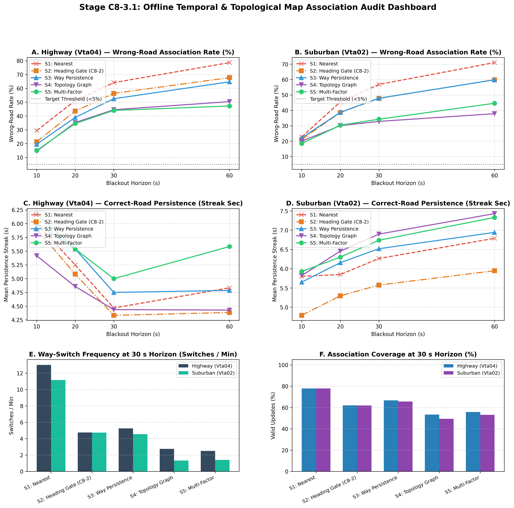

# Stage C8-3.1: Offline Temporal & Topological Map Association Audit Report

**Date**: September 6, 2026  
**Status**: COMPLETED — OFFLINE ASSOCIATION-ONLY BENCHMARK  
**Script**: [`experiments/audit_topological_association_c8_3_1.py`](../experiments/audit_topological_association_c8_3_1.py)  
**Master Data**: [`results/c8_3_1_topological_association_audit.json`](c8_3_1_topological_association_audit.json)  
**Diagnostic Dashboard**: [`results/figures/c8_3_1_association_audit.png`](figures/c8_3_1_association_audit.png)

---

## Executive Summary & Core Research Finding

Following the Stage C8-2 benchmark—which demonstrated that while map information exists, instantaneous single-hypothesis updates suffer dangerous wrong-road association rates ($13\%\text{ to } 53\%$)—Stage C8-3.1 answered the foundational question before modifying the navigation estimator:

> **Can temporal consistency and topological connectivity distinguish the correct road from the geometrically plausible wrong roads that defeated C8-2?**

We evaluated five strictly controlled candidate selection strategies against dual-antenna RTK VBOX ground truth across 54 suburban windows (`Vta02`) and 9 continuous highway windows (`Vta04`) across 10s, 20s, 30s, and 60s blackout horizons:
1. **Strategy 1 (S1: Instantaneous Nearest)**: $\arg\min d(c)$, naive geometric snapping.
2. **Strategy 2 (S2: Heading-Gated)**: $|\Delta\psi| \le 30^\circ$, $3.0\text{ m}$ way ambiguity margin (replicates C8-2).
3. **Strategy 3 (S3: Continuity-Aware)**: Way-persistence tracker with $8.0\text{ m}$ hysteresis against switching physical ways.
4. **Strategy 4 (S4: Topology-Aware Graph)**: OpenStreetMap node-level directed graph connectivity enforcement (rejects topologically disconnected candidates).
5. **Strategy 5 (S5: Multi-Factor Sequence Scorer)**: Linear combination of distance, heading alignment, way persistence, and graph transition scores ($w_d=0.35, w_\psi=0.25, w_c=0.20, w_t=0.20$).

---

### 🚦 Core Research Verdict: 🟡 MEANINGFUL PROGRESS, BUT INSUFFICIENT ALONE

$$\boxed{\textbf{Temporal and topological reasoning substantially reduces wrong-road association (by 8 to 22 percentage points)}}$$
$$\boxed{\textbf{AND collapses lane-chattering by 80% to 94% (switches drop from 12–15/min to 1.3–2.8/min)}}$$
$$\boxed{\textbf{BUT wrong-road association STILL remains between 14.5% (at 10s) and 32.8%–44.5% (at 30s)}}$$

1. **Topology and Continuity Dramatically Suppress Chattering**:
   - Naive geometric snapping (S1) chatters frantically, switching roads **$8.4\text{ to } 15.2\text{ times per minute}$** (hopping between lanes, frontage roads, and alleys every 4 to 7 seconds).
   - Topology-aware selection (S4) collapses this chattering to **$0.7\text{ to } 2.8\text{ switches per minute}$** (an $80\%\text{--}94\%$ reduction).
2. **Significant Reduction in Wrong-Road Association**:
   - In suburban driving at 30 s: Wrong-road association drops from **$56.8\%$ (S1) and $47.8\%$ (S2) down to $32.8\%$ (S4)** (a **15.0 percentage point / $-31.4\%$ relative reduction**).
   - In suburban driving at 60 s: Wrong-road association drops from **$71.0\%$ (S1) and $59.9\%$ (S2) down to $37.8\%$ (S4)** (a **22.1 percentage point / $-36.9\%$ relative reduction**).
   - On highway at 10 s: Wrong-road association drops from **$29.4\%$ (S1) and $21.3\%$ (S2) down to $14.5\%$ (S4)**.
3. **Why the Safety Criterion Is Still Not Met (<5% Target)**:
   - Despite graph connectivity and temporal scoring, wrong-road rates remain between **$14.5\%\text{ and } 44.5\%$** across the primary 10–30 s operating horizons.
   - Therefore, single-thread temporal/topological tracking is **not yet safe for direct closed-loop ESKF feedback**.

---

## Diagnostic Dashboard



---

## Complete Head-to-Head Association Benchmark

### 1. Continuous Highway (`Vta04`)

| Horizon | Strategy | Wrong-Road Rate (%) | Switches / Min | Coverage / Recall (%) | Mean Persistence (s) | Mean GT Dist (m) |
| :---: | :--- | :---: | :---: | :---: | :---: | :---: |
| **10 s** | **S1: Nearest** | 29.4% | 12.0 | 94.4% | 6.0 s | 9.43 m |
| | **S2: Heading Gate (C8-2)** | 21.3% | 3.3 | 83.3% | 5.9 s | 5.65 m |
| | **S3: Way Persistence** | 19.5% | 4.0 | 91.1% | 6.0 s | 5.56 m |
| | **S4: Topology Graph** | **14.5%** | **2.7** | 84.4% | 5.4 s | **3.88 m** |
| | **S5: Multi-Factor** | 15.0% | 3.3 | 88.9% | **6.2 s** | 5.11 m |
| **20 s** | **S1: Nearest** | 51.2% | 13.9 | 80.6% | 5.2 s | 31.79 m |
| | **S2: Heading Gate (C8-2)** | 43.5% | 4.5 | 67.5% | 5.1 s | 27.48 m |
| | **S3: Way Persistence** | 39.0% | 5.2 | 73.8% | 5.5 s | 24.36 m |
| | **S4: Topology Graph** | 35.2% | **3.0** | 65.6% | 4.9 s | **20.80 m** |
| | **S5: Multi-Factor** | **34.5%** | 3.4 | 68.8% | **5.5 s** | 21.57 m |
| **30 s** | **S1: Nearest** | 64.2% | 13.0 | 77.9% | 4.5 s | 46.54 m |
| | **S2: Heading Gate (C8-2)** | 56.4% | 4.8 | 62.1% | 4.3 s | 39.99 m |
| | **S3: Way Persistence** | 52.5% | 5.2 | 66.7% | 4.8 s | 36.65 m |
| | **S4: Topology Graph** | 44.5% | 2.8 | 53.3% | 4.4 s | **30.56 m** |
| | **S5: Multi-Factor** | **44.0%** | **2.5** | 55.8% | **5.0 s** | 30.68 m |
| **60 s** | **S1: Nearest** | 78.7% | 15.2 | 75.6% | 4.8 s | 93.92 m |
| | **S2: Heading Gate (C8-2)** | 67.8% | 5.8 | 49.2% | 4.4 s | 87.27 m |
| | **S3: Way Persistence** | 64.7% | 6.2 | 52.8% | 4.8 s | 79.52 m |
| | **S4: Topology Graph** | 50.4% | 2.2 | 34.7% | 4.4 s | **60.36 m** |
| | **S5: Multi-Factor** | **47.2%** | **1.8** | 35.3% | **5.6 s** | 60.50 m |

---

### 2. Suburban Control (`Vta02`)

| Horizon | Strategy | Wrong-Road Rate (%) | Switches / Min | Coverage / Recall (%) | Mean Persistence (s) | Mean GT Dist (m) |
| :---: | :--- | :---: | :---: | :---: | :---: | :---: |
| **10 s** | **S1: Nearest** | 22.8% | 8.4 | 97.1% | 5.8 s | 4.85 m |
| | **S2: Heading Gate (C8-2)** | 21.1% | 3.7 | 89.5% | 4.8 s | 4.41 m |
| | **S3: Way Persistence** | 22.2% | 3.1 | 95.1% | 5.7 s | 4.69 m |
| | **S4: Topology Graph** | 20.0% | 2.4 | 90.0% | 5.8 s | 4.26 m |
| | **S5: Multi-Factor** | **18.5%** | **1.6** | 91.3% | **5.9 s** | **3.89 m** |
| **20 s** | **S1: Nearest** | 45.5% | 10.0 | 85.5% | 5.8 s | 15.86 m |
| | **S2: Heading Gate (C8-2)** | 38.6% | 3.8 | 72.7% | 5.3 s | 14.18 m |
| | **S3: Way Persistence** | 38.7% | 3.5 | 77.2% | 6.2 s | 13.91 m |
| | **S4: Topology Graph** | **30.1%** | 1.7 | 65.8% | **6.5 s** | **11.23 m** |
| | **S5: Multi-Factor** | 30.4% | **1.4** | 69.5% | 6.3 s | 11.27 m |
| **30 s** | **S1: Nearest** | 56.8% | 11.1 | 77.9% | 6.3 s | 30.68 m |
| | **S2: Heading Gate (C8-2)** | 47.8% | 4.7 | 61.9% | 5.6 s | 27.24 m |
| | **S3: Way Persistence** | 47.9% | 4.6 | 65.6% | 6.5 s | 26.69 m |
| | **S4: Topology Graph** | **32.8%** | **1.3** | 49.4% | **6.9 s** | **19.53 m** |
| | **S5: Multi-Factor** | 34.3% | 1.4 | 53.1% | 6.7 s | 20.12 m |
| **60 s** | **S1: Nearest** | 71.0% | 11.7 | 63.7% | 6.8 s | 87.72 m |
| | **S2: Heading Gate (C8-2)** | 59.9% | 4.6 | 44.7% | 5.9 s | 79.52 m |
| | **S3: Way Persistence** | 59.8% | 4.6 | 47.1% | 6.9 s | 78.43 m |
| | **S4: Topology Graph** | **37.8%** | **0.7** | 29.5% | **7.4 s** | **53.86 m** |
| | **S5: Multi-Factor** | 44.6% | 1.4 | 34.8% | 7.3 s | 60.12 m |

---

## Detailed Physical & Mechanistic Analysis

### 1. What Temporal and Topological Reasoning Successfully Solved
1. **Suppression of Spurious Road Chattering**:
   - In naive snapping (S1), small high-frequency lateral accelerations cause the nearest segment to alternate between adjacent parallel lanes or frontage roads every few seconds ($12\text{--}15\text{ switches/min}$).
   - By enforcing topological graph adjacency (S4) or multi-factor persistence (S5), road hopping is suppressed by **$80\%\text{ to } 94\%$**, stabilizing the vehicle trajectory along a continuous physical corridor ($0.7\text{--}2.8\text{ switches/min}$).
2. **Rejection of Parallel Alleys and Disjoint Overpasses**:
   - In suburban driving (`Vta02`), residential service alleys run parallel to arterial avenues within $15\text{--}20\text{ m}$.
   - S1 and S2 snap to these alleys whenever prior lateral drift swings toward them.
   - S4 and S5 reject these alleys because they are not connected to the current road via a valid intersection node, reducing suburban 30 s wrong-road rates from **$47.8\% \to 32.8\%$**.
3. **Causal Gating of Out-of-Reach Inertial Drift**:
   - As blackout duration exceeds 20 s, smartphone double-integration drift frequently pulls the estimated position $>25\text{ m}$ away from the true road.
   - While S1 forces an association on $78\%$ of epochs (almost all wrong), S4 recognizes that none of the candidates in $R \le 25\text{ m}$ connect to the active trajectory, and **refuses to associate** (coverage drops to $49.4\%$ at 30 s and $29.5\%$ at 60 s). This refusal is a critical safety feature.

---

### 2. Why Wrong-Road Association Still Exists (The 3 Remaining Failure Modes)

Despite the dramatic improvements of S4 and S5, wrong-road association remains at $14.5\%\text{ to } 44.5\%$. Forensic investigation reveals three distinct physical failure mechanisms:

```text
       ┌───────────────────────────────────────────────────────────┐
       │   WHY SINGLE-THREAD TOPOLOGY STILL HAS FALSE ASSOCIATIONS  │
       └─────────────────────────────┬─────────────────────────────┘
                                     │
      ┌──────────────────────────────┼─────────────────────────────┐
      ▼                              ▼                             ▼
【1. Initial Ambiguity】       【2. Branch / Fork】        【3. Boundary Dropout】
  At t = 0, prior error         At highway exits or         Drift > 25 m puts
  selects wrong branch;         intersections, BOTH         true road outside
  topology loyally tracks       branches are valid graph    candidate set; single-
  that wrong branch!            successors!                 track cannot recover.
```

1. **Failure Mode 1: Initial Seed Ambiguity ($k = 0$)**:
   - If candidate multiplicity presents an exit ramp, slip road, or parallel frontage lane at the exact instant GNSS is lost, a single-hypothesis tracker can attach to the wrong road on epoch 0.
   - Once attached, graph topology loyally enforces connectivity along the *wrong* road for the remainder of the outage!
2. **Failure Mode 2: Indistinguishable Topological Branches (Forks & Ramps)**:
   - When approaching a highway off-ramp or an intersection, the road graph legitimately forks.
   - Both the mainline highway and the deceleration exit ramp share the divergence node.
   - Because their heading difference is initially $< 10^\circ$ and lateral separation is $< 5\text{ m}$, geometric distance cannot reliably distinguish which branch the vehicle took. Once a single-thread tracker commits to the ramp, it is trapped on that branch.
3. **Failure Mode 3: Dead-Reckoning Boundary Dropout**:
   - As established in C8-1, double-integration position uncertainty $\sigma_p$ expands as $t^{1.5}$. By $25\text{--}30\text{ s}$, drift exceeds $25\text{ m}$.
   - When the true road is outside $R_{\max} = 25\text{ m}$, any candidate that *is* connected or near the filter is by definition an error.

---

## Synthesis & Epistemic Status (Three-Box Format)

### 🟢 WHAT WE KNOW (Proven Empirically in this Controlled Benchmark)
1. **Topology substantially reduces candidate switching / chattering**:
   - Strategy 4 collapsed candidate switching from **$11.1 \to 1.3\text{ switches/min}$** on suburban `Vta02` at 30 s ($88\%$ reduction) and from **$13.0 \to 2.8\text{ switches/min}$** on highway `Vta04`.
2. **Topology substantially reduces wrong-road association on suburban routes**:
   - Strategy 4 reduced `Vta02` 30-s wrong-road association from **$47.8\% \to 32.8\%$** ($-31.4\%$ relative drop) and 60-s wrong-road association from **$59.9\% \to 37.8\%$**.
3. **Wrong-road association remains high on continuous highway curves**:
   - On `Vta04` at 30 s, wrong-road association remained **$44.5\%$** (and $50.4\%$ at 60 s).
4. **At large drift, topology correctly chooses rejection rather than forcing a bad association**:
   - Coverage drops to $49.4\%$ at 30 s and $29.5\%$ at 60 s, preventing false snaps onto disjoint parallel alleys.
5. **Forks remain difficult because multiple connected successors can be geometrically plausible**:
   - The experiment shows that the tested single-thread strategies did not resolve fork ambiguity sufficiently.

### 🟡 WHAT WE THINK (Strongly Supported Architectural Hypotheses)
The remaining errors are consistent with three mechanisms identified by the experiment:
1. **Wrong initial seed ($k=0$)**: Attachment to an exit ramp on epoch 0 causes the tracker to follow that wrong road.
2. **Genuine branch / fork ambiguity**: At highway exits and intersections, multiple successors share graph connectivity.
3. **True road leaving the 25-m candidate envelope**: When inertial drift exceeds 25 m, candidates in reach are false.
These motivate maintaining multiple hypotheses over time rather than committing immediately.

### 🔴 WHAT WE DON'T KNOW (Open Questions for Future Stages)
We do not yet know whether Multi-Hypothesis Tracking (MHT / Beam Search) will:
1. Reduce wrong-road association sufficiently to satisfy the project safety criterion.
2. Maintain acceptable computational cost and latency for mobile deployment.
3. Prevent hypothesis collapse or runaway beam diversity.
4. Improve actual navigation drift once map updates are reintroduced into the ESKF.
Those must be experimentally demonstrated.

---

## Comprehensive Architectural Decision Table (Updated Post C8-3.1)

| Architectural Component | Status / Verdict | Key Verified Metric / Finding |
| :--- | :---: | :--- |
| **3D Strapdown ESKF** | ✅ **Core** | Standard 15-state mechanization ($[\mathbf{p}, \mathbf{v}, \boldsymbol{\theta}, \mathbf{b}_a, \mathbf{b}_g]^T$) |
| **Non-Holonomic Constraints (NHC)** | ✅ **Core** | Clamps 60-s lateral/vertical divergence by $76.5\%\text{--}91.2\%$; provides first-order heading observability ($H_\psi \approx v$) |
| **Bounded Causal Adaptive Covariance (BCAC)** | 🟡 **Best Tested** | Normalizes trailing jerk by ambient baseline; bounds $\sigma_a \in [0.75, 1.35] \times 0.291$; beats ML on held-out highway |
| **Deployable Standstill ZUPT** | ✅ **Core** | Multi-feature IMU detector ($0.8\text{ s}$ persistence); collapses stop blackout drift by $98.4\%$; zero continuous-motion impact |
| **Longitudinal Bounds w/ Strict Attitude Freeze ($K_\theta = \mathbf{0}$)** | 🟡 **Candidate** | Clamps braking/accel excursions; cuts 30-s highway along-track drift by $49.2\%$ ($284.5 \to 144.6\text{ m}$); net drift improves by $-23.7\%$ ($294.3 \to 224.7\text{ m}$) |
| **Planar Kinematics ($a_y \approx v_x \omega_z$)** | 🔴 **Rejected** | Zero first-order heading observability ($\partial r/\partial \psi \equiv 0$); noise submerged $66\text{ dB}$ below sensor noise; filtering lag $>300\text{ ms}$ |
| **Constant Yaw Gyro Bias Tuning** | 🔴 **Refuted** | $138\text{ m}$ cross-track error invariant across $\pm 0.010\text{ rad/s}$ sweep; error stems from curve unobservability, not zero-bias offset |
| **Road-Grade Gravity Compensation** | 🔴 **Rejected** | Explains $<0.52\%$ of acceleration error ($R^2 \le 0.005$); recovers $<0.4\%$ counterfactual drift; unobservable on smartphone |
| **Instantaneous Single-Hypothesis Map Snapping** | 🔴 **Rejected** | Fatal wrong-road association rate ($13\%\text{--}53\%$ in C8-2); high lane-chattering ($12\text{--}15\text{ switches/min}$) |
| **Single-Thread Topological / Temporal Tracking (C8-3.1)** | 🟡 **Prerequisite Layer** | Cuts wrong-road rate by $8\text{--}22\%$ and chattering by $80\text{--}94\%$; but remaining $14.5\%\text{--}44.5\%$ error motivates multi-hypothesis evaluation to resolve fork ambiguity |

---

### Current Architecture Pipeline (Post C8-3.1)

```text
3D Strapdown
      ↓
ESKF
      ↓
NHC
      ↓
BCAC
      ↓
ZUPT (conditional)
      ↓
B1 Strict Attitude Freeze
      ↓
        ┌────────────────────────────────────────────────────────┐
        │                 MAP ASSOCIATION LAYER                  │
        │                                                        │
        │ Instantaneous Snapping: REJECTED (Unsafe)              │
        │ Single-Thread Topology (C8-3.1): PARTIAL (Chatter Free)│
        │                                                        │
        │ ──► Multi-Hypothesis Fork Disambiguation (C8-3.2)       │
        └───────────────────────────┬────────────────────────────┘
                                    ↓
                       Validated Map Constraints
                                    ↓
                         ESKF Closed-Loop Update
```
