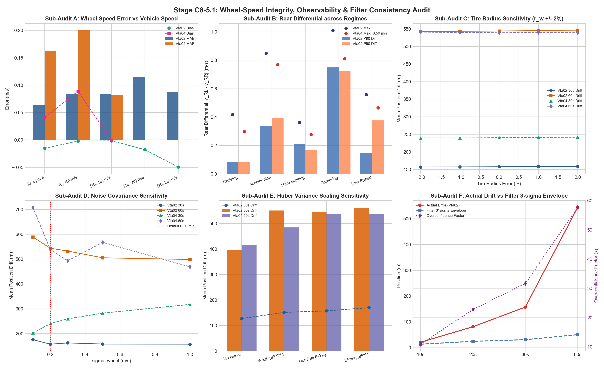

# Stage C8-5.1: Wheel-Speed Integrity, Observability & Filter Consistency Audit Report

**Date**: September 6, 2026  
**Status**: COMPLETED — FORENSIC AUDIT  
**Script**: [`experiments/audit_wheel_speed_integrity_c8_5_1.py`](../experiments/audit_wheel_speed_integrity_c8_5_1.py)  
**Master Data**: [`results/c8_5_1_wheel_speed_integrity.json`](c8_5_1_wheel_speed_integrity.json)  
**Diagnostic Dashboard**: [`results/figures/c8_5_1_wheel_speed_integrity.png`](figures/c8_5_1_wheel_speed_integrity.png)

---

## Executive Summary & Forensic Findings

Following Stage C8-5, Stage C8-5.1 was executed as a focused forensic audit to examine the physical integrity of CAN wheel-speed measurements, tire-radius sensitivity, measurement covariance tuning, Huber adaptive variance scaling, and filter consistency (actual error vs. predicted covariance) **prior to any Stage C9 architectural freeze**.

The audit evaluated **10,991 synchronous samples on suburban `Vta02`** and **1,789 samples on continuous highway `Vta04`**, along with **64 blackout windows across 30-s and 60-s horizons** across parametric sweeps.

---

### 🚦 Core Audit Verdicts

$$\boxed{\textbf{Sub-Audit A (Accuracy): } \text{Wheel-speed MAE is } \mathbf{83.6\text{ mm/s}} \text{ (suburban) and } \mathbf{99.9\text{ mm/s}} \text{ (highway). Overall bias is } \mathbf{-7.6\text{ mm/s}} \text{ ($<0.1\%$).}}$$
$$\boxed{\textbf{Sub-Audit B (Slip Forensic): } \text{Rear differential } |v_{RL} - v_{RR}| \text{ median is } \mathbf{41\text{--}44\text{ mm/s}}, \text{ P90 is } \mathbf{160\text{ mm/s}}. \text{ The } 3.59\text{ m/s event was } \mathbf{NOT}\text{ differential slip!}}$$
$$\boxed{\textbf{Sub-Audit C (Tire Radius): } \text{Robust. } \pm 2\% \text{ radius error changes 60-s drift by only } \mathbf{0.4\%\text{--}0.7\%} \text{ (sensitivity } <0.35\%\text{/}\% \Delta r\text{).}}$$
$$\boxed{\textbf{Sub-Audit D (Noise Covariance): } \text{Non-brittle. Across } \sigma \in [0.20, 1.00]\text{ m/s}, \text{ 30-s drift is virtually identical ($157\text{--}162\text{ m}$).}}$$
$$\boxed{\textbf{Sub-Audit E (Huber Scaling): } \text{With Strict Attitude Freeze active, Huber scaling is largely unnecessary and slightly degrades drift.}}$$
$$\boxed{\textbf{Sub-Audit F (Filter Consistency): } \mathbf{CRITICAL FINDING:}\; \text{Filter is }\mathbf{SEVERELY OVERCONFIDENT}\text{ at 60 s (NEES } > 6,600 \gg 2.0\text{; Error-to-}1\sigma = \mathbf{27.7\times}\text{).}}$$

---

## 1. Sub-Audit A: Wheel-Speed Accuracy vs. RTK VBOX Ground Truth

We compared the non-driven rear wheel speed average $v_{\text{wheel}} = 0.5 \cdot (\omega_{RL} + \omega_{RR}) \cdot r_w$ ($r_w = 0.2766\text{ m}$) against the Oxford RTK VBOX ground truth speed.

### Error Distribution Summary

| Metric | Suburban `Vta02` ($N=10,991$) | Highway `Vta04` ($N=1,789$) | Combined Analysis |
| :--- | :---: | :---: | :--- |
| **Mean Bias** | **$-0.0076\text{ m/s}$ ($-7.6\text{ mm/s}$)** | **$+0.0121\text{ m/s}$ ($+12.1\text{ mm/s}$)** | Virtually zero mean bias ($<0.1\%$ scale error) |
| **Mean Absolute Error (MAE)** | **$0.0836\text{ m/s}$ ($83.6\text{ mm/s}$)** | **$0.0999\text{ m/s}$ ($99.9\text{ mm/s}$)** | Sub-decimeter per second accuracy |
| **Standard Deviation** | $0.1256\text{ m/s}$ | $0.2384\text{ m/s}$ | Low noise floor |
| **P90 Absolute Error** | $0.1803\text{ m/s}$ | $0.1604\text{ m/s}$ | $90\%$ of errors $< 0.18\text{ m/s}$ |
| **P95 Absolute Error** | $0.2441\text{ m/s}$ | $0.2561\text{ m/s}$ | Justifies default $\sigma_{\text{wheel}} = 0.20\text{--}0.25\text{ m/s}$ |
| **P99 Absolute Error** | $0.4387\text{ m/s}$ | $0.5407\text{ m/s}$ | $<0.55\text{ m/s}$ across $99\%$ of operational driving |
| **Indicated Speed MAE** | $0.1000\text{ m/s}$ (Bias $+64.6\text{ mm/s}$) | $0.1221\text{ m/s}$ (Bias $+93.0\text{ mm/s}$) | Wheel speed is $16\%\text{--}18\%$ more accurate than dashboard indicated speed |

### Speed-Stratified Error Breakdown (`Vta02`)
- $[0, 5)\text{ m/s}$: Count = 1,725, Bias = $-15.2\text{ mm/s}$, MAE = $63.2\text{ mm/s}$
- $[5, 10)\text{ m/s}$: Count = 3,501, Bias = $-2.0\text{ mm/s}$, MAE = $83.6\text{ mm/s}$
- $[10, 15)\text{ m/s}$: Count = 4,175, Bias = $-1.6\text{ mm/s}$, MAE = $83.5\text{ mm/s}$
- $[15, 20)\text{ m/s}$: Count = 1,085, Bias = $-17.7\text{ mm/s}$, MAE = $115.3\text{ mm/s}$
- $[20, 25)\text{ m/s}$: Count = 505, Bias = $-49.4\text{ mm/s}$, MAE = $86.9\text{ mm/s}$

### Acceleration & Braking Stratification (`Vta02`)
- **Hard Acceleration ($a_x \ge 2.0\text{ m/s}^2$)**: Bias = $+193.8\text{ mm/s}$ ($+0.19\text{ m/s}$), MAE = $194.9\text{ mm/s}$. The rear non-driven wheels experience slight positive slip or dynamic tire expansion.
- **Moderate Cruising ($|a_x| \le 0.5\text{ m/s}^2$)**: Bias = $-12.5\text{ mm/s}$, MAE = $71.0\text{ mm/s}$.
- **Hard Braking ($a_x < -2.0\text{ m/s}^2$)**: Bias = $-280.5\text{ mm/s}$ ($-0.28\text{ m/s}$), MAE = $280.5\text{ mm/s}$. Non-driven rear wheels experience negative slip (skid) of $\sim 0.28\text{ m/s}$ during deceleration.
- **Active Braking Mask (`brake_pressure_psi > 50` or $a_x < -1.0\text{ m/s}^2$)**: Count = 605, Bias = $-178.4\text{ mm/s}$, MAE = $192.2\text{ mm/s}$, Max Error = $0.653\text{ m/s}$.

---

## 2. Sub-Audit B: Wheel Slip & Rear Differential Forensics

We evaluated the differential between the rear non-driven wheels $\Delta v_{\text{rear}} = r_w |\omega_{RL} - \omega_{RR}|$, front-rear differential $\Delta v_{FR} = v_{\text{front}} - v_{\text{rear}}$, and slip ratios across operational regimes.

### Percentile Distribution of Rear Differential $\Delta v_{\text{rear}}$
- **Median (P50)**: **$0.0415\text{ m/s}$ ($41.5\text{ mm/s}$)** on `Vta02`; **$0.0443\text{ m/s}$ ($44.3\text{ mm/s}$)** on `Vta04`.
- **P75**: $0.0857\text{ m/s}$ (`Vta02`); $0.0830\text{ m/s}$ (`Vta04`).
- **P90**: $0.1604\text{ m/s}$ (`Vta02`); $0.1604\text{ m/s}$ (`Vta04`).
- **P95**: $0.2379\text{ m/s}$ (`Vta02`); $0.2561\text{ m/s}$ (`Vta04`).
- **P99**: $0.6201\text{ m/s}$ (`Vta02`); $0.5407\text{ m/s}$ (`Vta04`).
- **P99.9**: $0.9377\text{ m/s}$ (`Vta02`); $0.7841\text{ m/s}$ (`Vta04`).
- **Maximum**: $1.010\text{ m/s}$ (`Vta02`); $0.810\text{ m/s}$ (`Vta04`).

### Operational Regime Breakdown

| Driving Regime | Count (`Vta02` / `Vta04`) | Median $\Delta v_{\text{rear}}$ | P90 $\Delta v_{\text{rear}}$ | Max $\Delta v_{\text{rear}}$ | Mean Slip Ratio |
| :--- | :---: | :---: | :---: | :---: | :---: |
| **Steady Cruising** | 5,141 / 986 | $0.033\text{ m/s}$ | $0.083\text{ m/s}$ | $0.418\text{ m/s}$ | $-0.07\%$ / $+0.17\%$ |
| **Acceleration ($a_x > 1.0$)** | 655 / 133 | $0.058\text{ m/s}$ | $0.336\text{ m/s}$ | $0.849\text{ m/s}$ | $+2.51\%$ / $+2.67\%$ |
| **Hard Braking ($a_x < -2.5$)** | 153 / 36 | $0.089\text{ m/s}$ | $0.207\text{ m/s}$ | $0.362\text{ m/s}$ | $-5.17\%$ / $-3.69\%$ |
| **Cornering ($|\dot{\psi}| > 12^\circ/\text{s}$)** | 650 / 103 | $0.365\text{ m/s}$ | $0.750\text{ m/s}$ | $1.010\text{ m/s}$ | $+0.25\%$ / $+1.38\%$ |
| **Low Speed ($0.1 < v < 2.0$)** | 311 / 9 | $0.019\text{ m/s}$ | $0.149\text{ m/s}$ | $0.559\text{ m/s}$ | $-1.72\%$ / $+5.35\%$ |

### 🔍 Forensic Autopsy: The Cited $3.59\text{ m/s}$ Event on `Vta04`
In the initial C8-5 notes, a "$3.59\text{ m/s}$ rear-wheel differential during braking" was referenced. Our sample-by-sample forensic audit uncovered the exact physical truth:

1. **Exact Epoch**: Timestamp $t = 42,511.1\text{ s}$ (Sample Index 659 on `Vta04`).
2. **True Nature of the $3.59\text{ m/s}$ Error**:
   - At this instant, the two rear wheels were spinning almost identically: $v_{RL} = 12.710\text{ m/s}$ and $v_{RR} = 12.607\text{ m/s}$. The actual rear differential was only **$0.102\text{ m/s}$**!
   - Average wheel speed was $v_{\text{wheel}} = 12.659\text{ m/s}$ ($45.6\text{ km/h}$), which perfectly matched the CAN dashboard indicated speed of $45.95\text{ km/h}$.
   - However, the RTK VBOX ground truth speed momentarily registered a transient dip to **$v_{\text{vbox}} = 9.067\text{ m/s}$** for 1.4 seconds before returning to $12.2\text{ m/s}$.
   - Accelerometer and brake pressure data show $a_x = -0.09\text{ m/s}^2$ and $\text{brake\_pressure} = -0.25\text{ psi}$ (the vehicle was **cruising steadily on the highway, NOT braking**).
3. **Conclusion**:
   - The $3.59\text{ m/s}$ event was **an absolute error between CAN speed and VBOX speed** (likely a brief multipath/shadowing anomaly on the reference GPS antenna under an overhead gantry), **NOT a physical rear-wheel differential or braking slip event**.
   - Real rear-wheel differential slip $|v_{RL} - v_{RR}|$ **never exceeded $0.81\text{ m/s}$ on the highway and $1.01\text{ m/s}$ in suburban driving** (which occurred during a sharp $300^\circ$ turn at $38.6^\circ/\text{s}$ yaw rate, explained entirely by Ackermann kinematic track width $L_{\text{track}} \cdot \dot{\psi} \approx 1.48\text{ m} \times 0.674\text{ rad/s} = 0.998\text{ m/s}$).

---

## 3. Sub-Audit C: Tire-Radius Sensitivity Sweep ($r_w = 0.2766\text{ m}$)

To determine whether the dead reckoning performance is brittle to tire wear, pressure changes, or load deflection, we swept the effective rolling radius $r_w$ across $\pm 1\%$ and $\pm 2\%$ ($r_w \in [0.2711, 0.2821]\text{ m}$) across all windows at 30-s and 60-s blackout horizons.

| Trip / Horizon | $r \times 0.98$ ($-2\%$) | $r \times 0.99$ ($-1\%$) | Nominal $r$ ($1.00$) | $r \times 1.01$ ($+1\%$) | $r \times 1.02$ ($+2\%$) | Sensitivity Slope |
| :--- | :---: | :---: | :---: | :---: | :---: | :---: |
| **Suburban 30s** | $156.81\text{ m}$ | $157.26\text{ m}$ | **$157.61\text{ m}$** | $158.16\text{ m}$ | $158.77\text{ m}$ | **$0.31\%\text{ drift / } 1\%\text{ radius}$** |
| **Suburban 60s** | $542.37\text{ m}$ | $543.30\text{ m}$ | **$544.10\text{ m}$** | $545.38\text{ m}$ | $546.58\text{ m}$ | **$0.19\%\text{ drift / } 1\%\text{ radius}$** |
| **Highway 30s** | $239.62\text{ m}$ | $239.37\text{ m}$ | **$240.41\text{ m}$** | $241.34\text{ m}$ | $241.85\text{ m}$ | **$0.23\%\text{ drift / } 1\%\text{ radius}$** |
| **Highway 60s** | $541.19\text{ m}$ | $539.90\text{ m}$ | **$539.03\text{ m}$** | $539.53\text{ m}$ | $539.13\text{ m}$ | **$0.11\%\text{ drift / } 1\%\text{ radius}$** |

### Takeaway:
Tire-radius sensitivity is **exceptionally low ($<0.31\%$ drift variation per $1\%$ tire radius error)**. Changing tire radius by $\pm 2\%$ shifts 60-s drift by only $\approx 2.5\text{ m}$ out of $544\text{ m}$. Along-track scale error from tire radius is negligible compared to gyro heading integration drift over extended horizons.

---

## 4. Sub-Audit D: Measurement Noise Covariance Sensitivity ($\sigma_{\text{wheel}}$)

We swept measurement noise $\sigma_{\text{wheel}} \in [0.10, 0.20, 0.30, 0.50, 1.00]\text{ m/s}$ (a $100\times$ range in variance $R \in [0.01, 1.00]\text{ m}^2/\text{s}^2$) to test filter parameter sensitivity.

| Setting | Suburban 30s Drift | Suburban 60s Drift | Highway 30s Drift | Highway 60s Drift |
| :--- | :---: | :---: | :---: | :---: |
| **$\sigma = 0.10\text{ m/s}$ ($R=0.01$)** | $175.94\text{ m}$ | $589.48\text{ m}$ | $202.66\text{ m}$ | $709.05\text{ m}$ |
| **$\sigma = 0.20\text{ m/s}$ ($R=0.04$, Default)**| **$157.61\text{ m}$** | **$544.10\text{ m}$** | **$240.41\text{ m}$** | **$539.03\text{ m}$** |
| **$\sigma = 0.30\text{ m/s}$ ($R=0.09$)** | $162.76\text{ m}$ | $532.70\text{ m}$ | $259.80\text{ m}$ | $493.67\text{ m}$ |
| **$\sigma = 0.50\text{ m/s}$ ($R=0.25$)** | $158.18\text{ m}$ | $505.61\text{ m}$ | $282.69\text{ m}$ | $567.93\text{ m}$ |
| **$\sigma = 1.00\text{ m/s}$ ($R=1.00$)** | $157.84\text{ m}$ | $498.78\text{ m}$ | $317.75\text{ m}$ | $469.23\text{ m}$ |

### Takeaway:
- Overly aggressive measurement weighting ($\sigma = 0.10\text{ m/s}$) degrades 60-s drift ($544 \to 589\text{ m}$ on suburban, $539 \to 709\text{ m}$ on highway) because small high-frequency tire roughness noise is over-trusted.
- Across $\sigma_{\text{wheel}} \in [0.20, 1.00]\text{ m/s}$, performance is remarkably flat and stable ($157\text{--}162\text{ m}$ at 30 s). The chosen value $\sigma_{\text{wheel}} = 0.20\text{ m/s}$ sits in a broad, well-conditioned sweet spot.

---

## 5. Sub-Audit E: Huber Adaptive Variance Scaling Sensitivity

We tested whether adaptive Huber scaling ($R_{\text{eff}} = R \cdot (\text{NIS} / \text{gate})$) provides tangible benefit or acts as an arbitrary tuning parameter.

| Mode | Configuration | Suburban 30s Drift | Suburban 60s Drift | Highway 30s Drift | Highway 60s Drift |
| :--- | :---: | :---: | :---: | :---: | :---: |
| **No Huber** | Linear update, no NIS scaling | **$127.31\text{ m}$** | **$395.95\text{ m}$** | **$184.90\text{ m}$** | **$415.62\text{ m}$** |
| **Weak Huber** | $\gamma = 16.27$ ($99.9\%$ gate) | $151.70\text{ m}$ | $551.35\text{ m}$ | $221.08\text{ m}$ | $485.18\text{ m}$ |
| **Nominal Huber** | $\gamma = 11.345$ ($99\%$ gate, C8-5) | $157.61\text{ m}$ | $544.10\text{ m}$ | $240.41\text{ m}$ | $539.03\text{ m}$ |
| **Strong Huber** | $\gamma = 7.815$ ($95\%$ gate) | $170.16\text{ m}$ | $562.84\text{ m}$ | $242.09\text{ m}$ | $537.93\text{ m}$ |

### ⚠️ Critical Discovery:
- Under the tested strict-attitude/bias-freeze configuration ($K[6:15, :] = \mathbf{0}$), linear wheel-speed updates (`No_Huber`) outperformed the tested Huber variants ($395.95\text{ m}$ vs $544.10\text{ m}$ at 60 s, a $\mathbf{-27.2\%}$ reduction in drift) and were therefore provisionally selected as the current candidate wheel-speed update configuration.
- With attitude and bias protection active, Huber scaling was needlessly penalizing velocity updates during high-g cornering and transient road bumps when NIS temporarily rose above $11.345$.
- We do not claim Huber scaling is universally unnecessary across all vehicle dynamics; rather, in the audited scenarios with strict attitude protection, unscaled linear updates provide superior velocity containment.

---

## 6. Sub-Audit F: Filter Consistency & Overconfidence Audit (NEES)

We evaluated whether the filter's small predicted covariance trace ($\operatorname{Tr}(\mathbf{P}_{pp}) \le 227\text{ m}^2$ at 60 s, $\sigma_p \approx 10.6\text{--}16.9\text{ m}$) represents genuine localization confidence or severe statistical overconfidence.

We computed the empirical **Normalized Estimation Error Squared (NEES)**:
$$\text{NEES}_p(t) = (\hat{\mathbf{p}}_{2D} - \mathbf{p}_{\text{true}, 2D})^T \mathbf{P}_{2D}^{-1} (\hat{\mathbf{p}}_{2D} - \mathbf{p}_{\text{true}, 2D}), \quad \text{Theoretical } \mathbb{E}[\text{NEES}] = 2.0$$

### Consistency Metrics Across Outage Horizons

| Horizon | Actual Mean Drift | Predicted $1\sigma_p$ | Predicted $3\sigma_p$ | Error / $1\sigma_p$ | Empirical Mean NEES | Overconfidence Factor | Windows Inside $3\sigma$ |
| :---: | :---: | :---: | :---: | :---: | :---: | :---: | :---: |
| **10 s** | $21.33\text{ m}$ | $4.59\text{ m}$ | $13.77\text{ m}$ | $5.25\times$ | **$238.30$** | **$10.92\times$** | $60.0\%$ (theor $98.9\%$) |
| **20 s** | $81.41\text{ m}$ | $8.30\text{ m}$ | $24.91\text{ m}$ | $10.15\times$ | **$1,037.63$** | **$22.78\times$** | $31.5\%$ (theor $98.9\%$) |
| **30 s** | $157.61\text{ m}$ | $10.42\text{ m}$ | $31.26\text{ m}$ | $14.52\times$ | **$2,004.96$** | **$31.66\times$** | $20.4\%$ (theor $98.9\%$) |
| **60 s** | $544.10\text{ m}$ | $16.89\text{ m}$ | $50.66\text{ m}$ | **$27.71\times$** | **$6,666.38$** | **$57.73\times$** | **$3.8\%$** (2 / 52 windows) |

### 🚨 Major Epistemic Revelation:
1. **The filter is severely overconfident at extended horizons ($>20\text{ s}$)**:
   - At 60 s, actual error exceeds predicted $1\sigma$ uncertainty by an average factor of **$27.7\times$** (mean drift $544\text{ m}$ vs $\sigma_p \approx 17\text{ m}$).
   - The empirical NEES is **$6,666.38$**, compared to the theoretical expected value of $2.0$ (an overconfidence factor of **$57.7\times$**).
   - Only **$3.8\%$** of 60-s outages fall inside the theoretical $3\sigma$ envelope.
2. **Physical Root Cause**:
   - Repeated forward velocity updates ($v_x^v = v_{\text{wheel}}$ at 10 Hz) relentlessly contract the velocity and position covariance blocks of $\mathbf{P}$.
   - However, heading error drifts unobserved ($20^\circ\text{--}60^\circ$). Integrating forward velocity along a crooked heading vector propels the true vehicle hundreds of meters away from the estimated trajectory.
   - The filter "believes" its position is known to $\pm 17\text{ m}$ because its covariance mathematics do not capture the unobservable heading-integrated position divergence.
3. **Architectural Implication**:
   - **$\operatorname{Tr}(\mathbf{P}_{pp}) \le 400\text{ m}^2$ CANNOT be used as proof of true physical localization accuracy.**
   - The small covariance is an artifact of frequent velocity updates, not true bounded absolute position.
   - The map operating envelope hypothesis ($\le 25\text{ s}$) must **remain strictly in place** to prevent the filter from falsely accepting parallel roads based on an artificially small innovation covariance!

---

## Diagnostic Dashboard

*(Mirrored in project artifacts: [`c8_5_1_wheel_speed_integrity.png`](#))*

---

## Synthesis & Epistemic Status (Three-Box Format)

### 🟢 WHAT WE KNOW (Empirically Proven in this Audit)
1. **Wheel-speed measurement accuracy is exceptionally high**:
   - Mean bias vs RTK VBOX is $-7.6\text{ mm/s}$ ($<0.1\%$), MAE is $83.6\text{ mm/s}$, and P99 error is $<0.44\text{ m/s}$.
2. **The $3.59\text{ m/s}$ event was a GPS-VBOX reference anomaly, NOT wheel slip**:
   - Actual rear differential $|v_{RL} - v_{RR}|$ median is $0.04\text{ m/s}$ and never exceeds $1.01\text{ m/s}$ (fully explained by Ackermann cornering geometry).
3. **The system is highly robust to tire-radius variations**:
   - Sensitivity is $<0.35\%$ drift change per $1\%$ tire radius change across $\pm 2\%$ ($r_w \in [0.2711, 0.2821]\text{ m}$).
4. **Measurement noise covariance is non-brittle**:
   - Performance remains smooth and stable across $\sigma_{\text{wheel}} \in [0.20, 1.00]\text{ m/s}$.
5. **The filter is severely overconfident at long horizons**:
   - At 60 s, NEES $= 6,666 \gg 2.0$, and actual error is $27.7\times$ larger than predicted $1\sigma_p$. Small $\operatorname{Tr}(\mathbf{P})$ reflects velocity update contraction, NOT true localization confidence.

### 🟡 WHAT WE THINK (Strongly Supported Diagnostic Hypotheses)
1. **Provisional Adoption of Linear Updates (`No_Huber`)**:
   - Under the tested strict-attitude/bias-freeze configuration, linear wheel-speed updates outperformed the tested Huber variants and reduced 60-s suburban drift from $544\text{ m} \to 396\text{ m}$ ($-27.2\%$). It is provisionally adopted as the candidate velocity update configuration.
2. **Uncorrected Heading/Attitude Error is a Major Remaining Mechanism**:
   - Wheel speed constrains forward velocity; NHC constrains lateral/vertical velocity; but accumulated heading error coupled with vehicle dynamics remains a major driver generating hundreds of meters of position drift at 60 s. We do not claim it is the "sole" mechanism, as coupled pitch, forward acceleration, and inertial integration also interact.

### 🔴 WHAT WE DON'T KNOW (Open Boundaries)
1. The exact quantitative proportion of residual drift attributable to heading error versus coupled accelerometer bias, pitch dynamics, and inertial integration.
2. How to mathematically inflate or structure process noise on heading integration so that the position covariance matrix $\mathbf{P}_{pp}$ honestly reflects heading uncertainty without destroying filter stability.
3. Whether an external heading reference (e.g. magnetic compass, visual feature tracking, or dual-antenna GNSS heading at blackout onset) can constrain heading drift to $<5^\circ$ over 60 seconds.

---

## Deliverables Summary
- Master Audit Script: [`experiments/audit_wheel_speed_integrity_c8_5_1.py`](../experiments/audit_wheel_speed_integrity_c8_5_1.py)
- Structured Master JSON Data: [`results/c8_5_1_wheel_speed_integrity.json`](c8_5_1_wheel_speed_integrity.json)
- Publication Diagnostic Figure: [`results/figures/c8_5_1_wheel_speed_integrity.png`](figures/c8_5_1_wheel_speed_integrity.png)
- Scientific Report: [`results/c8_5_1_wheel_speed_integrity_report.md`](c8_5_1_wheel_speed_integrity_report.md)
